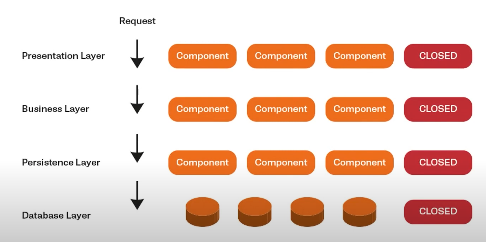
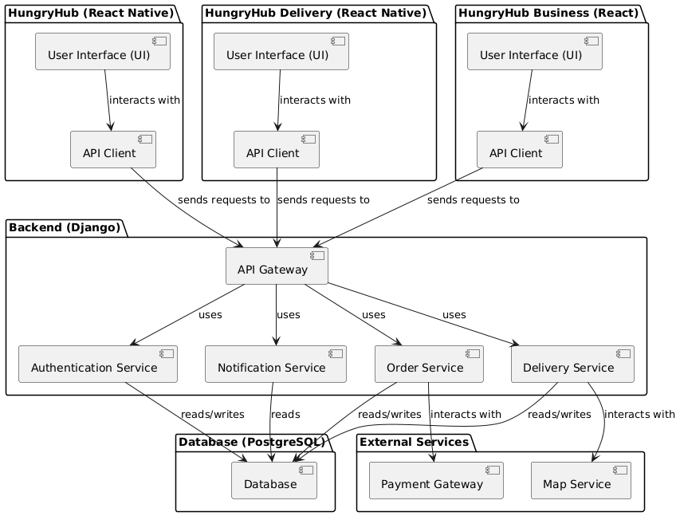
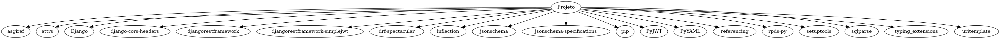
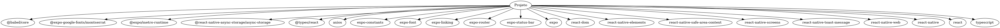
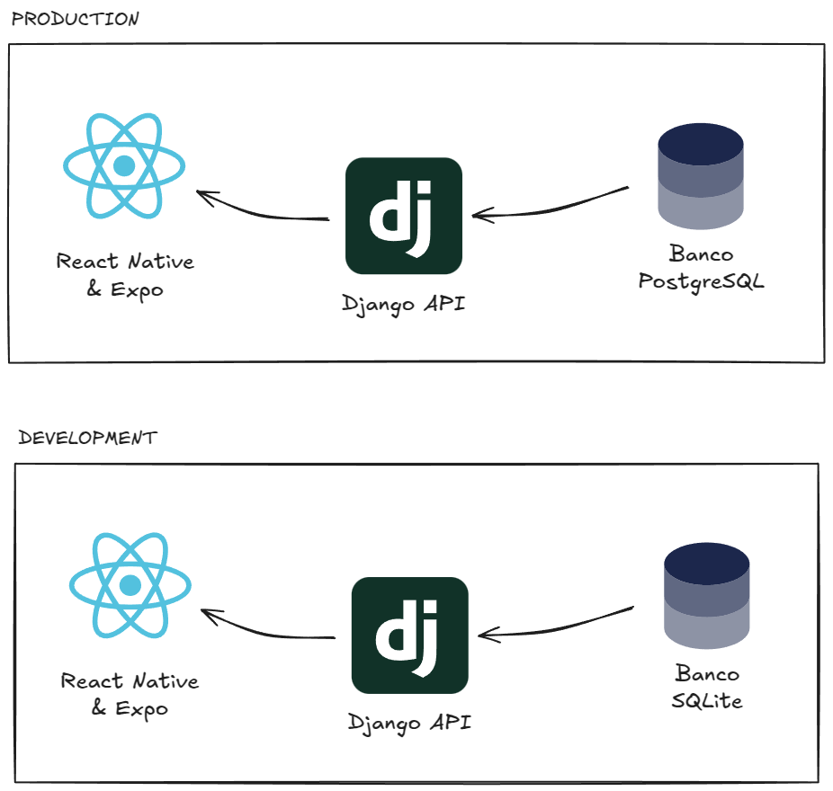

# Documento de Arquitetura de Software (DAS)

## 1. Introdução

<!-- [The introduction of the Software Architecture Document provides an overview of the entire Software Architecture Document. It includes the purpose, scope, definitions, acronyms, abbreviations, references, and overview of the Software Architecture Document.] -->

### 1.1 Propósito

Este documento fornece uma visão geral abrangente da arquitetura do aplicativo de entregas **HungryHub**, usando uma série de visualizações arquiteturais diferentes para representar diferentes aspectos do sistema. Ele é destinado a capturar e transmitir as decisões arquiteturais significativas que foram tomadas no sistema. Este documento servirá como um ponto de referência para todos os envolvidos no desenvolvimento do sistema, incluindo desenvolvedores, testadores, gerentes de projeto e outros stakeholders.

<!-- [This section defines the role or purpose of the Software Architecture Document, in the overall project documentation, and briefly describes the structure of the document. The specific audiences for the document is identified, with an indication of how they are expected to use the document.] -->

### 1.2 Escopo

O **[HungryHub](#hungryhub)** é um aplicativo de entregas que conecta restaurantes e entregadores a clientes que desejam receber comida em casa. O aplicativo permite que os usuários façam pedidos de comida de restaurantes locais e que entregadores façam entregas desses pedidos. O aplicativo é composto por um **aplicativo móvel para clientes**, um **aplicativo móvel para entregadores** e um **aplicativo web para restaurantes**. O aplicativo móvel para clientes permite que os usuários visualizem restaurantes próximos, façam pedidos de comida e acompanhem o status de seus pedidos. O aplicativo móvel para entregadores permite que os entregadores visualizem pedidos disponíveis, aceitem pedidos e entreguem pedidos. O aplicativo web para restaurantes permite que os restaurantes gerenciem seus menus, recebam pedidos e gerenciem suas entregas. O aplicativo é desenvolvido usando tecnologias modernas como [React Native](https://reactnative.dev/docs/getting-started), [Django](https://www.djangoproject.com/) e [PostgreSQL](https://www.postgresql.org/).

A equipe de desenvolvimento é composta por alunos de Engenharia de Software do campus FCTE da Universidade de Brasília (UnB), que estão desenvolvendo o aplicativo como parte de um projeto da disciplina de **Arquitetura e Desenho de Software**.

<!-- [A brief description of what the Software Architecture Document applies to; what is affected or influenced by this document.] -->

### 1.3 Definições, Acrônimos e Abreviações

| Abreviação | Definição |
| -- | -- |
| **<a id="hungryhub">HungryHub</a>** | Aplicativo de entregas que conecta restaurantes e entregadores a clientes que desejam receber comida em casa. |
| **<a id="entregador">Entregador</a>** | Pessoa que faz entregas de pedidos de comida. |
| **<a id="cliente">Cliente</a>** | Pessoa que faz pedidos de comida. |
| **<a id="restaurante">Restaurante</a>** | Estabelecimento que vende comida. |
| **<a id="pedido">Pedido</a>** | Solicitação de comida feita por um cliente. |
| **<a id="menu">Menu</a>** | Lista de comidas disponíveis em um restaurante. |
| **<a id="react-native">React Native</a>** | Framework de desenvolvimento de aplicativos móveis. |
| **<a id="django">Django</a>** | Framework de desenvolvimento web para APIs. |
| **<a id="postgresql">PostgreSQL</a>** | Sistema de gerenciamento de banco de dados relacional. |

Outras definições, acrônimos e abreviações podem ser encontrados no documento dos [Léxicos](https://unbarqdsw2024-2.github.io/2024.2_G7_Entrega_Entrega_02/#/Modelagem/Extra/Lexicos).

<!-- [This subsection provides the definitions of all terms, acronyms, and abbreviations required to properly interpret the Software Architecture Document.  This information may be provided by reference to the project’s Glossary.] -->

### 1.4 Referências

<!-- [This subsection provides a complete list of all documents referenced elsewhere in the Software Architecture Document. Identify each document by title, report number (if applicable), date, and publishing organization. Specify the sources from which the references can be obtained. This information may be provided by reference to an appendix or to another document.] -->

<!-- formato:

1. Nome do autor. **Título do documento**. Editora, ano. -->

1. SERRANO, Milene. **Estilos e Padrões Arquiteturais I**. UnB, 2025. Disponível em: [https://aprender3.unb.br/pluginfile.php/2928962/mod_page/content/1/Arquitetura%20e%20Desenho%20de%20Software%20-%20Aula%20Estilos%20e%20Padr%C3%B5es%20Arquiteturais%20I%20-%20Profa.%20Milene.pdf](https://aprender3.unb.br/pluginfile.php/2928962/mod_page/content/1/Arquitetura%20e%20Desenho%20de%20Software%20-%20Aula%20Estilos%20e%20Padr%C3%B5es%20Arquiteturais%20I%20-%20Profa.%20Milene.pdf)
2. Fulltureschool. **Tudo sobre a Arquitetura em Camadas | Arquitetura de Soluções**. Youtube, 2022. Disponível em: [https://www.youtube.com/watch?v=doAQjr0mwdg](https://www.youtube.com/watch?v=doAQjr0mwdg)
3. Tribunal Regional do Trabalho do Paraná (TRT-PR). **Diretriz: Descrever a Arquitetura**. TRT-PR, 2025. Disponível em: [https://www.trt9.jus.br/pds/pdstrt9/guidances/guidelines/outline_the_architecture_35F1530A.html#:~:text=Identifique%20as%20metas%20arquiteturais.%20As%20metas%20arquiteturais,est%C3%A3o%20evidentes%20somente%20nos%20casos%20de%20uso](https://www.trt9.jus.br/pds/pdstrt9/guidances/guidelines/outline_the_architecture_35F1530A.html#:~:text=Identifique%20as%20metas%20arquiteturais.%20As%20metas%20arquiteturais,est%C3%A3o%20evidentes%20somente%20nos%20casos%20de%20uso)
4. SERRANO, Milene. **05b - VideoAula - DSW-Modelagem - Diagrama de Classe - View-only**. UnB, 2025. Disponível em: https://unbbr-my.sharepoint.com/personal/mileneserrano_unb_br/_layouts/15/stream.aspx?id=%2Fpersonal%2Fmileneserrano%5Funb%5Fbr%2FDocuments%2FArqDSW%20%2D%20V%C3%ADdeosOriginais%2F05h%20%2D%20VideoAula%20%2D%20DSW%2DModelagem%20%2D%20Componentes%2Emp4&ga=1&referrer=StreamWebApp%2EWeb&referrerScenario=AddressBarCopied%2Eview%2Eee59e527%2D0649%2D48e1%2D9f8b%2D49e43aec547c
5. SERRANO, Milene. **05b - VideoAula - DSW-Modelagem - Diagrama de Classe - View-only**. UnB, 2025. Disponível em: https://unbbr-my.sharepoint.com/personal/mileneserrano_unb_br/_layouts/15/stream.aspx?id=%2Fpersonal%2Fmileneserrano%5Funb%5Fbr%2FDocuments%2FArqDSW%20%2D%20V%C3%ADdeosOriginais%2F05b%20%2D%20VideoAula%20%2D%20DSW%2DModelagem%20%2D%20Diagrama%20de%20Classe%2Emp4&ga=1&referrer=StreamWebApp%2EWeb&referrerScenario=AddressBarCopied%2Eview%2E6c0ba26e%2Dfd12%2D451b%2Da5f6%2D9f15f468f0fd
6. Tribunal Regional do Trabalho do Paraná (TRT-PR). **Diretriz: Visão Arquitetural**. TRT-PR, 2025. Disponível em: https://www.trt9.jus.br/pds/pdstrt9/guidances/guidelines/architectural_view_FF6EDA37.html#:~:text=Vis%C3%A3o%20de%20Implementa%C3%A7%C3%A3o:%20Descreve%20como,uso%20das%20Vis%C3%B5es%204+1.
7. Instituto Infnet. **Principais visões em arquitetura de software**. Infnet, 2017. Disponível em: [https://blog.infnet.com.br/arquitetura_software/principais-visoes-em-arquitetura-de-software/#:~:text=3.,conformidade%20com%20as%20regulamenta%C3%A7%C3%B5es%20vigentes](https://blog.infnet.com.br/arquitetura_software/principais-visoes-em-arquitetura-de-software/#:~:text=3.,conformidade%20com%20as%20regulamenta%C3%A7%C3%B5es%20vigentes)

### 1.5 Visão Geral

<!-- [This subsection describes what the rest of the Software Architecture Document contains and explains how the Software Architecture Document is organized.] -->

O restante deste documento está organizado da seguinte forma, buscando conter os detalhes sobre as características arquiteturais escolhidas pela equipe de desenvolvimento:

- **[Representação Arquitetural](#2-representação-arquitetural)**: Descreve a arquitetura do sistema e como ela é representada.
- **[Metas e Restrições de Arquitetura](#3-metas-e-restrições-de-arquitetura)**: Descreve as metas e restrições arquiteturais do sistema.
- **[Visão Lógica](#4-visão-lógica)**: Descreve a decomposição do sistema em subsistemas e pacotes.
- **[Visão de Casos de Uso](#5-visão-de-casos-de-uso)**: Descreve a decomposição do sistema em processos.
- **[Visão de Processo](#6-visão-de-processo)**: Descreve a arquitetura de implantação do sistema.
- **[Visão de Implementação](#7-visão-de-implementação)**: Descreve a estrutura de implementação do sistema.
- **[Visão de Dados](#8-visão-de-dados)**: Descreve a perspectiva de armazenamento de dados do sistema.

## 2. Representação Arquitetural

<!-- [This section describes what software architecture is for the current system, and how it is represented. Of the Use-Case, Logical, Process, Deployment, and Implementation Views, it enumerates the views that are necessary, and for each view, explains what types of model elements it contains.] -->

A arquitetura lógica do aplicativo segue uma abordagem **modular e em camadas**, com o objetivo de **separar as responsabilidades** e **facilitar a manutenção** e **evolução** do sistema. A arquitetura é baseada no **padrão de arquitetura de software MVC (Model-View-Controller)**, que é um padrão de projeto de software que separa a representação da informação da interação do usuário com ela. O **Django**, framework web utilizado no projeto, segue esse padrão, facilitando a implementação e manutenção do sistema.

### 2.1 Arquitetura em Camadas

A arquitetura em camadas divide o sistema em **camadas lógicas** que são responsáveis por diferentes aspectos do sistema. Cada camada tem um **propósito específico** e **responsabilidades bem definidas**, garantindo a **separação de interesses** e **facilitando a manutenção** e **evolução** do sistema. A arquitetura em camadas é uma abordagem comum em sistemas web, pois permite a **escalabilidade**, **reutilização de código** e **facilidade de manutenção**. [[SERRANO, Milene, 2024]](https://aprender3.unb.br/pluginfile.php/2928962/mod_page/content/1/Arquitetura%20e%20Desenho%20de%20Software%20-%20Aula%20Estilos%20e%20Padr%C3%B5es%20Arquiteturais%20I%20-%20Profa.%20Milene.pdf)

<center>



**Figura 01** - Representação da arquitetura em camadas. [[Fulltureschool, 2022]](https://www.youtube.com/watch?v=doAQjr0mwdg)

</center>

### 2.2 Arquitetura MVC

O **Model-View-Controller (MVC)** é um padrão de arquitetura de software que separa a representação da informação da interação do usuário com ela. O **Model** é a representação dos dados e a lógica de negócios do sistema, o **View** é a camada de apresentação, responsável por exibir os dados ao usuário, e o **Controller** é a camada de controle, responsável por receber as requisições do usuário, processar as informações e retornar a resposta adequada. [[SERRANO, Milene, 2025]](https://aprender3.unb.br/pluginfile.php/2928962/mod_page/content/1/Arquitetura%20e%20Desenho%20de%20Software%20-%20Aula%20Estilos%20e%20Padr%C3%B5es%20Arquiteturais%20I%20-%20Profa.%20Milene.pdf)

<center>


**Figura 02** - Visualização do Padrão Arquitetural - MVC. [[SERRANO, Milene, 2025]](https://aprender3.unb.br/pluginfile.php/2928962/mod_page/content/1/Arquitetura%20e%20Desenho%20de%20Software%20-%20Aula%20Estilos%20e%20Padr%C3%B5es%20Arquiteturais%20I%20-%20Profa.%20Milene.pdf)

</center>

No contexto do projeto, as camadas **Model** e **Controller** serão implementadas no **backend** do sistema, utilizando o **Django**, enquanto a **View** será implementada utilizando o **React Native** no **frontend** do sistema. Assim como representado na tabela a seguir:

#### Tabela - Representação da Arquitetura MVC

| Camada | Tecnologia | Descrição |
| -- | -- | -- |
| **Model** | Django | Representação dos dados e lógica de negócios do sistema |
| **View** | React Native | Camada de apresentação, responsável por exibir os dados ao usuário |
| **Controller** | Django | Camada de controle, responsável por receber as requisições do usuário, processar as informações e retornar a resposta adequada |

### 2.3 Representação Visual

A arquitetura do sistema é representada visualmente pelas seguintes visualizações arquiteturais:

- **[Visão Lógica](#4-visão-lógica)**: Representação da estrutura lógica do sistema, incluindo a decomposição em subsistemas e pacotes, contendo os [diagramas de componentes](#41-diagrama-de-componentes), [classes](#42-diagrama-de-classes) e [componentes do front-end](#43-diagrama-de-componentes-front-end).
- **[Visão de Casos de Uso](#5-visão-de-casos-de-uso)**: Representação dos casos de uso do sistema, incluindo a decomposição em processos, contendo os [diagramas de casos de uso gerais](), [casos de uso do cliente](), [entregador]() e [restaurante]().
- **[Visão de Processo](#6-visão-de-processo)**: Representação da arquitetura de implantação do sistema, incluindo a mapeamento de processos em processadores, threads e sincronização, e os [diagramas de atividades](), [estados]() e [sequência]().
- **[Visão de Implementação](#7-visão-de-implementação)**: Representação da estrutura de implementação do sistema, incluindo a decomposição em camadas e subsistemas, contendo os [diagramas de implementação](), [estrutura modular do código](), [dependências](), [padrões de design]() e [configuração de ambiente]().
- **[Visão de Dados](#8-visão-de-dados)**: Representação da estrutura de dados do sistema, incluindo o [modelo relacional](#81-diagrama-de-modelo-relacional) e o [repositório de dados](#82-repositório-de-dados).

## 3. Metas e Restrições de Arquitetura
<!-- 
[This section describes the software requirements and objectives that have some significant impact on the architecture; for example, safety, security, privacy, use of an off-the-shelf product, portability, distribution, and reuse. It also captures the special constraints that may apply: design and implementation strategy, development tools, team structure, schedule, legacy code, and so on.] -->

As **metas** e **restricões** de arquitetura são fundamentais para o projeto, pois definem os objetivos que a arquitetura do sistema deve atender e as restrições que devem ser consideradas durante o desenvolvimento do sistema. As metas de arquitetura ajudam a garantir que a arquitetura do sistema atenda aos requisitos de negócios e de qualidade, enquanto as restrições de arquitetura ajudam a garantir que a arquitetura do sistema seja consistente e viável. Portanto, é importante identificar e documentar as metas e restrições de arquitetura para orientar o desenvolvimento do sistema e garantir que a arquitetura atenda aos requisitos e expectativas dos stakeholders. [[TRTPR, 2025]](https://www.trt9.jus.br/pds/pdstrt9/guidances/guidelines/outline_the_architecture_35F1530A.html#:~:text=Identifique%20as%20metas%20arquiteturais.%20As%20metas%20arquiteturais,est%C3%A3o%20evidentes%20somente%20nos%20casos%20de%20uso.)

### 3.1 Metas de Arquitetura

As metas de arquitetura definem os objetivos que a arquitetura do sistema deve atender. Um documento **Especificação Suplementar** foi criado para detalhar algumas das principais metas, requisitos não-funcionais e outros aspectos críticos do sistema, utilizando o modelo **FURPS+**. O documento com suas respectivas rastreabilidades pode ser encontrado [aqui](https://unbarqdsw2024-2.github.io/2024.2_G7_Entrega_Entrega_02/#/Modelagem/Extra/especificacao-suplementar).

### 3.2 Restrições de Arquitetura

| Meta/Restrição | Descrição | Ferramenta | Rastreabilidade |
| -- | -- | -- | -- |
| **Linguagens** | A restrição de linguagem define quais linguagens deverão ser utilizadas no desenvolvimento do sistema. | [Python](https://www.python.org/), [TypeScript](https://www.typescriptlang.org/) | [R58, R59](https://unbarqdsw2024-2.github.io/2024.2_G7_Entrega_Entrega_02/#/Modelagem/Extra/Baseline) |
| **Frameworks** | A restrição de frameworks define quais frameworks serão utilizados no desenvolvimento do sistema de acordo com as linguagens escolhidas. | [Django](https://www.djangoproject.com/), [React Native](https://reactnative.dev/docs/getting-started) | [R58, R59](https://unbarqdsw2024-2.github.io/2024.2_G7_Entrega_Entrega_02/#/Modelagem/Extra/Baseline) |
| **Banco de Dados** | A restrição de banco de dados define qual banco de dados será utilizado para armazenar os dados do sistema e implementar a camada de persistência. | [PostgreSQL](https://www.postgresql.org/), [SQLite](https://www.sqlite.org/index.html) | [R57](https://unbarqdsw2024-2.github.io/2024.2_G7_Entrega_Entrega_02/#/Modelagem/Extra/Baseline) |
| **Plataformas** | Define as plataformas nas quais o sistema terá suporte. | Android, iOS, Web | [R54](https://unbarqdsw2024-2.github.io/2024.2_G7_Entrega_Entrega_02/#/Modelagem/Extra/Baseline) |
| **Segurança** | Define as medidas de segurança que devem ser implementadas no sistema. | Autenticação, Autorização, Criptografia | [Especificação Suplementar - CR01, CR02, CR06](https://unbarqdsw2024-2.github.io/2024.2_G7_Entrega_Entrega_02/#/Modelagem/Extra/especificacao-suplementar) |
| **Padrões de Comunicação** | Define os padrões de comunicação que devem ser utilizados no sistema. | REST API, JSON | [Especificação Suplementar - RD04](https://unbarqdsw2024-2.github.io/2024.2_G7_Entrega_Entrega_02/#/Modelagem/Extra/especificacao-suplementar) |

<center>

**Autores**: [Felipe Amorim de Araújo](https://github.com/lipeaaraujo)

</center>

## 4. Visão Lógica

<!-- [This section describes the architecturally significant parts of the design model, such as its decomposition into subsystems and packages. And for each significant package, its decomposition into classes and class utilities. You should introduce architecturally significant classes and describe their responsibilities, as well as a few very important relationships, operations, and attributes.] -->

### 4.1 Diagrama de Componentes

O diagrama de componentes é uma representação visual da arquitetura de software que mostra a estrutura e as dependências entre os componentes do sistema. [[SERRANO, Milene, 2025]](https://unbbr-my.sharepoint.com/personal/mileneserrano_unb_br/_layouts/15/stream.aspx?id=%2Fpersonal%2Fmileneserrano%5Funb%5Fbr%2FDocuments%2FArqDSW%20%2D%20V%C3%ADdeosOriginais%2F05h%20%2D%20VideoAula%20%2D%20DSW%2DModelagem%20%2D%20Componentes%2Emp4&ga=1&referrer=StreamWebApp%2EWeb&referrerScenario=AddressBarCopied%2Eview%2E915de1b8%2Df447%2D4986%2Db25c%2Defb877516b21)

<center>



**Figura 03** - Diagrama de Componentes do HungryHub (Versão simplificada)

**Autores:** [Felipe Amorim de Araújo](https://github.com/lipeaaraujo)

</center>

O diagrama representa os principais componentes do sistema, incluindo a separação dos aplicativos HungryHub, HungryHub Delivery
e HungryHub Business.

#### 4.1.1 Tabela de Elementos

| Elemento | Tipo | Descrição |
| -- | -- | -- |
| **HungryHub** | Pacote | Aplicativo principal do HungryHub dedicado aos usuários interessados em encontrar restaurantes e realizar pedidos |
| **HungryHub Delivery** | Pacote | Aplicativo do HungryHub dedicado aos entregadores que realizam a entrega dos pedidos |
| **HungryHub Business** | Pacote | Aplicativo do HungryHub dedicado aos restaurantes e estabelecimentos que desejam gerenciar seus pedidos e cardápios |
| **Backend (Django)** | Pacote | Camada de controle do sistema, responsável por receber as requisições do usuário, processar as informações e retornar a resposta adequada |
| **Database (PostgreSQL)** | Pacote | Banco de dados relacional utilizado para armazenar e gerenciar os dados do sistema |
| External Services | Pacote | Serviços externos utilizados pelo sistema, como serviços de geolocalização e pagamento |
| **User Interface (UI)** | Componente | Interface do usuário, responsável por exibir as informações ao usuário e receber as interações do usuário do aplicativo específico |
| **API Client** | Componente | Interface utilizada pela camada da interface do usuário para se comunicar com a camada de controle do sistema |
| **API Gateway** | Componente | Interface disponibilizada pela camada de controle do sistema para se comunicar com a camada de interface do usuário |
| **Authentication Service** | Componente | Serviço de autenticação utilizado para autenticar usuários e garantir a segurança do sistema |
| **Order Service** | Componente | Serviço de pedidos utilizado para gerenciar os pedidos realizados pelos usuários |
| **Notification Service** | Componente | Serviço de notificação utilizado para enviar notificações aos usuários sobre o status dos pedidos |
| **Delivery Service** | Componente | Serviço de entrega utilizado para gerenciar as entregas dos pedidos realizados pelos usuários |
| **Database** | Componente | Banco de dados relacional utilizado para armazenar e gerenciar os dados do sistema |
| **Payment Gateway** | Componente | Serviço de pagamento utilizado para processar os pagamentos dos pedidos realizados pelos usuários |
| **Map Service** | Componente | Serviço de geolocalização utilizado para exibir a localização dos restaurantes e entregadores aos usuários |

<center>

**Autores:** [Felipe Amorim de Araújo](https://github.com/lipeaaraujo)

</center>

#### 4.1.2 Tabela de Relacionamentos

| Relacionamento | Descrição |
| -- | -- |
| **User Interface (UI) -> API Client** | A interface do usuário se comunica com a camada de controle do sistema por meio de uma API Client |
| **API Client -> API Gateway** | A API Client se comunica com a API Gateway para acessar os serviços disponibilizados pela camada de controle do sistema |
| **API Gateway -> Authentication Service** | A API Gateway se comunica com o serviço de autenticação para autenticar os usuários e garantir a segurança do sistema |
| **API Gateway -> Order Service** | A API Gateway se comunica com o serviço de pedidos para gerenciar os pedidos realizados pelos usuários |
| **API Gateway -> Notification Service** | A API Gateway se comunica com o serviço de notificação para enviar notificações aos usuários sobre o status dos pedidos |
| **API Gateway -> Delivery Service** | A API Gateway se comunica com o serviço de entrega para gerenciar as entregas dos pedidos realizados pelos usuários |
| **Authentication Service -> Database** | O serviço de autenticação acessa o banco de dados para autenticar os usuários |
| **Order Service -> Database** | O serviço de pedidos acessa o banco de dados para gerenciar os pedidos realizados pelos usuários |
| **Notification Service -> Database** | O serviço de notificação acessa o banco de dados para enviar notificações aos usuários |
| **Delivery Service -> Database** | O serviço de entrega acessa o banco de dados para gerenciar as entregas dos pedidos realizados pelos usuários |
| **Order Service -> Payment Gateway** | O serviço de pedidos se comunica com o serviço de pagamento para processar os pagamentos dos pedidos realizados pelos usuários |
| **Delivery Service -> Map Service** | O serviço de entrega se comunica com o serviço de geolocalização para exibir a localização dos restaurantes e entregadores aos usuários |

<center>

**Autores:** [Felipe Amorim de Araújo](https://github.com/lipeaaraujo)

</center>

### 4.2 Diagrama de Classes

O diagrama de classes é uma representação visual da estrutura e das relações entre as classes do sistema. Ele mostra as classes do sistema, seus atributos, métodos e as relações entre elas. O diagrama de classes é uma ferramenta importante para a modelagem de sistemas orientados a objetos, pois permite visualizar a estrutura do sistema e identificar as classes e suas relações. [[SERRANO, Milene, 2025]](https://unbbr-my.sharepoint.com/personal/mileneserrano_unb_br/_layouts/15/stream.aspx?id=%2Fpersonal%2Fmileneserrano%5Funb%5Fbr%2FDocuments%2FArqDSW%20%2D%20V%C3%ADdeosOriginais%2F05b%20%2D%20VideoAula%20%2D%20DSW%2DModelagem%20%2D%20Diagrama%20de%20Classe%2Emp4&ga=1&referrer=StreamWebApp%2EWeb&referrerScenario=AddressBarCopied%2Eview%2E6c0ba26e%2Dfd12%2D451b%2Da5f6%2D9f15f468f0fd)

<center>


**Figura 04** - Diagrama de Classes

**Autores:** [Bruno Cunha Vasconcelos de Araújo](https://github.com/brunocva), [Davi Gonçalves Akegawa Pierre](https://github.com/DaviPierre), [Gabryel Nicolas Soares de Sousa](https://github.com/gabryelns), [Júlio Roberto da Silva Neto](https://github.com/JulioR2022), [Lucas Martins Gabriel](https://github.com/martinsglucas), [Raquel Ferreira Andrade](https://github.com/raquel-andrade) e [Wolfgang Friedrich Stein](https://github.com/Wolffstein)

</center>

O documento completo do diagrama de classes pode ser encontrado na documentação da entrega 02 do projeto [aqui](https://unbarqdsw2024-2.github.io/2024.2_G7_Entrega_Entrega_02/#/Modelagem/ModelagemEstatica/DiagramaClasses).

### 4.3 Diagrama de Componentes (FRONT-END)

O diagrama de componentes do front-end é uma representação visual da arquitetura de software do front-end do sistema, mostrando os principais componentes e suas interações. Ele é útil para entender a estrutura do front-end, identificar os componentes principais e suas dependências. Ele foi criado como uma adaptação de um diagrama de componentes comum, para representar a arquitetura do React Native, que é a tecnologia utilizada no front-end do HungryHub.

<center>


**Figura 05** - Diagrama de Classes

**Autores:** [Felipe Amorim de Araújo](https://github.com/lipeaaraujo), [Leonardo Sobrinho de Aguiar](https://github.com/Leonardo0o0), [Guilherme Westphall de Queiroz](https://github.com/west7), [Guilherme Silva Dutra](https://github.com/GuiDutra21), [Kallyne Macedo Passos](https://github.com/kalipassos), [Kauan de Torres Eiras](https://github.com/kauaneiras)

</center>

O documento completo do diagrama de componentes do front-end com mais detalhes sobre metodologia, abordagem e tecnologias utilizadas pode ser encontrado na documentação da entrega 02 do projeto [aqui](https://unbarqdsw2024-2.github.io/2024.2_G7_Entrega_Entrega_02/#/Modelagem/ModelagemEstatica/DiagramaComponentes).

## 5. Visão de Casos de Uso

<!-- [This section describes the system's decomposition into lightweight processes (single threads of control) and heavyweight processes (groupings of lightweight processes). Organize the section by groups of processes that communicate or interact. Describe the main modes of communication between processes, such as message passing, interrupts, and rendezvous.] -->

### Diagrama de Casos de Uso - Geral

O diagrama de casos de uso geral representa uma visão mais abragente do sistema destacando os principais atores (Cliente, Entregador, Loja, Serviço de Pagamentos) e suas interações com as funcionalidades oferecidas que pode ser visualizado na imagem a seguir


<center>

**Figura 06** - Diagrama de Casos de Uso Geral

</center>

Segue Link da Entrega anterior, onde é possivel ver os detalhes do diagrama de casos de uso <br>[Casos de uso geral](https://unbarqdsw2024-2.github.io/2024.2_G7_Entrega_Entrega_02/#/Modelagem/ModelagemOrganizacional/DiagramaCasosDeUsoGeral)<br>

### Diagrama de Casos de Uso - Cliente

O diagrama de casos de uso do Cliente representa uma visão mais focada nas interações do Cliente com o sistem, este diagrama detalha as funcionalidades disponíveis para o usuário final que pode ser visualizado na imagem a seguir


<center>

**Figura 07** - Diagrama de Casos de Uso Geral

</center>


Segue Link da Entrega anterior, onde é possivel ver os detalhes do diagrama de casos de uso <br>[Casos de uso cliente](https://unbarqdsw2024-2.github.io/2024.2_G7_Entrega_Entrega_02/#/Modelagem/ModelagemOrganizacional/CasosDeUsoCliente)<br>

### Diagrama de Casos de Uso - Entregador

O diagrama de casos de uso do Entregador representa uma visão mais focada nas interações do Cliente com o sistema que pode ser visualizado na imagem a seguir


<center>

**Figura 08** - Diagrama de Casos de Uso do Entregador

</center>


Segue Link da Entrega anterior, onde é possivel ver os detalhes do diagrama de casos de uso <br>[Casos de uso entregador](https://unbarqdsw2024-2.github.io/2024.2_G7_Entrega_Entrega_02/#/Modelagem/ModelagemOrganizacional/DiagramaCasosDeUsoLoja)<br>

### Diagrama de Casos de Uso - Restaurante

O diagrama de casos de uso do Cliente representa uma visão mais focada nas interações do Cliente dentro do sistema. este diagrama deetalha as funcionalidades e pode ser visualizado na imagem a seguir


<center>

**Figura 09** - Diagrama de Casos de Uso do Restaurante

</center>


Segue Link da Entrega anterior, onde é possivel ver os detalhes do diagrama de casos de uso 
<br>[Casos de uso restaurante](https://unbarqdsw2024-2.github.io/2024.2_G7_Entrega_Entrega_02/#/Modelagem/ModelagemOrganizacional/CasosDeUsoEntregador)<br>

## 6. Visão de Processo

### 6.1 Diagrama de Atividades

O Diagrama de Atividades representa o fluxo de atividades dentro do sistema, focando nos processos e regras de negócio que pode ser visualizado a seguir

#### Cadastro de Usuário


<center>

**Figura 10** - Diagrama de Atividades - Cadastro de Usuário

</center>


#### Loja cadastra cardápio


<center>

**Figura 11** - Diagrama de Atividades - Loja cadastra cardápio

</center>


#### Cliente realiza pedido


<center>

**Figura 12** - Diagrama de Atividades - Cliente realiza pedido

</center>

#### Loja recebe pedido


<center>

**Figura 13** - Diagrama de Atividades - Loja recebe pedido

</center>

#### Entregador recebe solicitação de entrega


<center>

**Figura 14** - Diagrama de Atividades - Entregador recebe solicitação de entrega

</center>

#### Cliente avalia Entregador e Loja


<center>

**Figura 15** - Diagrama de Atividades - Cliente avalia Entregador e Loja

</center>

#### Cliente inicia suporte via chat


<center>

**Figura 16** - Diagrama de Atividades - Cliente inicia suporte via chat

</center>

Segue Link da Entrega anterior, onde é possivel ver os detalhes dos diagramas de atividades <br>[Diagrama de atividades](https://unbarqdsw2024-2.github.io/2024.2_G7_Entrega_Entrega_02/#/Modelagem/ModelagemDinamica/Diagrama_de_atividades)<br>

### 6.2 Diagrama de Estados

O Diagrama de Estados representa os diferentes estados de um objeto dentro do sistema e as transições entre eles. Ele é útil para modelar o comportamento dinâmico de um objeto ao longo de seu ciclo de vida que pode ser visualizado a seguir

#### Diagrama de Estados - Visão Geral


<center>

**Figura 16** - Diagrama de Estados - Visão Geral

**Autores**: [Bruno Araújo](https://github.com/brunocva), [Wolfgang Friedrich Stein](https://github.com/Wolffstein)

</center>

Segue Link da Entrega anterior, onde é possivel ver os detalhes dos diagramas de estados <br>[Diagrama de estados](https://unbarqdsw2024-2.github.io/2024.2_G7_Entrega_Entrega_02/#/Modelagem/ModelagemDinamica/DiagramaDeEstados)<br>

### Diagrama de Sequencias

O Diagrama de Sequência modela a interação entre objetos ao longo do tempo, detalhando a troca de mensagens entre eles que pode ser visualizado a seguir

#### Solicitação de Pedido


<center>

**Figura 17** - Diagrama de Sequência - Solicitação de Pedido

</center>

#### Cadastro de Usuário


<center>

**Figura 18** - Diagrama de Sequência - Cadastro de Usuário

</center>

#### Login


<center>

**Figura 19** - Diagrama de Sequência - Login

</center>

#### Logout


<center>

**Figura 20** - Diagrama de Sequência - Logout

</center>

#### Editar conta


<center>

**Figura 21** - Diagrama de Sequência - Editar conta

</center>

#### Cadastro método de pagamento


<center>

**Figura 22** - Diagrama de Sequência - Cadastro método de pagamento

</center>

Segue Link da Entrega anterior, onde é possivel ver os detalhes dos diagramas de sequencias <br>[Diagrama de sequencias](https://unbarqdsw2024-2.github.io/2024.2_G7_Entrega_Entrega_02/#/Modelagem/ModelagemDinamica/DiagramaSequencia)<br>

## 7. Visão de Implementação

<!-- [This section describes the overall structure of the implementation model, the decomposition of the software into layers and subsystems in the implementation model, and any architecturally significant components.] -->

A **visão de implementação** detalha a estrutura de implementação do sistema, incluindo a decomposição em camadas e subsistemas, os padrões de design utilizados, a estrutura modular do código, as dependências entre os componentes e a configuração do ambiente de desenvolvimento. A visão de implementação é essencial para garantir que a arquitetura do sistema seja implementada de acordo com as decisões arquiteturais tomadas e que o código seja organizado, modular e reutilizável. [[TRTPR, 2025]](https://www.trt9.jus.br/pds/pdstrt9/guidances/guidelines/architectural_view_FF6EDA37.html#:~:text=Vis%C3%A3o%20de%20Implementa%C3%A7%C3%A3o:%20Descreve%20como,uso%20das%20Vis%C3%B5es%204+1.)

### 7.1 Estrutura do Código Fonte

A estrutura do código fonte é a organização dos arquivos e diretórios do sistema, que reflete a arquitetura do sistema e facilita a manutenção e evolução do código. O nosso repositório do projeto está estruturado da seguinte forma:

```
📂 docs/                               # Documentação do projeto
📂 src/                             # Código fonte do projeto
  📂 HungryHub.2024.2-Back/         # Backend do sistema (Django)
    📂app/
      __init__.py
      asgi.py
      settings.py
      urls.py
      wsgi.py
    📂 hungryhub/
      📂 migrations/
      📂 views/
      __init__.py
      admin.py
      apps.py
      models.py
      tests.py
      signals.py
      permissions.py
    manage.py
    requirements.txt
  📂 HungryHub.2024.2-Front            # Frontend do sistema (React Native)
    📂 hungryhub/                   # Aplicativo principal
      📂 assets/                    
      📂 src/                       # Diretório principal
        📂 api/                     # Serviços da API
        📂 components/              # Componentes reutilizáveis
        📂 app/                     # Páginas e navegação
        📂 context/                 # Estados globais e contextos
        📂 interfaces/              # Interfaces do Typescript
        📂 utils/                   # Funções auxiliares
      app.json
      index.js
      package.json
      tsconfig.json

```

<center>

**Autores:** [Felipe Amorim de Araújo](https://github.com/lipeaaraujo)

</center>

A estrutura pode ser visualizada de forma mais detalhada no repositório do projeto [aqui](https://github.com/UnBArqDsw2024-2/2024.2_G7_Entrega_Entrega_03/tree/main)

### 7.2 Dependências

As dependências do sistema são as **bibliotecas**, **frameworks** e ferramentas utilizadas no desenvolvimento do sistema. As dependências são essenciais para o funcionamento do sistema e devem ser gerenciadas de forma eficiente para garantir a compatibilidade e a estabilidade do sistema. As principais dependências em termos de frameworks do sistema são:

- **Django**: Framework web utilizado no backend do sistema para desenvolver APIs RESTful.
- **React Native**: Framework de desenvolvimento de aplicativos móveis utilizado no frontend do sistema para desenvolver aplicativos móveis multiplataforma.
- **PostgreSQL**: Sistema de gerenciamento de banco de dados relacional utilizado para armazenar e gerenciar os dados do sistema.

Além disso, o sistema utiliza outras dependências, como bibliotecas de terceiros, ferramentas de desenvolvimento e serviços externos. Alguns diagramas foram criados utilizando o [Graphviz](https://graphviz.org/download/) para visualizar as dependências do sistema:



<center>

**Figura 23** - Diagrama de Dependências do Backend do HungryHub

**Autores:** [Felipe Amorim de Araújo](https://github.com/lipeaaraujo)

</center>



<center>

**Figura 24** - Diagrama de Dependências do Backend do HungryHub

**Autores:** [Felipe Amorim de Araújo](https://github.com/lipeaaraujo)

</center>

**Observação:** *Abra as imagens em uma nova aba para visualizar em tamanho completo, o formato atual dificulta a visualização por conta forma que a ferramenta gera elas*

É possível encontrar mais informações sobre as dependências do projeto no arquivo no Insight de Dependencies Graph no GitHub do projeto [aqui](https://github.com/UnBArqDsw2024-2/2024.2_G7_Entrega_Entrega_03/network/dependencies)

### 7.3 Padrões de Design

Os padrões de design são soluções reutilizáveis para problemas comuns de design de software. Eles ajudam a organizar o código, torná-lo mais legível e manutenível, e promover a reutilização de código. Os padrões de design são uma parte importante da arquitetura de software, pois ajudam a garantir que o código seja organizado, modular e reutilizável. Alguns dos padrões de design utilizados no sistema podem ser encontrados nos documentos da entrega 03 [aqui](https://github.com/UnBArqDsw2024-2/2024.2_G7_Entrega_Entrega_03).

### 7.4 Configuração de Ambiente

A configuração de ambiente é a preparação do ambiente de desenvolvimento para o desenvolvimento, teste e implantação do sistema. A configuração do ambiente inclui a instalação de ferramentas, bibliotecas e dependências necessárias, a configuração de variáveis de ambiente e a configuração de serviços externos. A configuração do ambiente é essencial para garantir que o sistema seja desenvolvido e implantado de forma eficiente e consistente.

O documento markdown com a configuração do ambiente pode ser encontrado na documentação da entrega 03 do projeto [aqui](https://github.com/UnBArqDsw2024-2/2024.2_G7_Entrega_Entrega_03/blob/main/src/README.md)

Ele detalha a configuração do ambiente virtual do Python, a instalação das dependências do projeto, a configuração do ambiente de desenvolvimento do React Native e do Expo (biblioteca).

## 8. Visão de Dados

A visão de dados é uma visão arquitetural que descreve a **estrutura dos dados** que são utilizados pelo sistema, bem como a forma como esses dados são **armazedos**, **acessados**, **modificados**, **transferidos** e **gerenciados** atendendo os requisitos funcionais e não funcionais do sistema. É essencial para a compreensão da arquitetura do sistema garantindo consistência, integridade, segurança e desempenho das operações de manipulação de dados. [[Instituto Infnet 2025]](https://blog.infnet.com.br/arquitetura_software/principais-visoes-em-arquitetura-de-software/#:~:text=3.,conformidade%20com%20as%20regulamenta%C3%A7%C3%B5es%20vigentes.)

### 8.1 Diagrama de Modelo Relacional

Para a representação do modelo relacional, foi utilizado o diagrama de entidade-relacionamento (DER) que é uma técnica para modelar dados em um sistema de banco de dados. O DER é uma coleção de entidades e relacionamentos entre entidades. Uma entidade é uma classe de objetos. Normalmente, uma entidade corresponde a uma tabela em um banco de dados, e um objeto corresponde a uma linha na tabela. [[Lucidchart 2025]](https://www.lucidchart.com/pages/pt/o-que-e-diagrama-entidade-relacionamento#:~:text=Um%20diagrama%20entidade%20relacionamento%20(ER,si%20dentro%20de%20um%20sistema.)

<center>


**Figura 25** - Diagrama de Modelo Relacional ou Diagrama de Entidade-Relacionamento (DER) do HungryHub

**Autores**: [Júlio Roberto da Silva Neto](https://github.com/JulioR2022), [Kallyne Macedo Passos](https://github.com/kalipassos), [Wolfgang Friedrich Stein](https://github.com/Wolffstein)

</center>

Este artefato também pode ser encontrado na documentação da entrega 02 do projeto com mais detalhes [aqui](https://unbarqdsw2024-2.github.io/2024.2_G7_Entrega_Entrega_02/#/Modelagem/Extra/DiagramaModeloRelacional).

### 8.2 Repositório de Dados

O HungryHub armazena e gerencia os dados do sistema em um banco de dados relacional **PostgreSQL**, garantindo a integridade, segurança e desempenho das operações de manipulação de dados. O banco **PostgreSQL** é utilizado em produção, devido a sua robustez, confiabilidade e suporte a transações ACID e a escalabilidade para lidar com grandes volumes de dados.

Para o ambiente de desenvolvimento local, é utilizado o banco de dados **SQLite**, que é um banco de dados relacional embutido, leve e de fácil configuração, permitindo a criação de um banco de dados local para testes e desenvolvimento sem necessidade de uma infraestrutura complexa. Essa abordagem facilita a iteração rápida no desenvolvimento, garantindo que os dados sejam compatíveis entre os dois ambientes. O próprio **Django**, framework utilizado no projeto, possui suporte nativo ao **SQLite**.

- [Documentação Oficial do PostgreSQL](https://www.postgresql.org/docs/)
- [Documentação Oficial do SQLite](https://www.sqlite.org/docs.html)
- [Documentação Oficial do Django](https://docs.djangoproject.com/en/5.1/)

<center>



**Figura 26** - Ambientes de repositório de dados

**Autores**: [Felipe Amorim de Araújo](https://github.com/lipeaaraujo)

</center>

#### Tabela X - Repositório de Dados

| Tecnologia | Contexto de Uso | Rastrabilidade |
| -- | -- | -- |
| **PostgreSQL** | Banco de Dados Relacional utilizado em ambiente de produção | [Baseline - R57](https://unbarqdsw2024-2.github.io/2024.2_G7_Entrega_Entrega_02/#/Modelagem/Extra/Baseline), [Brainstorming - RNF24](https://unbarqdsw2024-2.github.io/2024.2_G7_Entrega_Entrega_01/#/Base/DesignSprint/Requisitos/Brainstorming.md#b24), [Documento de Brainstorming](https://unbarqdsw2024-2.github.io/2024.2_G7_Entrega_Entrega_01/#/Base/DesignSprint/MapaMental) |
| **SQLite** | Banco de Dados Relacional nativo do Django utilizado para ambiente de desenvolvimento, permitindo a execução de testes e verificações locais | [Baseline - R58](https://unbarqdsw2024-2.github.io/2024.2_G7_Entrega_Entrega_02/#/Modelagem/Extra/Baseline), [Brainstorming - RNF23](https://unbarqdsw2024-2.github.io/2024.2_G7_Entrega_Entrega_01/#/Base/DesignSprint/Requisitos/Brainstorming.md#b23), [Documento de Brainstorming](https://unbarqdsw2024-2.github.io/2024.2_G7_Entrega_Entrega_01/#/Base/DesignSprint/MapaMental) |

<!-- [A description of the persistent data storage perspective of the system. This section is optional if there is little or no persistent data, or the translation between the Design Model and the Data Model is trivial.] -->

## Histórico de Versões

| Versão | Data da alteração | Comentário | Autor(es) | Revisor(es) | Data de revisão |
| -- | -- | -- | -- | -- | -- |
| 1.0 | 23/01/2025 | Criação do documento | [Felipe Amorim de Araújo](https://github.com/lipeaaraujo) | [Gabryel Nicolas S de Sousa](https://github.com/gabryelns) | 03/02/2025 |
| 1.1 | 28/01/2025 | Tópicos 1.1, 1.2 e 1.3 | [Felipe Amorim de Araújo](https://github.com/lipeaaraujo) | [Gabryel Nicolas S de Sousa](https://github.com/gabryelns) | 03/02/2025 |
| 1.2 | 31/01/2025 | Adição dos diagramas de caso de uso | [Felipe Amorim de Araújo](https://github.com/lipeaaraujo) | [Gabryel Nicolas S de Sousa](https://github.com/gabryelns) | 03/02/2025 |
| 1.3 | 31/01/2025 | Adição do diagrama de modelo relacional | [Felipe Amorim de Araújo](https://github.com/lipeaaraujo) | [Gabryel Nicolas S de Sousa](https://github.com/gabryelns) | 03/02/2025 |
| 1.4 | 02/02/2025 | Adição da seção de repositório de dados | [Felipe Amorim de Araújo](https://github.com/lipeaaraujo) | [Gabryel Nicolas S de Sousa](https://github.com/gabryelns) | 03/02/2025 |
| 1.5 | 02/02/2025 | Adição da visão lógica | [Felipe Amorim de Araújo](https://github.com/lipeaaraujo) | [Gabryel Nicolas S de Sousa](https://github.com/gabryelns) | 03/02/2025 |
| 1.6 | 02/02/2025 | Criando seção de metas e restrições arquiteturais | [Felipe Amorim de Araújo](https://github.com/lipeaaraujo) | [Gabryel Nicolas S de Sousa](https://github.com/gabryelns) | 03/02/2025 |
| 1.7 | 03/02/2025 | Finalizando introdução | [Felipe Amorim de Araújo](https://github.com/lipeaaraujo) | [Gabryel Nicolas S de Sousa](https://github.com/gabryelns) | 03/02/2025 |
| 1.8 | 03/02/2025 | Adiciona Visao de Processos (diagramas, textos e links) | [Gabryel Nicolas S de Sousa](https://github.com/gabryelns) | [Felipe Amorim de Araújo](https://github.com/lipeaaraujo) | 03/02/2025 |
| 1.9 | 03/02/2025 | Adição dos textos dos diagramas de caso de uso e links da entrega anteior | [Gabryel Nicolas S de Sousa](https://github.com/gabryelns) | [Felipe Amorim de Araújo](https://github.com/lipeaaraujo) | 03/02/2025 |