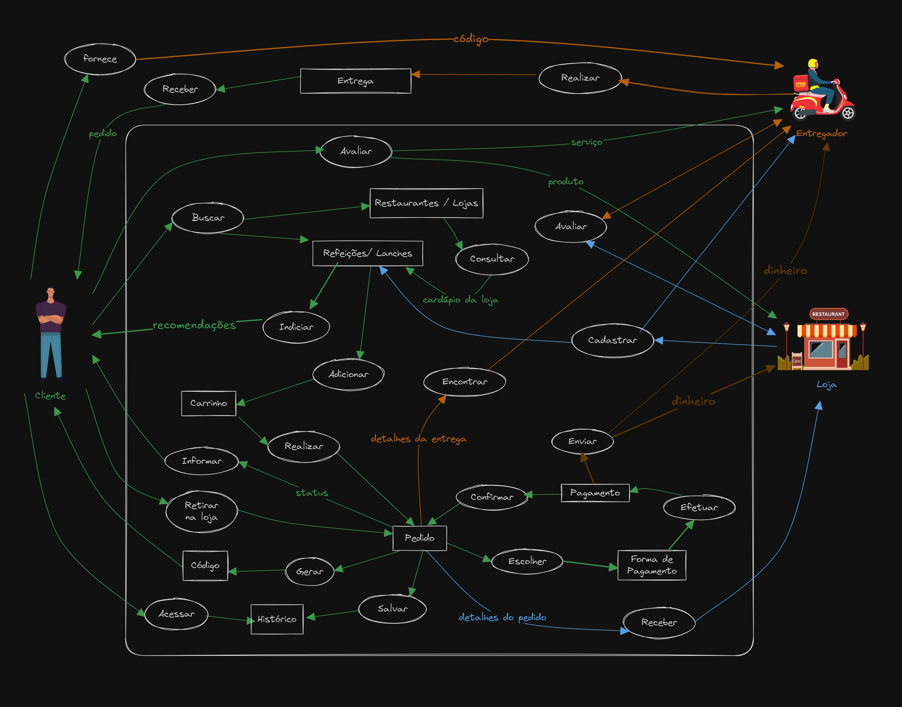
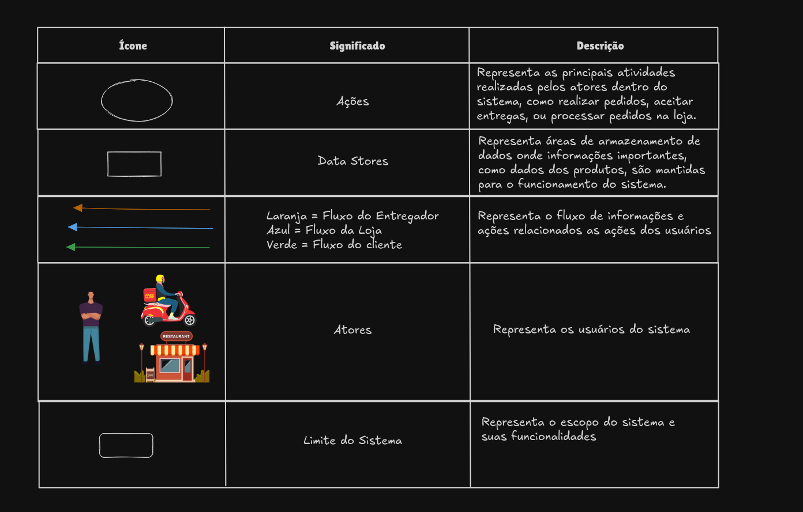

# 1.2.3 Rich Picture

## Introdução

O Rich Picture é uma técnica de modelagem visual que tem como objetivo representar um sistema complexo de forma simples e intuitiva. Ele é utilizado para facilitar a comunicação entre os stakeholders e a equipe de desenvolvimento, permitindo que todos tenham uma visão geral do sistema.

## Metodologia

Dentre os Rich Pictures criados na [Design Sprint](../DesignSprint/RichPictures.md), foi escolhido um para ser aprimorado e utilizado como base para o desenvolvimento do sistema.

## Rich Picture

O Rich Picture a seguir representa o sistema de delivery de comida que será desenvolvido:

**Figura 1**: Rich Picture

**Autores**: [Lucas Martins](https://github.com/martinsglucas), [Guilherme Silva Dutra](https://github.com/GuiDutra21) e [Wolfgang Friedrich Stein](https://github.com/Wolffstein)

**Figura 2**: Legenda

**Autores**: [Guilherme Silva Dutra](https://github.com/GuiDutra21), [Lucas Martins](https://github.com/martinsglucas) e [Wolfgang Friedrich Stein](https://github.com/Wolffstein)

## Referências

1. CTEC2402 Software Development Project. Introducing Rich Pictures. Disponível em: [https://www.scribd.com/document/227529428/Rich-Picture-Guidelines](https://www.scribd.com/document/227529428/Rich-Picture-Guidelines) Acesso em 31 de outubro 2024.

## Histórico de Versões

| Versão | Data da alteração | Comentário                                                                                                                          | Autor(es)                                                                                                                                                             | Revisor(es)                                                  | Data de revisão |
|--------|-------------------|-------------------------------------------------------------------------------------------------------------------------------------|-----------------------------------------------------------------------------------------------------------------------------------------------------------------------|--------------------------------------------------------------|-----------------|
| 1.0    | 01/11/2024        | Adiciona introdução, metodologia e evolução do rich picture (confirmação do pedido e recebimento do status do pedido pelo cliente)  | [Lucas Martins](https://github.com/martinsglucas)                                                                                                                     | [Raquel Ferreira Andrade](https://github.com/raquel-andrade) | 03/11/2024      |
| 1.1    | 02/11/2024        | Adiciona legenga e finaliza evolução (método de pagamento, fluxo do dinheiro, avaliações, recomendações, cadastro dos entregadores) | [Guilherme Silva Dutra](https://github.com/GuiDutra21), [Lucas Martins](https://github.com/martinsglucas) e [Wolfgang Friedrich Stein](https://github.com/Wolffstein) | [Raquel Ferreira Andrade](https://github.com/raquel-andrade) | 03/11/2024      |
| 1.2    | 03/11/2024        | Adiciona histórico de pedidos no Rich Picture                                                                                       | [Lucas Martins](https://github.com/martinsglucas)                                                                                                                     |               [Gabryel Nicolas Soares de Sousa](https://github.com/gabryelns)      | 03/11/2024                |