# 1.1.2. Rich Pictures

## Introdução 

O rich picture é uma representação visual que ajuda a equipe a compreender um produto de software. Capta os principais relacionamentos conceituais entre as principais entidades conceituais de um sistema. O mais relevante é que o rich picture identifica as questões ou preocupaçoes dos stakeholders, ajudando, assim, a concentrar a atenção nos problemas ou nas potenciais soluções de desing.

## Metodologia

A fim de entender melhor o funcionamento de um aplicativo "Delivery", cada integrante do grupo criou um rich picture, que foi discutido em conjunto para a criação de um único rich picture que representasse o entendimento do grupo sobre o aplicativo.

## Rich Pictures

**Figura 1**: <a id="felipe">Rich Picture do Felipe</a>

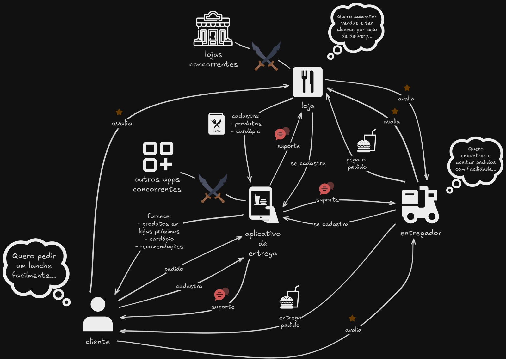

**Autor**: [Felipe Amorim](https://github.com/lipeaaraujo)

---

**Figura 2**: <a id="westphall">Rich Picture do Westphall</a>

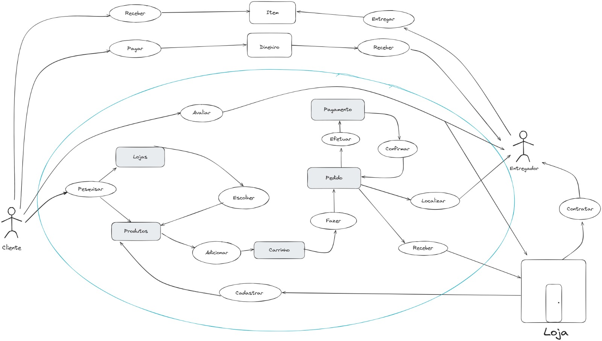

**Autor**: [Guilherme Westphall de Queiroz](https://github.com/west7)

---

**Figura 3**: <a id="bruno">Rich Picture do Bruno</a>

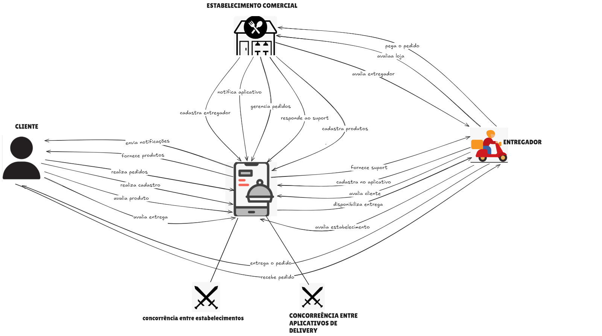

**Autor**: [Bruno Cunha Vasconcelos de Araújo](https://github.com/brunocva)

---

**Figura 4**: <a id="dutra">Rich Picture do Dutra</a>

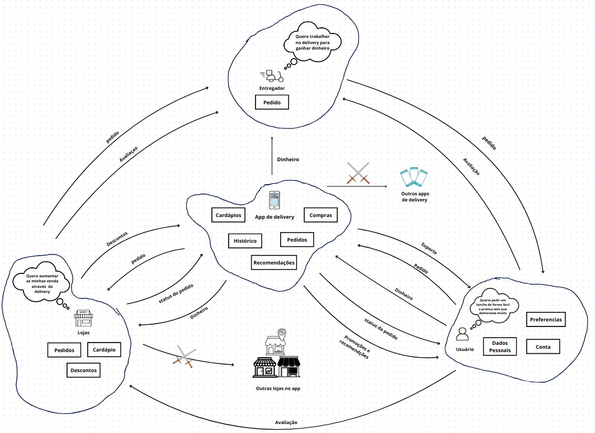

**Autor**: [Guilherme Silva Dutra](https://github.com/GuiDutra21)

---

**Figura 5**: <a id="kallyne">Rich Picture da Kallyne</a>

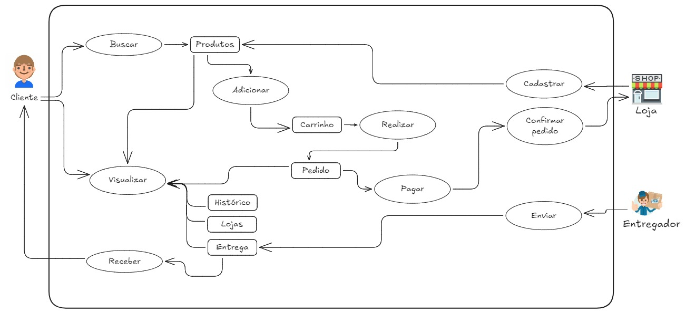

**Autor**: [Kallyne Macedo Passos](https://github.com/kalipassos)

---

**Figura 6**: <a id="lucas">Rich Picture do Lucas</a>

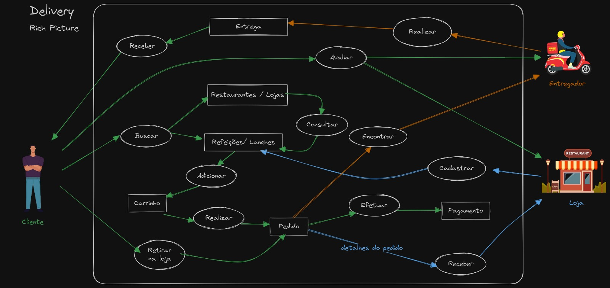

**Autor**: [Lucas Martins Gabriel](https://github.com/martinsglucas)

---

**Figura 7**: <a id="davi">Rich Picture do Davi</a>

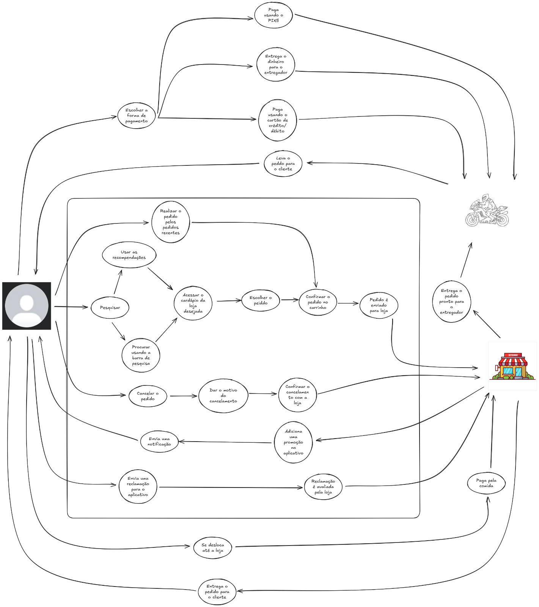

**Autor**: [Davi Gonçalves Akegawa Pierre](https://github.com/DaviPierre)

---

**Figura 8**: <a id="raquel">Rich Picture da Raquel</a>

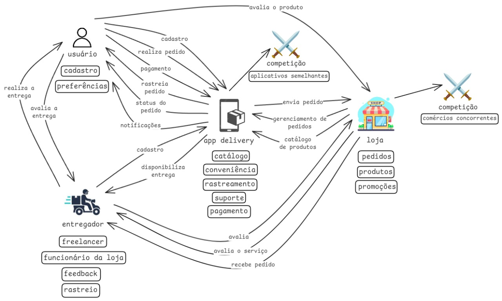

**Autor**: [Raquel Ferreira Andrade](https://github.com/raquel-andrade)

---

**Figura 9**: <a id="wolfgang">Rich Picture do Wolfgang</a>

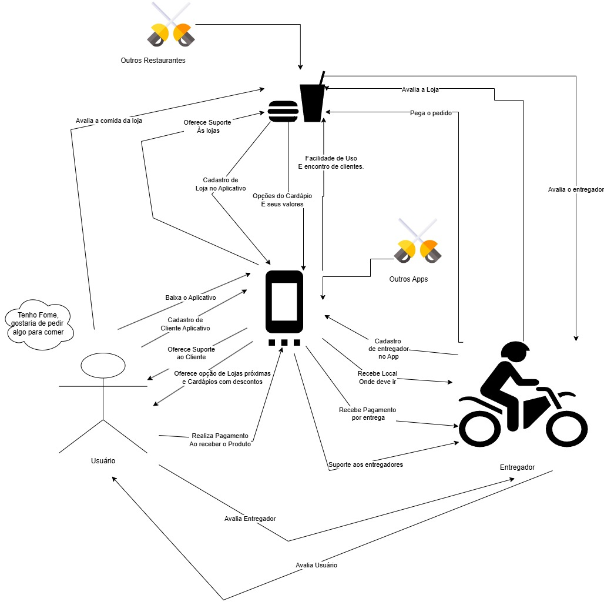

**Autor**: [Wolfgang Friedrich Stein](https://github.com/Wolffstein)

---

**Figura 10**: <a id="gabryel">Rich Picture do Gabryel</a>

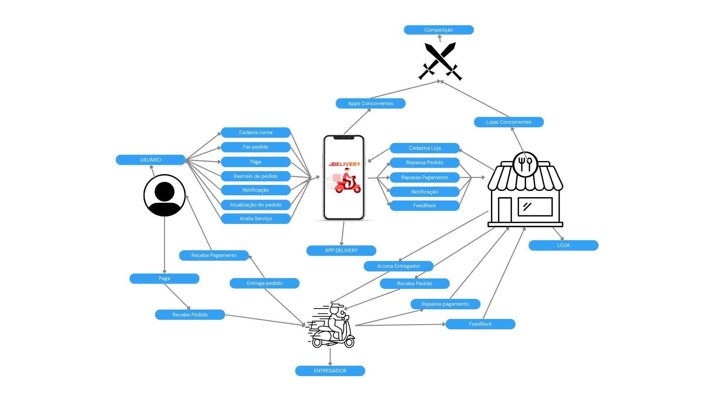

**Autor**: [Gabryel Nicolas Soares de Sousa](https://github.com/gabryelns)

---

**Figura 11**: <a id="leonardo">Rich Picture do Leonardo</a>

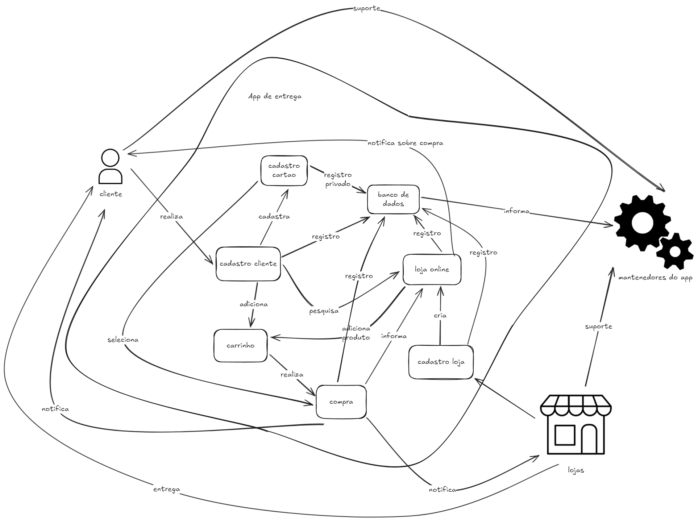

**Autor**: [Leonardo Sobrinho de Aguiar](https://github.com/Leonardo0o0)

## Referências

1. CTEC2402 Software Development Project. Introducing Rich Pictures. Disponível em: https://www.scribd.com/document/227529428/Rich-Picture-Guidelines Acesso em 31 de outubro 2024.

## Histórico de Versões

| Versão | Data da alteração | Comentário                                             | Autor(es)                                       | Revisor(es) | Data de revisão |
| ------ | ----------------- | ------------------------------------------------------ | ----------------------------------------------- | ----------- | --------------- |
| 1.0    | 31/10/2024        | Adiciona Introdução, Metodologia e Rich pictures 1 e 2 | [Guilherme Westphall](https://github.com/west7) | [Gabryel Nicolas Soares de Sousa](https://github.com/gabryelns) | 04/11/2024 |
| 1.1    | 03/11/2024        | Adicionando Rich Pictures 3 a 11 | [Raquel Andrade](https://github.com/raquel-andrade), [Wolfgang Stein](https://github.com/Wolffstein) |   [Júlio Roberto da Silva Neto](https://github.com/JulioR2022)          |  04/11/2024   |