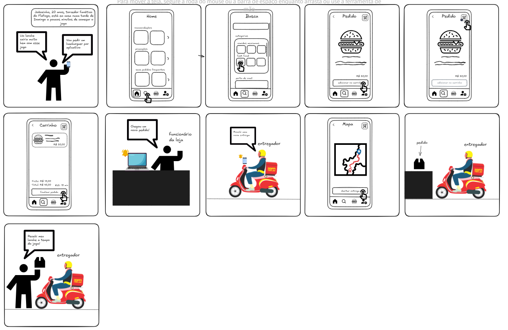

# 1.1.3. Storyboarding

## Introdução

Storyboarding é uma técnica visual utilizada para elaborar a narrativa de um projeto, seja ele um filme, uma peça e mesmo um produto digital. Consiste em uma série de quadros sequenciais, que ilustram as principais cenas, eventos ou interações da história que será contada.

Cada quadro do storyboard geralmente contém uma imagem, um esboço ou uma descrição visual do que ocorrerá naquela cena, acompanhada por legendas ou anotações que explicam ações, diálogos e contextos. A ideia é criar uma representação visual do fluxo do projeto, ajudando a equipe a visualizar e a planejar a narrativa, identificar pontos de transição e entender como as cenas e interações se conectarão.

## Metodologia

Foi organizada uma reunião entre os integrantes da equipe para que, em conjunto, fosse definido uma situação comum de utilização de um aplicativo de delivery, buscando definir os desejos dos clientes e como o processo de entrega se desenvolve.

## Artefato produzido

**Figura 1**: Storyboarding

**Autor**: [Felipe Amorim](https://github.com/lipeaaraujo), [Júlio Roberto da Silva Neto](https://github.com/JulioR2022),
[Lucas Martins Gabriel](https://github.com/martinsglucas), [Guilherme Silva Dutra](https://github.com/GuiDutra21), [Bruno Cunha Vasconcelos de Araújo](https://github.com/brunocva), [Guilherme Westphall de Queiroz](https://github.com/west7)

**Link**: https://excalidraw.com/#json=auQh_2HDYa5DChj1MYIny,K_F58nZ4YLJgrZdPg9VQtw

## Fluxo do artefato produzido

* **Painel 1:**

    No painel 1, foi representado um cliente do aplicativo a ser produzido. Nele, o cliente resolve pedir um lanche para comer.

* **Painel 2:**

    No painel 2, mostra o que seria o início do fluxo do cliente em nosso aplicativo. O cliente está na página inicial, selecionando a aba de pesquisa.

* **Painel 3:**

    No painel 3, mostra a página de pesquisa, onde o cliente seleciona um lanche que ele gostou.

* **Painel 4:**

    No painel 4, mostra a página de seleção do lanche, onde o cliente tem a opção e executa a ação de adicionar o lanche ao carrinho.

* **Painel 5:**

    No painel 5, mostra a página de seleção de lanche, onde o cliente decide abrir o carrinho.

* **Painel 6:**
    
    No painel 6, mostra a página do carrinho, onde o cliente pode ver os lanches que estão no carrinho e pode decidir realizar a compra. Nesse caso, o cliente está finalizando o pedido.

* **Painel 7:**
    
    No painel 7, mostra o que seria a loja recebendo o pedido que o cliente fez.

* **Painel 8:**

    No painel 8, mostra o entregador recebendo a notificação de entrega do pedido do nosso cliente.

* **Painel 9:**

    No painel 9, mostra o entregador aceitando a entrega no que seria a página de visualização de viagem do aplicativo.

* **Painel 10:**

    No painel 10, mostra o entregador pegando o pedido do cliente.

* **Painel 11:**

    No painel 11, mostra o entregador entregando o pedido ao cliente.

## Referências

1. **O que é Storyboard? Como fazer? Veja modelos e exemplos**. Disponivel em: https://miro.com/pt/storyboard/o-que-e-storyboard/#como-storyboards-s%C3%A3o-usados-na-%C3%A1rea-de-product?. Acesso em 3 de nov. 2024.

## Histórico de Versões

| Versão | Data da alteração | Comentário | Autor(es) | Revisor(es) | Data de revisão |
|--------|-----------|-----------|-----------|-------------|-------------|
| 1.0 | 02/11/2024 | Adiciona Introdução, Metodologia e inserção de artefatos produzidos  | [Júlio Roberto da Silva Neto](https://github.com/JulioR2022) | [Kallyne Passos](https://github.com/kalipassos) | 03/11/2024 |
| 1.1 | 03/11/2024 | Adiciona Fluxo do Storyboard  | [Leonardo Aguiar](https://github.com/Leonardo0o0) | [Kallyne Passos](https://github.com/kalipassos) | 03/11/2024 |
