## Introdução

As metodologias ágeis desempenham um papel crucial no desenvolvimento de projetos, proporcionando flexibilidade, eficiência e colaboração contínua entre os membros da equipe. A adoção de práticas ágeis, como [Scrum](#scrum), [Kanban](#kanban) e [XP](#xp-extreme-programming), permite uma melhor adaptação às mudanças e uma entrega incremental de valor ao cliente. Neste documento, exploraremos como essas metodologias serão aplicadas no projeto.

## Metodologias

Para a organização do projeto, utilizaremos uma abordagem que combina práticas do [Scrum](#scrum), [Kanban](#kanban]) e [XP](#xp-extreme-programming) como descritas a seguir. 

### Scrum

O Scrum é um framework ágil para o desenvolvimento de produtos complexos. O Scrum é baseado em um conjunto de valores, princípios e práticas que fornecem a base para a tomada de decisões em um ambiente de mudança e incerteza. O Scrum é composto por três papéis, cinco eventos e três artefatos. Os cinco eventos do Scrum são: Sprint, Sprint Planning, Daily Scrum, Sprint Review e Sprint Retrospective. Faremos uso de três eventos e uma adaptação para a organização do projeto:
    
- **Sprint**: É um período de um mês ou menos durante o qual um “Pronto”, utilizável, e um incremento de produto potencialmente liberável é criado. Sprints têm durações consistentes ao longo de um esforço de desenvolvimento. Uma nova Sprint começa imediatamente após a conclusão do Sprint anterior.
- **Sprint Planning**: Esse é o ponto de partida de cada sprint. Durante o planejamento, o time de desenvolvimento seleciona itens do backlog que serão desenvolvidos na sprint, com base nas prioridades definidas e na capacidade do time.
- **Sprint Review**: Ao final da sprint, o time apresenta o incremento do produto para os demais stakeholders. Essa apresentação é uma oportunidade para coletar feedback sobre o trabalho realizado e verificar se ele atende aos critérios definidos.
- **Sprint Checkpoint**: Momento na metade da sprint em que o time se reúne para reportar seu progresso e seus bloqueios nas atividades. No contexto do projeto, substitui a Daily (Reunião diária).

Todos os artefatos do Scrum serão utilizados no contexto do projeto, e eles são:

- **Product Backlog**:  é uma lista ordenada de tudo que é conhecido a respeito do produto que precisa ser feito. 
- **Sprint Backlog**: é a lista de elementos selecionados do Product Backlog que o time de desenvolvimento se compromete a transformar em um incremento de produto potencialmente entregável. 
- **Incremento**: é o produto potencialmente entregável que o time de desenvolvimento constrói a cada sprint.

### Kanban

O Kanban é uma estrutura visual de gestão de trabalho relevante no contexto do desenvolvimento ágil na medida em que permite acompanhar um fluxo contínuo das atividades de forma limpa, simples e eficaz. O quadro Kanban é dividido em colunas que, através do armazenamento dos cartões (tarefas), representam os diferentes estágios do trabalho: 
- **Backlog (to-do)**: Coluna em que ficam listadas todas as tarefas que ainda não foram iniciadas mas que estão previstas para serem executadas.
- **In Progress**: Coluna que armazena os cartões de tarefas já em execução pelos membros da equipe.
- **Review/Validation** :Coluna que armazena as tarefas que precisam passar por validação para serem concluídas, caracterizando um ponto de controle de qualidade no processo.  
- **Done**: Coluna que armazena as tarefas que já passaram por todas as outras etapas do processo e foram finalizadas.

No projeto, a estrutura do Kanban será aplicada adaptada em conjunto com as técnicas Scrum e XP, através do uso das GitHub Issues, ferramenta de planejamento e visualização atrelada ao repositório. Dessa forma, os to-dos (tarefas a fazer) são dependentes do Product e Sprint Backlog. 

### XP (Extreme Programming)

O XP (Extreme Programming ou Programação Extrema) é uma metodologia de desenvolvimento de software que se baseia em uma série de valores e princípios como comunicação, simplicidade, feedback, coragem, respeito, feedback rápido, simplicidade, mudanças contínuuas, alta qualidade, pequenos passos e melhoria, fundamentados por um conjunto de práticas de desenvolvimento.

As práticas constituem o núcleo central do processo no XP, as quais ajudam na rapidez, qualidade e flexibilidade no desenvolvimento de um software, são elas: Cliente presente, Planejamento, Stand Up Meeting, Programação em par, Testes constantes, Refatoração, Código coletivo, Padronização do código, Design simples, Metáfora, Ritmo sustentável, Semana de 40 horas, Integração contínua, Releases curtos.

No contexto do projeto tilizaremos uma abordagem adaptada do XP que se refere a dois principais rituais:

- **Programação em pares**: Programação em par (dupla) em um único computador. No contexto utilizado, a utilização de ferramentas como o Liveshare, Excalidraw e Miro para a colaboração entre duas ou mais pessoas em um mesmo artefato, diminuindo a possibilidade de falhas e garantindo a qualidade dos artefatos.
- **Melhoria contínua (refatoração)**: A revisão e melhoria constante dos artefatos gerados por outros membros, a fim de garantir a qualidade e a detecção de possíveis erros.

## Modelagem BPMN

Nesse documento, o fluxo de trabalho do projeto será organizado de acordo com uma adaptação do modelo Business Process Model and Notation (BPMN). Esse modelo consiste em organizar os processos em piscinas (pools) contendo as atividades que serão realizadas em cada etapa do projeto. Essas atividades serão subdivididas em raias horizontais (lanes) que representarão os possíveis responsáveis pelo cumprimento das tarefas mencionadas na atividade. Essas raias, por sua vez, serão subdivididas em fases verticais que serão responsáveis por indicar o tempo necessário para o cumprimento das tarefas.
As tarefas, bem como as piscinas, se comunicam umas com as outras por meio de conectores que podem ser vistos na [Tabela 1](#tabela-1-legenda-dos-conectores) abaixo.

### Tabela 1: Legenda dos conectores

| Imagem                                            S                         | Descrição                                                                   |
| --------------------------------------------------------------------------- | --------------------------------------------------------------------------- |
| 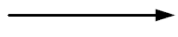                    | Representa o fluxo ideal das atividades em questão                          |
| 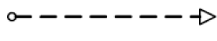 | Representa o fluxo das mensagens enviadas de um remetente a um destinatário |
| 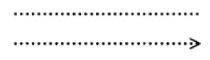   | Representa a ligação de uma tarefa ou atividade a um artefato específico    |

Cada uma das piscinas (atividades) terá um símbolo correspondente, que será responsável por representar os diferentes tipos e suas necessidades. Tais símbolos e seus significados podem ser encontrados na [Tabela 2](#tabela-2-legenda-dos-símbolos-das-atividades) abaixo.

### Tabela 2: Legenda dos símbolos das atividades

| Imagem                                                                                       | Descrição                                                                                                   |
| -------------------------------------------------------------------------------------------- | ----------------------------------------------------------------------------------------------------------- |
|                             | Representa uma atividade ou tarefa que tem muitas possibilidades de ser classificada                        |
|                        | Representa uma atividade ou tarefa que necessita de um serviço externo ou automação ara ser realizado       |
|                     | Representa uma atividade ou tarefa que envia uma mensagem para outra atividade ou tarefa                    |
|           | Representa uma atividade ou tarefa que que recebe uma mensagem de outra atividade ou tarefa                 |
|                             | Representa uma atividade ou tarefa que necessita de um trabalho humano para ser concluída                   |
|                                | Representa uma atividade ou tarefa que necessita de um trabalho manual para ser conclída                    |
|             | Representa uma atividade ou tarefa que utiliza de uma regra de negócio                                      |
|           | Representa uma atividade ou tarefa que sua conclusão exige a criação de um script                           |
|  | Representa uma atividade intermediária no processo                                                          |
| 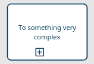            | Representa uma etapa do processo maior que uma única atividade e que deve ser representada em outra piscina |
|                                 | Representa o fim de um processo                                                                            |
|                                 | Representa o início de um processo                                                                          |
|                                                | Representa uma escolha que será feita dependendo de como está o estado do projeto                           |

Nessa etapa do trabalho  vamos demonstrar como essas várias metodologias trabalharam juntas a fim de criar um planejamento de trabalho. Estes artefatos foram feitos utilizando a plataforma Miro, no qual os alunos se reuniram e trabalharam todos em conjunto para esta criação.

### Imagem 1: Piscina do SCRUM

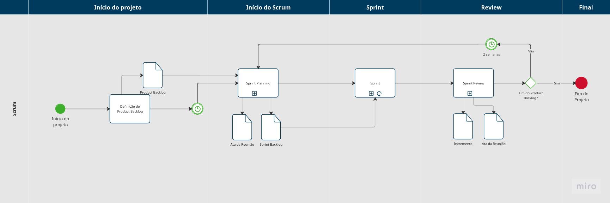 

Na [imagem 1](#imagem-1-piscina-do-scrum) podemos ver como a atividade do SCRUM será realizada no decorrer do projeto

### Imagem 2: Piscina do Sprint Planning

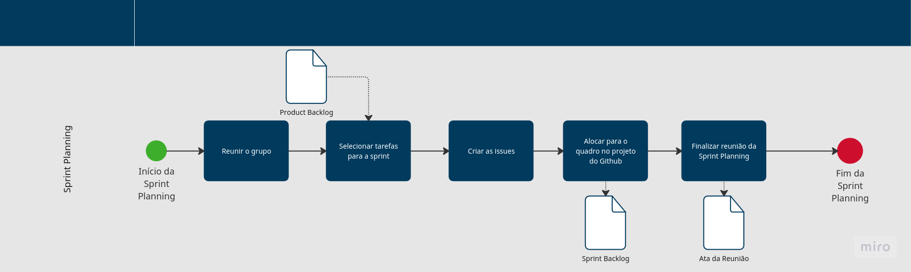 

Na [imagem 2](#imagem-2-piscina-do-sprint-planning) podemos ver o sprint planning e todos os seus passos, como que o Product Backlog é uma entrada para serem criadas as issues.

### Imagem 3: Piscina da Sprint 

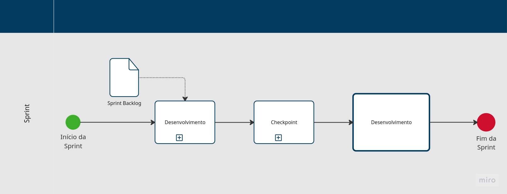 

Na [imagem 3](#imagem-3-piscina-da-sprint) mostra os devidos passos a serem seguidos e o que será gerado nessa piscina.

### Imagem 4: Piscina do Checkpoint

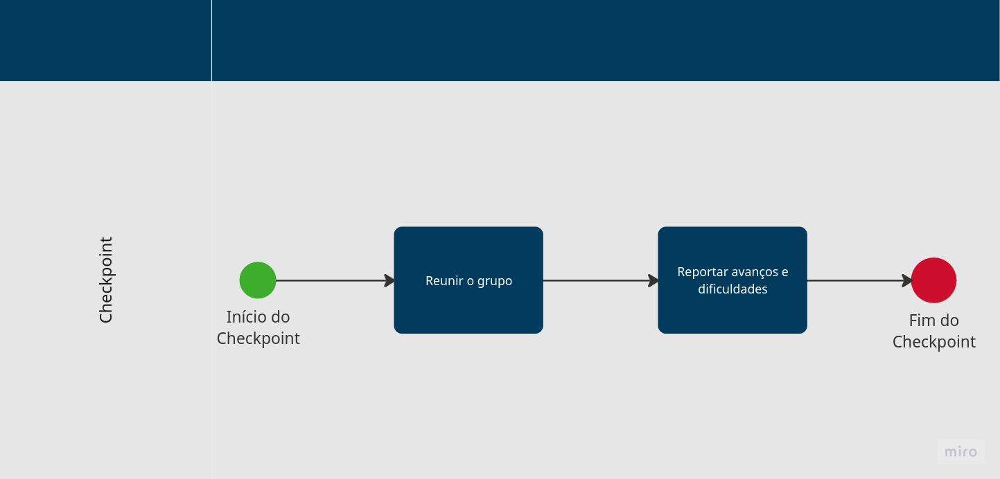 

Na [imagem 4](#imagem-4-piscina-do-checkpoint) mostra os passos a serem seguidos entre os diversos checkpoint.
    

### Imagem 5: Piscina do Desenvolvimento 

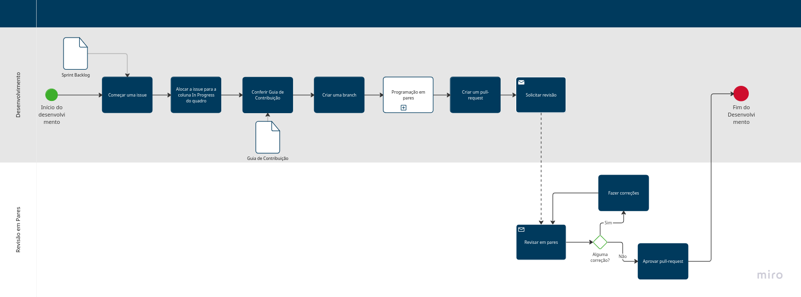

Na [imagem 5](#imagem-5-piscina-do-desenvolvimento) podemos verificar as etapas necessárias para desenvolver no projeto

### Imagem 6: Piscina da Programação por Pares

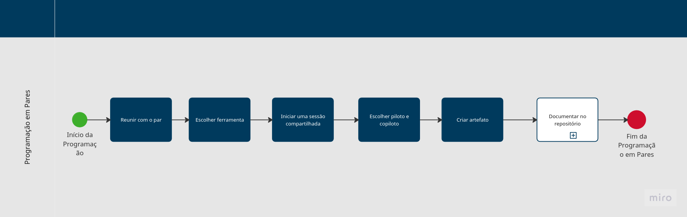

Na [imagem 6](#imagem-6-piscina-da-programação-por-pares) esta mostrando como deve ser seguido uma programação por pares (com mais de uma pessoa).

### Imagem 7: Piscina de Documentar no Repositório

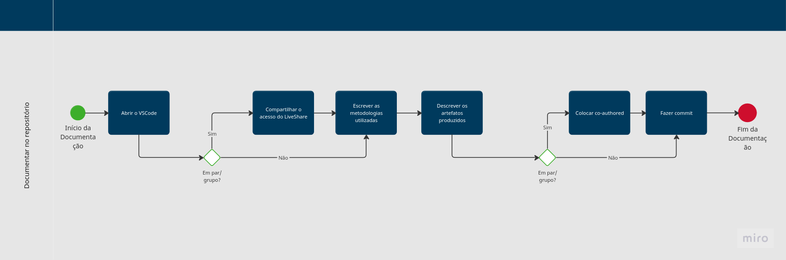

Na [imagem 7](#imagem-7-piscina-de-documentar-no-repositório) mostra o fluxo que o usuário deve seguir para documentar no repositório

### Imagem 8: Piscina da Sprint Review

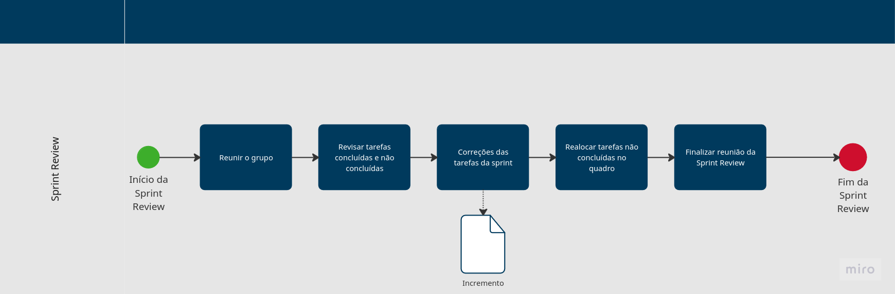

Na [imagem 8](#imagem-8-piscina-da-sprint-review) podemos verificar os passos da sprint review bem como quando a sprint review deve finalizar.

**Autores:** [Bruno Cunha Vasconcelos de Araújo](https://github.com/brunocva), [Davi Gonçalves Akegawa Pierre](https://github.com/DaviPierre), [Felipe Amorim](https://github.com/lipeaaraujo), [Júlio Roberto da Silva Neto](https://github.com/JulioR2022), [Lucas Martins Gabriel](https://github.com/martinsglucas), [Guilherme Westphall de Queiroz](https://github.com/west7), [Kallyne Macedo Passos](https://github.com/kalipassos), [Leonardo Sobrinho de Aguiar](https://github.com/Leonardo0o0), [Raquel Ferreira Andrade](https://github.com/raquel-andrade) ,[Wolfgang Friedrich Stein](https://github.com/Wolffstein)

## Referências 

1. OBJECT MANAGEMENT GROUP. *Business Process Model and Notation (BPMN)*. Disponível em: <https://www.omg.org/bpmn/>.
2. UNIVERSIDADE DE SÃO PAULO. *Notação BPMN 2*. São Paulo: USP, 2017. Disponível em: <https://edisciplinas.usp.br/pluginfile.php/4449285/mod_resource/content/0/Notacao-BPMN%202%20-%202017.pdf>. Acesso em 31 de outubro de 2024
3. ATLASSIAN. *Kanban — Uma breve introdução*. Disponível em: <https://www.atlassian.com/br/agile/kanban>. Acesso em 02 de novembro de 2024 
4. GUEDES, Marylene. O que é XP - Extreme Programming?. Disponível em https://www.treinaweb.com.br/blog/o-que-e-xp-extreme-programming. Acesso em 02 de novembro de 2024
5. SCRUMGUIDES. *What is Scrum?* Disponível em: https://www.scrumguides.org/docs/scrumguide/v2017/2017-Scrum-Guide-US.pdf. Acesso em 02 de novembro de 2024

## Histórico de Versões

| Versão | Data da alteração | Comentário                                                                                    | Autor(es)                                                                                                                                                                                                                                                                                        | Revisor(es) | Data de revisão |
| ------ | ----------------- | --------------------------------------------------------------------------------------------- | ------------------------------------------------------------------------------------------------------------------------------------------------------------------------------------------------------------------------------------------------------------------------------------------------ | ----------- | --------------- |
| 1.0    | 31/10/2024        | Criação da Introdução, Tabela 1 e Tabela 2                                                    | [Davi Pierre](https://github.com/DaviPierre) | [Guilherme Silva Dutra](https://github.com/GuiDutra21) | 03/11/2024 |
| 1.1    | 02/11/2024        | Adicionando introdução das metodologias                                                       | [Felipe Amorim de Araújo](https://github.com/lipeaaraujo), [Kallyne Macedo Passos](https://github.com/kalipassos), [Raquel Ferreira Andrade](https://github.com/raquel-andrade), [Júlio Roberto da Silva Neto](https://github.com/JulioR2022), [Lucas Martins](https://github.com/martinsglucas) | [Leonardo Aguiar](https://github.com/Leonardo0o0) | 03/11/2024 |
| 1.2    | 03/11/2024        | Finalização do artefato de BPMN com a documentação das imagens de 1 a 8 e as legendas das próprias | [Davi Pierre](https://github.com/DaviPierre),  [Wolfgang Friedrich Stein](https://github.com/Wolffstein) | [Felipe Amorim de Araújo](https://github.com/lipeaaraujo), [Gabryel Nicolas Soares de Sousa](https://github.com/gabryelns) |  03/11/2024 |