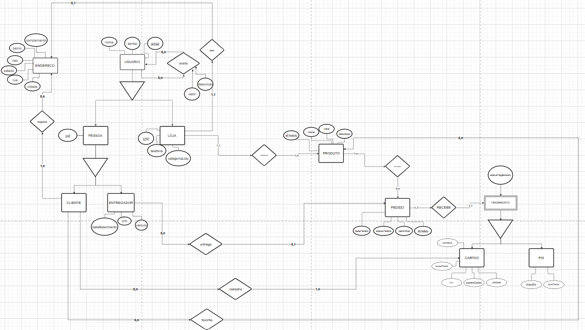

# Modelo Relacional

## Introdução

O Diagrama de Modelo Relacional (DMR) é uma representação visual fundamental na arquitetura de bancos de dados que mapeia a estrutura e os relacionamentos entre dados em um sistema. Esta ferramenta de modelagem traduz requisitos de negócio em estruturas lógicas de armazenamento, buscando representar entidades, atributos e suas conexões, de forma a comunicar efetivamente a arquitetura do banco de dados para diferentes stakeholders. 

## Metodologia

Foi separada uma equipe de três integrantes responsáveis para a elaboração do Diagrama de Modelo Relacional, integrantes estes descritos na **Tabela 01**. O diagrama em questão foi desenvolvido a partir dos preceitos da modelagem conceitual de um banco de dados, contando com a identificação das entidades, definição dos relacionamentos, determinação de cardinalidade e com a identificação de atributos principais.

### Tabela 01: Integrantes
| Número | Integrante                                                   |
|--------|--------------------------------------------------------------|
| 1      | [Júlio Roberto da Silva Neto](https://github.com/JulioR2022) |
| 2      | [Kallyne Macedo Passos](https://github.com/kalipassos)       |
| 3      | [Wolfgang Friedrich Stein](https://github.com/Wolffstein)    |

## Diagrama do Modelo Relacional

**Autores**: [Júlio Roberto da Silva Neto](https://github.com/JulioR2022), [Kallyne Macedo Passos](https://github.com/kalipassos), [Wolfgang Friedrich Stein](https://github.com/Wolffstein)

**Disponível em**: [Diagrama de Modelo Relacional](https://drive.google.com/file/d/1XPdnkWzAXDTOlLEV3FFoSbgc6ncnuU2A/view?usp=sharing)

## Conclusão

A modelagem relacional através do diagrama apresentado apoia os esforços de garantir a integridade, eficiência e escalabilidade dos dados em sistemas pois não apenas atua como documentação da estrutura do banco de dados, mas também serve como base para implementação e evolução do aplicativo.

## Referências

1. DevMedia, Modelagem Relacional. Disponível em: https://www.devmedia.com.br/modelagem-relacional/19614

## Histórico de Versão

| Versão | Data da alteração | Comentário | Autor(es) | Revisor(es) | Data de revisão |
|--------|-----------|-----------|-----------|-------------|-------------|
| 1.0 | 26/11/2024 | Criação do documento, adiciona introdução e metologia. | [Júlio Roberto da Silva Neto](https://github.com/JulioR2022) | [Kallyne Macedo Passos](https://github.com/kalipassos)       | 28/11/2024 |  |
| 1.1 | 28/11/2024 | Conclusão e correções de forma | [Kallyne Macedo Passos](https://github.com/kalipassos)    |  [Felipe Amorim de Araújo](https://github.com/lipeaaraujo)      | 28/11/2024 |  |