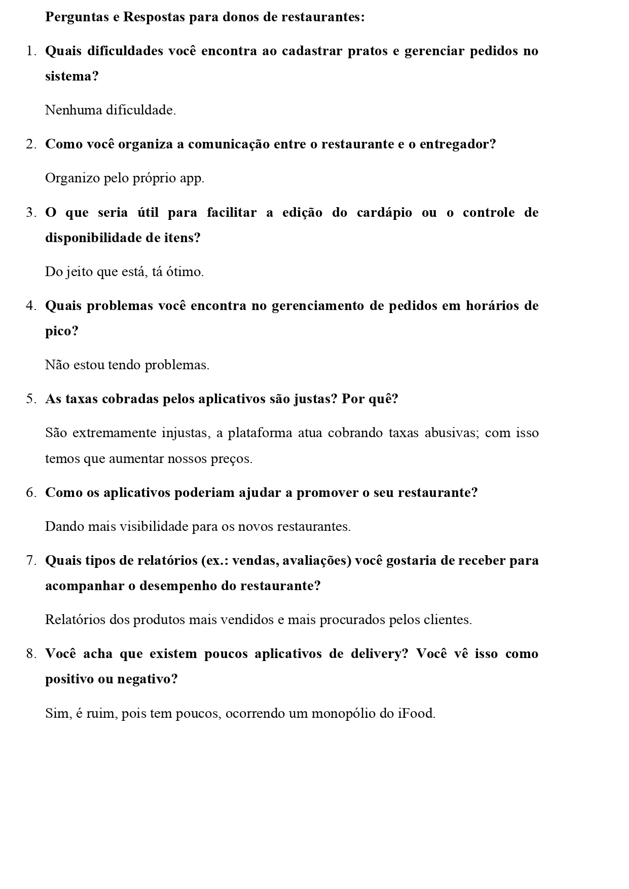
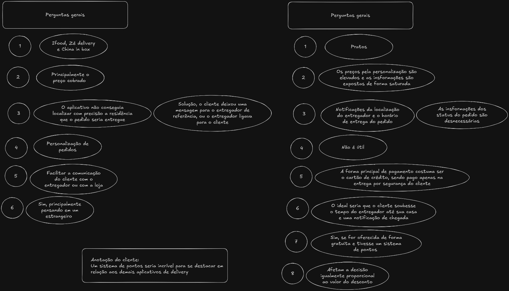

# Entrevistas

## Introdução

As entrevistas são uma técnica comumente utilizada para extrair os detalhes na elicitação de requisitos, elas envolvem uma discussão entre um entrevistador, que geralmente faz parte da equipe de desenvolvimento, e um stakeholder ou parte interessada no sistema em desenvolvimento. A técnica é eficiente e eficaz para obter conhecimento profundo, sentimentos, objetivos, esclarecer tópicos complexos e corrigir ambiguidades de diferentes indivíduos tanto para a elicitação e para validação dos requisitos de software. Apesar de estar limitada pela linha de questionamento do entrevistador, através da discussão são documentados os fatores que podem estar associados aos requisitos fornecendo uma visão geral de todo o sistema.

As entrevistas estão separadas em:

- **Estruturadas**: entrevista baseada em um conjunto fixo de perguntas
- **Não estruturadas**: entrevista conversacional, baseada em discussões abertas
- **Semi-estruturada**: baseada numa combinação de perguntas pré-definidas e não planejadas

## Metodologia

A equipe trabalhou a técnica de entrevista por meio de uma abordagem semi-estruturada. Foram escolhidos previamente 4 entrevistadores que ficariam responsáveis por realizarem uma ou mais entrevistas cada um. A escolha dos stakeholders a serem entrevistados foi feita com base nos principais perfis interessados no sistema (**clientes**, **entregadores** ou **donos de restaurantes**). Os integrantes do grupo responsáveis pelas entrevistas estão listados na **tabela 1** a seguir:

### Tabela 1: Participantes

| Matrícula | Aluno                                                            |
| --------- | ---------------------------------------------------------------- |
| 221034973 | [Bruno Cunha Vasconcelos de Araújo](https://github.com/brunocva) |
| 190105071 | [Davi Gonçalves Akegawa Pierre](https://github.com/DaviPierre)   |
| 221022275 | [Felipe Amorim de Araújo](https://github.com/lipeaaraujo)        |
| 200022199 | [Leonardo Sobrinho de Aguiar](https://github.com/Leonardo0o0)    |

Foi pré-definido um conjunto de perguntas norteadoras para as entrevistas, as mesmas foram elaboradas com a importancia das linhas de questionamento em mente, buscando extrair o máximo de informações relevantes dos diferentes stakeholders entrevistados.

### Perguntas

#### Perguntas de cunho geral

> 1. Quais aplicativo de delivery você costuma usar? O que mais gosta neles?
> 2. O que você considera essencial em um aplicativo de delivery?
> 3. Já teve alguma experiência ruim ao usar um aplicativo de delivery? Pode contar o que aconteceu?
> 4. O que você sente falta nos seus aplicativos de delivery favoritos?
> 5. Quais tipos de suporte você gostaria de ter em um aplicativo de delivery?
> 6. Você acha que há necessidade de suporte a diferentes idiomas no aplicativo?

#### Perguntas para clientes

> 1. Você prefere pesquisar por restaurantes ou por pratos específicos? Por quê?
> 2. Como você se sente sobre o processo de personalizar pedidos (ex.: retirar ingredientes)? É fácil?
> 3. Quais tipos de notificações você considera úteis durante um pedido?
> 4. Você gostaria de poder agendar pedidos para horários futuros?
> 5. Quais formas de pagamento você prefere? Alguma delas já deu problema para você?
> 6. Como seria o recurso ideal para rastrear seu pedido?
> 7. Um programa de fidelidade (ex.: pontos, cupons) é algo que influenciaria seu uso do aplicativo?
> 8. Promoções ou descontos afetam suas escolhas? De que forma?

#### Perguntas para donos de restaurantes

> 1. Quais dificuldades você encontra ao cadastrar pratos e gerenciar pedidos no sistema?
> 2. Como você organiza a comunicação entre o restaurante e o entregador?
> 3. O que seria útil para facilitar a edição do cardápio ou o controle de disponibilidade de itens?
> 4. Quais problemas você encontra no gerenciamento de pedidos em horários de pico?
> 5. As taxas cobradas pelos aplicativos são justas? Por quê?
> 6. Como os aplicativos poderiam ajudar a promover o seu restaurante?
> 7. Quais tipos de relatórios (ex.: vendas, avaliações) você gostaria de receber para acompanhar o desempenho do restaurante?
> 8. Você acha que existem poucos aplicativos de delivery? Você vê isso como positivo ou negativo?

#### Perguntas para entregadores

> 1. Quais são os maiores desafios que você enfrenta durante uma entrega?
> 2. Como você prefere receber informações sobre um pedido (ex.: texto, mapas, instruções claras)?
> 3. Qual seria a funcionalidade ideal para ajudar na sua rotina de entregas?
> 4. O rastreamento em tempo real ajuda ou atrapalha no seu trabalho? Por quê?
> 5. Como você gostaria de ser notificado sobre novos pedidos (ex.: som, vibração)?
> 6. Como você avalia os sistemas de pagamento dos aplicativos que já usou? Alguma melhoria que gostaria de ver?
> 7. Você recebe suporte suficiente dos aplicativos em caso de problemas com clientes ou restaurantes?

Com as respostas obtidas nas entrevistas foi gerado uma tabela de elicitação ([tabela 2](/Modelagem/Extra/Elicitacao/Entrevistas.md#tabela-2-requisitos-elicitados)) com todos os requisitos elicitados, a [tabela 2](/Modelagem/Extra/Elicitacao/Entrevistas.md#tabela-2-requisitos-elicitados) pode ser encontrada após a seção das entrevistas

## Entrevistas

### Entrevista 1

A entrevista 1 foi realizada no dia 24/11/2024 com o estudante de Engenharia de Software na UnB, João Vitor, e com o entrevistador [Felipe Amorim de Araújo](https://github.com/lipeaaraujo), utilizando a ferramenta de reuniões Teams. O entrevistado nos permitiu usar a entrevista para fins de validação no nosso projeto.

<iframe width="560" height="315" src="https://www.youtube.com/embed/zy7KxT5LnR4?si=Dw0uRsoKeE2bbiP8" title="YouTube video player" frameborder="0" allow="accelerometer; autoplay; clipboard-write; encrypted-media; gyroscope; picture-in-picture; web-share" referrerpolicy="strict-origin-when-cross-origin" allowfullscreen></iframe>

**Autores:** [Felipe Amorim de Araújo](https://github.com/lipeaaraujo)

Um documento com as respostas do entrevistado foi gerado durante a entrevista, o mesmo foi utilizado como base para a elitação dos requisitos. O documento pode ser encontrado a seguir:

<iframe src="https://drive.google.com/file/d/1n6V1_1wnds1jd30d0Sj7CFnCL3bVq8pw/preview" width="100%" height=600px></iframe>

### Entrevista 2

A entrevista 2 foi realizada no dia 25/11/2024 com o comerciante Júlio Cesar, proprietário do Food Truck Blood Brothers, e com o entrevistador [Bruno Araújo](https://github.com/brunocva), utilizando a ferramenta de reuniões Teams. O entrevistado nos permitiu usar a entrevista para fins de validação no nosso projeto.

<iframe width="560" height="315" src="https://www.youtube.com/embed/Fd-mN2RQdZs?si=2Ea4ReXYgz0OFStV" title="YouTube video player" frameborder="0" allow="accelerometer; autoplay; clipboard-write; encrypted-media; gyroscope; picture-in-picture; web-share" referrerpolicy="strict-origin-when-cross-origin" allowfullscreen></iframe>

**Autores:** [Bruno Araújo](https://github.com/brunocva)

Um documento com as respostas do entrevistado foi gerado durante a entrevista, o mesmo foi utilizado como base para a elitação dos requisitos. O documento pode ser encontrado a seguir:

### Entrevista 3

A entrevista 3 foi realizada no dia 25/11/2024 com a estudante de Engenharia Aeroespacial na UnB, Luisa Musse, e com o entrevistador [Leonardo Aguiar](https://github.com/Leonardo0o0), utilizando a ferramenta de reuniões Teams. A entrevistada nos permitiu usar a entrevista para fins de validação no nosso projeto.

<iframe width="560" height="315" src="https://www.youtube.com/embed/hoGwOpZyQRg?si=kygZol3R3zyeJAPR" title="YouTube video player" frameborder="0" allow="accelerometer; autoplay; clipboard-write; encrypted-media; gyroscope; picture-in-picture; web-share" referrerpolicy="strict-origin-when-cross-origin" allowfullscreen></iframe>

**Autor** [Leonardo Aguiar](https://github.com/Leonardo0o0).

Um documento com as respostas do entrevistado foi gerado durante a entrevista, o mesmo foi utilizado como base para a elitação dos requisitos. O documento pode ser encontrado a seguir:

<iframe src="https://drive.google.com/file/d/19lgtAAuuWTiCNGxwHUfZ8UmN8Qtj1soH/preview" width="100%" height=600px></iframe>

### Entrevista 4

A entrevista 4 foi realizada no dia 26/11/2024 com o usuário padrão de um aplicativo delivery Luis Felipe, e com o entrevistador [Davi Gonçalves Akegawa Pierre](https://github.com/DaviPierre), utilizando a ferramenta de reuniões Teams. O entrevistado nos permitiu usar a entrevista para fins de validação no nosso projeto.

<iframe width="560" height="315" src="https://www.youtube.com/embed/wYqew2vSPco?si=WpEmN9sajLjQide-" title="YouTube video player" frameborder="0" allow="accelerometer; autoplay; clipboard-write; encrypted-media; gyroscope; picture-in-picture; web-share" referrerpolicy="strict-origin-when-cross-origin" allowfullscreen></iframe>

**Autores:** [Davi Gonçalves Akegawa Pierre](https://github.com/DaviPierre)

Um documento com as respostas do entrevistado foi gerado durante a entrevista, o mesmo foi utilizado como base para a elitação dos requisitos. O documento pode ser encontrado a seguir:

### Tabela 2: Requisitos elicitados

| Número             | Descrição                                                                                                                                                          | Tipo |
| ------------------ | ------------------------------------------------------------------------------------------------------------------------------------------------------------------ | ---- |
| <a id="e01">1</a>  | O aplicativo deve organizar os restaurantes e pratos por categorias (lanches, lojas, alimentos), preço, distância e tempo estimado.                                | RF   |
| <a id="e02">2</a>  | O aplicativo deve permitir a localização precisa da residência do cliente.                                                                                         | RF   |
| <a id="e03">3</a>  | O sistema deve enviar notificações ao cliente sobre o status do pedido, incluindo quando o pedido sair para entrega, estiver próximo de chegar ou houver atrasos.  | RF   |
| <a id="e04">4</a>  | O aplicativo deve permitir a personalização de pedidos (ex.: remover ou adicionar ingredientes), exibindo claramente as observações e garantindo padronização.     | RF   |
| <a id="e05">5</a>  | O sistema deve permitir a comunicação entre o cliente e o entregador, e entre o cliente e a loja, para tratar observações ou problemas no pedido.                  | RF   |
| <a id="e06">6</a>  | O aplicativo deve oferecer suporte em múltiplos idiomas, como espanhol e inglês, para facilitar o uso internacional.                                               | RF   |
| <a id="e07">7</a>  | O aplicativo deve permitir o pagamento por diferentes métodos, incluindo PIX, cartão de crédito, crédito do aplicativo, vale-refeição, dinheiro e agendamento.     | RF   |
| <a id="e08">8</a>  | O aplicativo deve oferecer um sistema de avaliação, permitindo que o cliente avalie a experiência e se as observações foram atendidas, impactando na reputação.    | RF   |
| <a id="e09">9</a>  | O aplicativo deve disponibilizar rastreamento em tempo real do pedido, com visualização no mapa e detalhes sobre o tempo estimado de entrega e status.             | RF   |
| <a id="e10">10</a> | O aplicativo deve permitir o agendamento de pedidos para horários futuros.                                                                                         | RF   |
| <a id="e11">11</a> | O aplicativo deve oferecer um programa de fidelidade, com sistema de pontos que acumule recompensas, descontos e cupons, e exiba o valor economizado pelo usuário. | RF   |
| <a id="e12">12</a> | O aplicativo deve apresentar promoções e descontos de forma destacada para incentivar pedidos e facilitar sua localização.                                         | RF   |
| <a id="e13">13</a> | O sistema deve permitir a compra de crédito do aplicativo para outras contas de forma segura.                                                                      | RF   |
| <a id="e14">14</a> | O aplicativo deve disponibilizar suporte por chat 24 horas para resolver problemas rapidamente.                                                                    | RF   |
| <a id="e15">15</a> | O aplicativo deve promover a visibilidade de novos restaurantes.                                                                                                   | RF   |
| <a id="e16">16</a> | O aplicativo deve oferecer uma interface intuitiva e eficiente, organizando informações (como personalização de pedidos) de forma clara e legível.                 | RNF  |

**Autores**: [Davi Gonçalves Akegawa Pierre](https://github.com/DaviPierre), [Felipe Amorim de Araújo](https://github.com/lipeaaraujo), [Bruno Cunha Vasconcelos de Araújo](https://github.com/brunocva),  [Leonardo Sobrinho de Aguiar](https://github.com/Leonardo0o0)

## Referências

1. REtraining Requirements Engineering. Guia facetado de técnicas elicitação de requisitos. Disponível em: https://retraining.inf.ufsc.br/guia/app/classificacoes/tecnicas-de-elicitacao-de-requisitos/entidades/tecnicas-de-elicitacao-de-requisitos-entrevista. Acesso em 16 de novembro de 2024.

## Histórico de Versão

| Versão | Data da alteração | Comentário                                                                 | Autor(es)                                                      | Revisor(es)                                   | Data de revisão |
| ------ | ----------------- | -------------------------------------------------------------------------- | -------------------------------------------------------------- | --------------------------------------------- | --------------- |
| 1.0    | 16/11/2024        | Criação do documento                                                       | [Felipe Amorim de Araújo](https://github.com/lipeaaraujo)      | [Guilherme Westphall](https:github.com/west7) | 28/11/2024      |
| 1.1    | 25/11/2024        | Adição do entrevista 1, e tabela de requisitos                             | [Felipe Amorim de Araújo](https://github.com/lipeaaraujo)      | [Guilherme Westphall](https:github.com/west7) | 28/11/2024      |
| 1.2    | 26/11/2024        | Adição de pergunta no questionário,, requisito tabela 2 e entrevista 2     | [Bruno Araújo](https://github.com/brunocva)                    | [Guilherme Westphall](https:github.com/west7) | 28/11/2024      |
| 1.3    | 26/11/2024        | Adição entrevista 3                                                        | [Leonardo Aguiar](https://github.com/Leonardo0o0)              | [Guilherme Westphall](https:github.com/west7) | 28/11/2024      |
| 1.4    | 26/11/2024        | Adição entrevista 4                                                        | [Davi Gonçalves Akegawa Pierre](https://github.com/DaviPierre) | [Guilherme Westphall](https:github.com/west7) | 28/11/2024      |
| 1.5    | 26/11/2024        | Juntando tabelas de requisitos, corrigindo links e fazendo rastreabilidade | [Felipe Amorim de Araújo](https://github.com/lipeaaraujo)      | [Guilherme Westphall](https:github.com/west7) | 28/11/2024      |
| 1.5    | 28/11/2024        | Adicionando documento de entrevista 3 | [Felipe Amorim de Araújo](https://github.com/lipeaaraujo)      | [Guilherme Westphall](https:github.com/west7) | 28/11/2024      |
