# Diagrama de Sequência

## Introdução

O diagrama de sequência, um dos diagramas dinâmicos mais relevantes da UML, é um tipo de diagrama de interação, que se concentra na troca de mensagens entre várias linhas de vida, que representam os objetos ou entidades participantes da interação. A interação é descrita com foco na ordem cronológica das mensagens trocadas, detalhando suas especificações de ocorrência ao longo das linhas de vida. Cada linha de vida está associada a um ator ou objeto no sistema, e as mensagens são representadas por setas, indicando o fluxo de comunicação entre elas.

## Metodologia

O diagrama de sequência foi elaborado baseado nos padrões da UML, utilizando os seguintes principais elementos:

| Elemento | Descrição | Exemplo |
|--|--|--|
| **Entidades** | Representam os atores, objetos ou componentes que participam da interação, e são retratadas por um retângulo. | 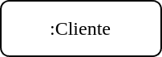 |
| **Linhas de Vida** | Cada entidade no diagrama possui uma linha de vida, que representa o tempo de vida do participante durante a interação. As linhas de vida são fundamentais para identificar o momento em que cada entidade interage e como ela se mantém ativa ao longo do processo. | 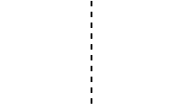 |
| **Métodos e Mensagens** | Representam a comunicação entre as entidades de uma interação, podendo ser síncronas (representa uma chamada de operação, em que envia mensagem e suspende a execução enquanto aguarda resposta, e são indicadas com setas preenchidas) ou assíncronas (envia mensagem e prossegue imediatamente sem esperar pelo valor de retorno, indicadas por uma seta aberta). Retornos de mensagens são representados por setas tracejadas, indicando a resposta ou conclusão de um método. | 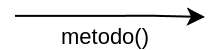 |
| **Especificação de Execução** | Representa o intervalo de tempo em que uma entidade executa uma operação ou está envolvida em uma atividade, como executar um comportamento ou ação dentro da linha de vida, enviar um sinal para outro participante, ou aguardar uma mensagem de resposta de outro participante. É indicada como um retângulo alongado sobre a linha de vida. |  |
| **Fragmento Combinado** | Define uma combinação (expressão) de fragmentos de interação, um fragmento combinado é definido por um operador de interação e operandos de interação correspondentes, como o Loop (utilizado para ações que se repetem), Opt (usado para ações opcionais que podem ou não ocorrer, dependendo de uma condição), Alt (utilizado em cenários alternativos, onde apenas uma opção será seguida). | 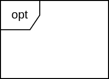 |
| **Ocorrência de Destruição** | Representa o momento em que uma entidade é destruída ou deixa de existir na interação, e é indicada por um "X" no final da linha de vida da entidade. | 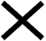 |

## Diagramas

### Solicitação de Pedido

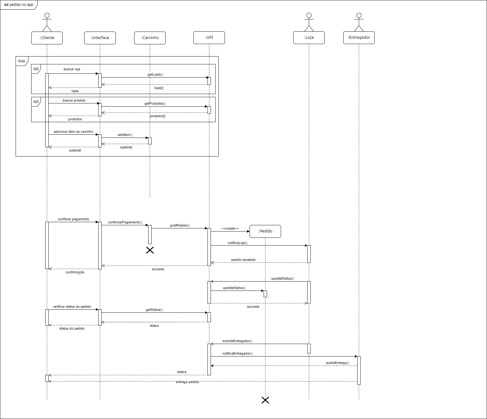

**Autores**: [Felipe Amorim de Araújo](https://github.com/lipeaaraujo), [Lucas Martins Gabriel](https://github.com/martinsglucas), [Guilherme Silva Dutra](https://github.com/GuiDutra21)

### Cadastro de Usuário

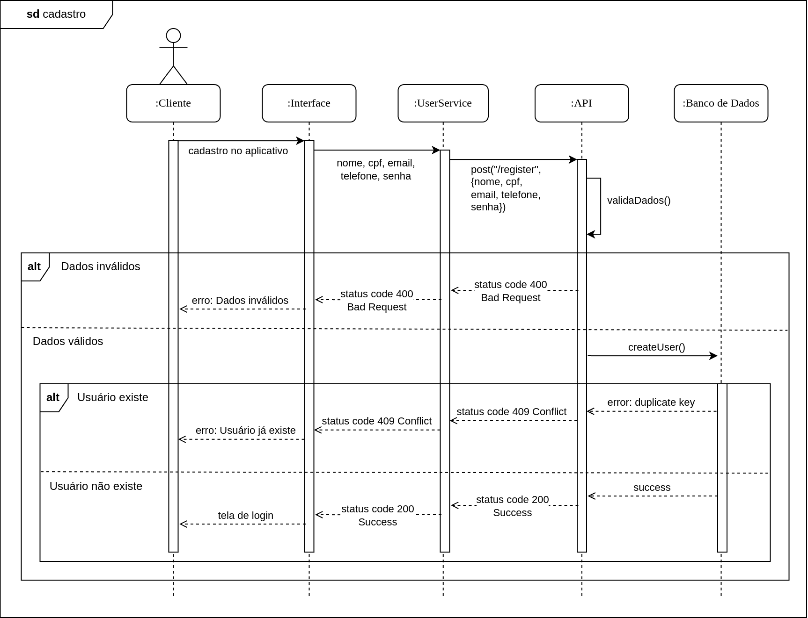

**Autores**: [Felipe Amorim de Araújo](https://github.com/lipeaaraujo), [Lucas Martins Gabriel](https://github.com/martinsglucas)

### Login

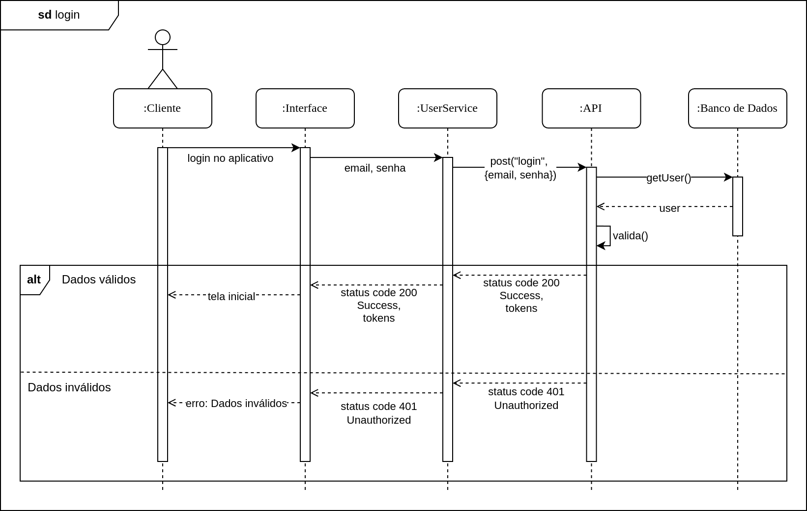

**Autores**: [Felipe Amorim de Araújo](https://github.com/lipeaaraujo)

### Logout

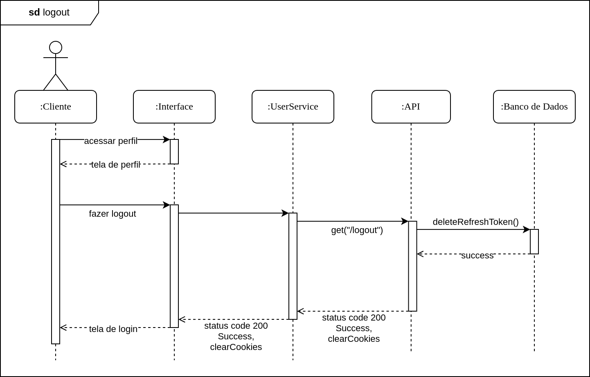

**Autores**: [Felipe Amorim de Araújo](https://github.com/lipeaaraujo)

### Editar conta

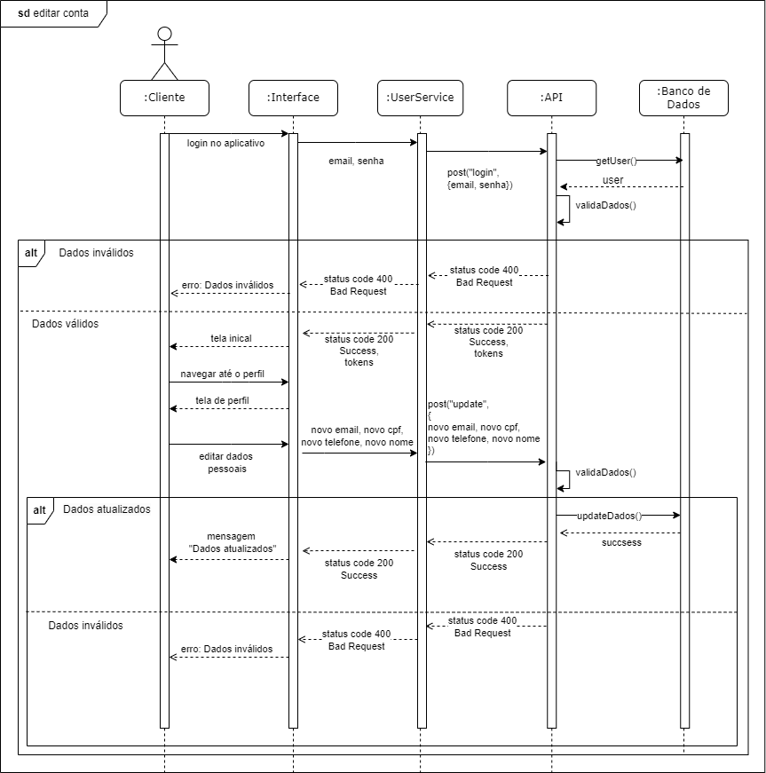

**Autores**: [Davi Gonçalves Akegawa Pierre](https://github.com/DaviPierre), [Raquel Ferreira Andrade](https://github.com/raquel-andrade)

### Cadastro método de pagamento

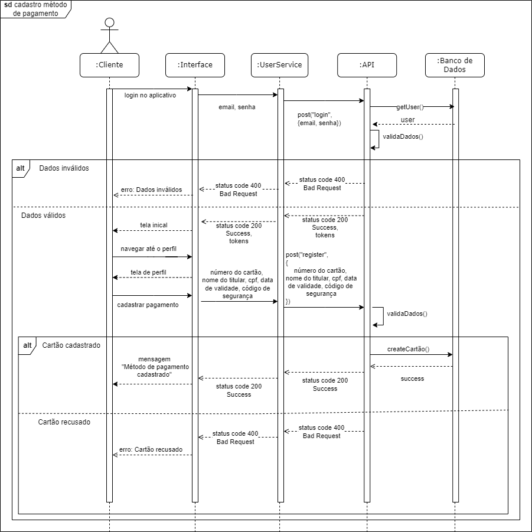

**Autores**: [Davi Gonçalves Akegawa Pierre](https://github.com/DaviPierre), [Raquel Ferreira Andrade](https://github.com/raquel-andrade)

## Referências

1. UML Diagrams. UML sequence diagrams overview. Disponível em: https://www.uml-diagrams.org/sequence-diagrams.html. Acesso em: 25 nov. 2024.
2. BOSON Treinamentos. Curso de UML - O que é um Diagrama de Sequência. Disponível em: https://www.youtube.com/watch?v=UVkj3ed0ZuM&. Acesso em: 26 nov. 2024.
3. BOSON Treinamentos. Curso de UML - Diagrama de Sequência UML - Exemplo Básico. Disponível em: https://www.youtube.com/watch?v=LeV6RO-6Tn4. Acesso em: 26 nov. 2024.

## Histórico de Versões

| Versão | Data da alteração | Comentário | Autor(es) | Revisor(es) | Data de revisão |
|--------|-----------|-----------|-----------|-------------|-------------|
| 1.0 | 25/11/2024 | Adiciona introdução e metodologia | [Raquel Ferreira Andrade](https://github.com/raquel-andrade) | [Lucas Martins Gabriel](https://github.com/martinsglucas) | 26/11/2024 |
| 1.1 | 26/11/2024 | Adicionando tabela na metodologia, algumas referências e diagramas de cadastro, login, logout | [Felipe Amorim de Araújo](https://github.com/lipeaaraujo) | [Lucas Martins Gabriel](https://github.com/martinsglucas) | 26/11/2024 |
| 1.2 | 26/11/2024 | Adiciona diagrama de pedido | [Lucas Martins Gabriel](https://github.com/martinsglucas) | [Kallyne Passos](https://github.com/kalipassos) | 28/11/2024 |
| 1.3 | 27/11/2024 | Modifica diagrama de pedido | [Raquel Ferreira Andrade](https://github.com/raquel-andrade) | [Kallyne Passos](https://github.com/kalipassos) | 28/11/2024 |
| 1.4 | 28/11/2024 | Adiciona diagramas de conta e pagamento | [Davi Gonçalves Akegawa Pierre](https://github.com/DaviPierre), [Raquel Ferreira Andrade](https://github.com/raquel-andrade) |  [Kallyne Passos](https://github.com/kalipassos) | 28/11/2024 |

