# Diagrama de Atividades

## Introdução

O diagrama de atividades na UML é uma representação gráfica para descrever os fluxos de trabalho, ações e decisões dentro de um sistema ou processo. É útil para a modelar o comportamento dinâmico de um sistema/software, facilitando sua compreensão e implementação.

## Metodologia

Foi definida uma equipe de quatro integrantes para a confecção dos diagramas de atividade, que foram montados através da ferramenta Draw.io. A tabela abaixo exibe os responsáveis por essa tarefa:

| Matrícula | Integrante                                                      |
|-----------|-----------------------------------------------------------------|
| 211061805 | [Guilherme Westphall](https://github.com/west7)                 |
| 221022570 | [Gabryel Nicolas Soares de Sousa](https://github.com/gabryelns) |
| 221022041 | [Júlio Roberto da Silva Neto](https://github.com/JulioR2022)    |
| 202046229 | [Kallyne Macedo Passos](https://github.com/kalipassos)          |

**Autores**: [Júlio Roberto da Silva Neto](https://github.com/JulioR2022), [Guilherme Westphall](https://github.com/west7)

A tabela abaixo apresenta os elementos de notação UML utilizados nos diagramas de atividade e suas respectivas descrições:

| Símbolo                            | Nome                   | Descrição                                                                                                                                                                    |
|------------------------------------|------------------------|------------------------------------------------------------------------------------------------------------------------------------------------------------------------------|
|   | Nodo Inicial           | Representa o ponto de início do fluxo de atividades. É simbolizado por um círculo preenchido em preto.                                                                       |
| 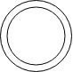        | Nodo Final             | Indica o término do fluxo de atividades. É representado por um círculo preenchido em preto dentro de outro círculo.                                                          |
| 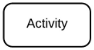 | Atividade              | Representa uma ação ou tarefa específica no fluxo. É simbolizada por um retângulo com bordas arredondadas contendo a descrição da ação.                                      |
|      | Nodo de Decisão        | Indica um ponto de decisão no fluxo onde diferentes caminhos podem ser tomados. É representado por um losango.                                                               |
| 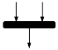          | Barra de Sincronização | Representa um ponto onde o fluxo pode se dividir em atividades paralelas (fork) ou se juntar novamente (join). É simbolizada por uma barra preta horizontal.                 |
|           | Fluxo de Controle      | Indica a direção do fluxo entre as atividades. É representado por uma linha com uma seta na extremidade.                                                                     |
| 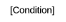   | Texto de Condição      | Representa a regra ou condição que determina qual caminho o fluxo deve seguir quando encontra um ponto de decisão. É escrito ao lado da linha que sai do losango de decisão. |

## Diagramas produzidos

### Cadastro de Usuário

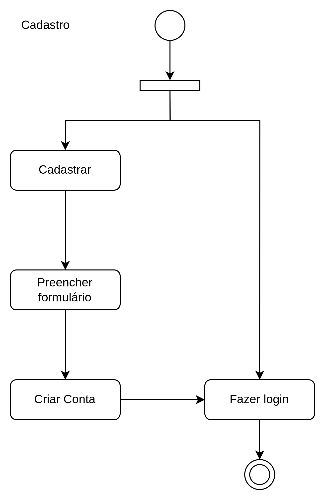

**Autores**: [Júlio Roberto da Silva Neto](https://github.com/JulioR2022), [Guilherme Westphall](https://github.com/west7)

### Loja cadastra cardápio

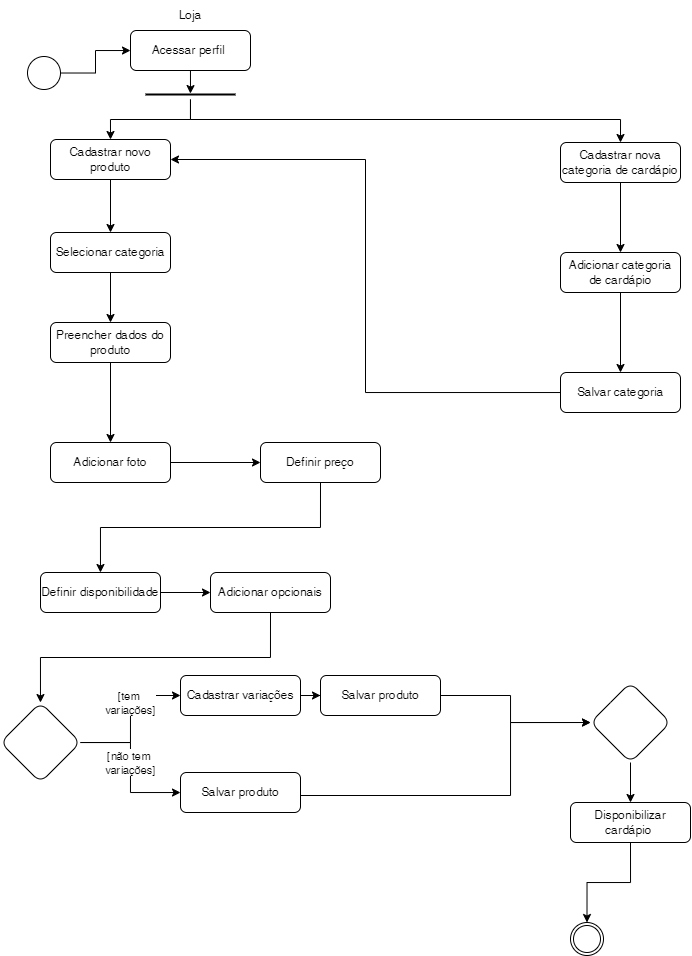

**Autor**: [Kallyne Macedo Passos](https://github.com/kalipassos)  

### Cliente realiza pedido

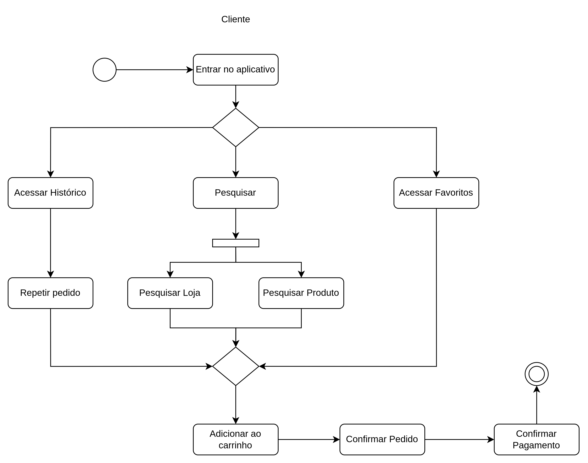

**Autores**: [Júlio Roberto da Silva Neto](https://github.com/JulioR2022), [Guilherme Westphall](https://github.com/west7)

### Loja recebe pedido

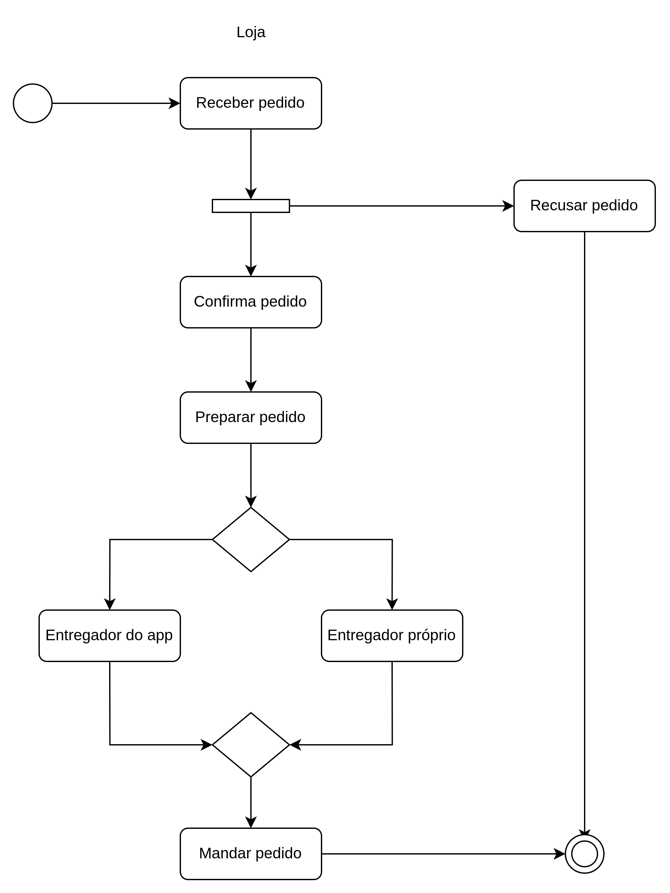

**Autores**: [Júlio Roberto da Silva Neto](https://github.com/JulioR2022), [Guilherme Westphall](https://github.com/west7)

### Entregador recebe solicitação de entrega

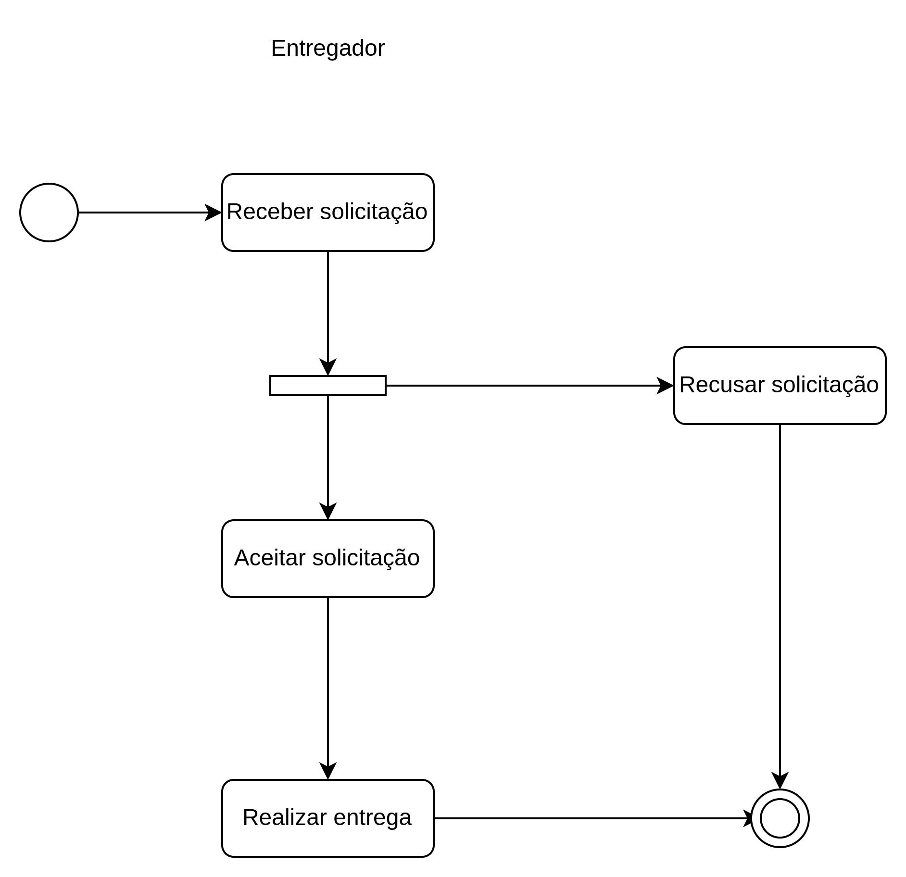

**Autores**: [Júlio Roberto da Silva Neto](https://github.com/JulioR2022), [Guilherme Westphall](https://github.com/west7)

### Cliente avalia Entregador e Loja

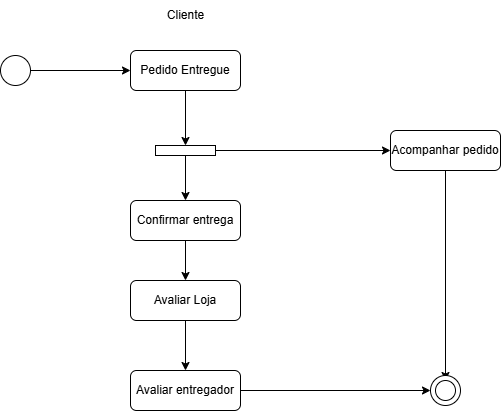

**Autor**: [Gabryel Nicolas Soares de Sousa](https://github.com/gabryelns)

## Cliente inicia suporte via chat

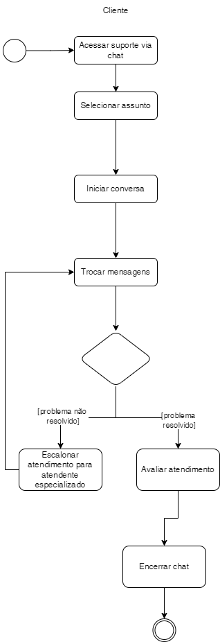

**Autor**: [Kallyne Macedo Passos](https://github.com/kalipassos)  

## Conclusão

Os diagramas de atividades apresentados demonstram a complexidade e interatividade dos processos do aplicativo, abrangendo diversas situações. A utilização dessa ferramenta de modelagem permite a identificação de pontos de atenção e a otimização de fluxos de trabalho conforme as necessidades dos clientes do sistema.

## Revisão

<iframe width="560" height="315" src="https://www.youtube.com/embed/kGjPXhEUhsw?si=lQJeSTFt6vASYPh8" title="YouTube video player" frameborder="0" allow="accelerometer; autoplay; clipboard-write; encrypted-media; gyroscope; picture-in-picture; web-share" referrerpolicy="strict-origin-when-cross-origin" allowfullscreen></iframe>

*Disponível em: https://youtu.be/kGjPXhEUhsw?si=P8E8vKkBmgNTU32H*

## Referências

1. SERRANO, Milene. Arquitetura e Desenho de Software: Projeto e Desenho de Software. Disponível em: https://aprender3.unb.br/pluginfile.php/2928948/mod_page/content/1/Arquitetura%20e%20Desenho%20de%20Software%20-%20Aula%20Modelagem%20UML%20Din%C3%A2mica%20-%20Profa.%20Milene.pdf. Acessado em 26 de novembro de 2024.

## Histórico de versões

| Versão | Data da alteração | Comentário                                                 | Autor(es)                                                                                                     | Revisor(es)                                                                                          | Data de revisão |
|--------|-------------------|------------------------------------------------------------|---------------------------------------------------------------------------------------------------------------|------------------------------------------------------------------------------------------------------|-----------------|
| 1.0    | 26/11/2024        | Criação do documento                                       | [Guilherme Westphall](https://github.com/west7), [Júlio Roberto da Silva Neto](https://github.com/JulioR2022) | [Kallyne Macedo Passos](https://github.com/kalipassos), [Kauan Eiras](https://github.com/kauaneiras) | 28/11/2024      |
| 1.1    | 26/11/2024        | Adição dos diagramas 1, 3, 4, 5                            | [Guilherme Westphall](https:github.com/west7), [Júlio Roberto da Silva Neto](https://github.com/JulioR2022)   | [Kallyne Macedo Passos](https://github.com/kalipassos), [Kauan Eiras](https://github.com/kauaneiras) | 28/11/2024      |
| 1.2    | 27/11/2024        | Adição do diagrama 6                                       | [Gabryel Nicolas Soares de Sousa](https://github.com/gabryelns)                                               | [Kallyne Macedo Passos](https://github.com/kalipassos), [Kauan Eiras](https://github.com/kauaneiras) | 28/11/2024      |
| 1.3    | 27/11/2024        | Pequenas correções                                         | [Guilherme Westphall](https://github.com/west7)                                                               | [Kallyne Macedo Passos](https://github.com/kalipassos), [Kauan Eiras](https://github.com/kauaneiras) | 28/11/2024      |
| 1.4    | 28/11/2024        | Adição dos diagramas 2 e 7, correções de forma e conclusão | [Guilherme Westphall](https://github.com/west7)                                                               | [Kallyne Macedo Passos](https://github.com/kalipassos), [Kauan Eiras](https://github.com/kauaneiras) | 28/11/2024      |