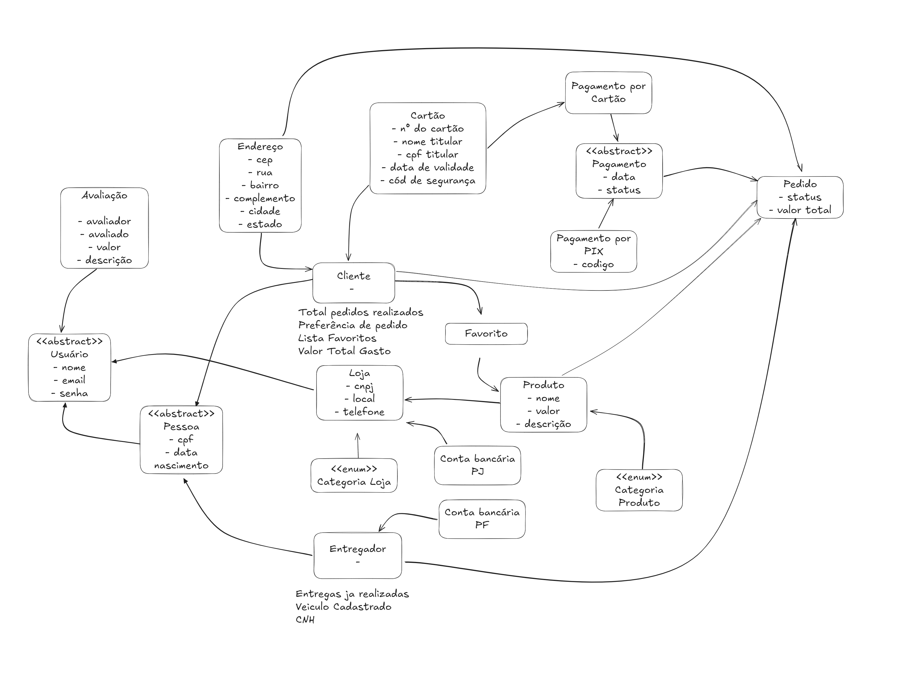

# Diagrama de Classes

## Introdução

O diagrama de classes é um dos principais artefatos da Linguagem de Modelagem Unificada (UML), utilizado para representar a estrutura estática de um sistema orientado a objetos. Ele descreve as classes, seus atributos, métodos e os relacionamentos entre elas, proporcionando uma visão clara e detalhada da arquitetura do sistema. De acordo com Booch, Rumbaugh e Jacobson (2005), o diagrama de classes é essencial para o design de software, pois ajuda a definir os principais componentes do sistema, documenta requisitos, e facilita a comunicação entre os membros da equipe de desenvolvimento. Além disso, ele serve como base para a implementação, reduzindo ambiguidades e promovendo consistência no desenvolvimento.

## Metodologia

Este diagrama foi desenvolvido utilizando a linguagem de modelagem unificada (UML), seguindo a estrutura e os padrões descritos em aula e priorizando clareza na representação dos elementos e suas relações. No diagrama, uma classe é representada por um retângulo dividido em três partes, em que a primeira parte contém o nome representativo da classe, a segunda contém os atributos, que são propriedades dos objetos representados pela classe, e a última parte possui os métodos, que descrevem o comportamento da classe. Os relacionamentos entre as classes podem ser de diferentes tipos, como dependência, associação, agregação, composição, generalização e realização.

### Abordagem

O objetivo principal deste diagrama é fornecer uma representação visual da estrutura do sistema, facilitando:

- Planejamento: Auxiliar na definição das entidades e suas inter-relações antes da implementação.
- Documentação: Servir como referência para desenvolvedores e partes interessadas.
- Comunicação: Promover um entendimento comum entre os membros da equipe, reduzindo falhas de interpretação.
- Rastreabilidade: Garantir que os elementos do diagrama estejam alinhados com os requisitos levantados, servindo como baseline (marco inicial) para acompanhar mudanças durante o desenvolvimento.

> **Observação**: Fizemos uma modificação no diagrama de classes para ficar mais próximo da implementação em Django que já iniciamos. Sendo assim, os atributos e os métodos não possuem especificação de acesso e visibilidade. Além disso, os atributos já foram tipados com os tipos do Django também, como CharField, ForeignKey, ManyToManyField, entre outros. Por fim, colocamos a classe Model do Django no diagrama, que já têm os métodos implementados, para mostrar que todas as classes herdam dela.

Foi realizado um brainstorming com a equipe para identificar as principais classes e suas responsabilidades. Esse levantamento foi baseado nos requisitos funcionais e não funcionais do sistema, garantindo rastreabilidade entre as necessidades levantadas e os componentes modelados.

### Brainstorming das Classes

**Autores**: [Bruno Cunha Vasconcelos de Araújo](https://github.com/brunocva), [Davi Gonçalves Akegawa Pierre](https://github.com/DaviPierre), [Gabryel Nicolas Soares de Sousa](https://github.com/gabryelns), [Júlio Roberto da Silva Neto](https://github.com/JulioR2022), [Lucas Martins Gabriel](https://github.com/martinsglucas), [Raquel Ferreira Andrade](https://github.com/raquel-andrade) e [Wolfgang Friedrich Stein](https://github.com/Wolffstein)

### Rastreabilidade

O diagrama também está rastreado com os [requisitos do sistema](/Modelagem/Extra/Baseline), o que permite verificar a correspondência entre a modelagem e os objetivos e funcionalidades estabelecidos no início do projeto. Cada classe e relacionamento foi pensado e mapeado com base nos requisitos funcionais e não funcionais, garantindo que a estrutura proposta atenda aos critérios definidos pela equipe de desenvolvimento.

## Diagrama de Classes

**Autores**: [Bruno Cunha Vasconcelos de Araújo](https://github.com/brunocva), [Davi Gonçalves Akegawa Pierre](https://github.com/DaviPierre), [Gabryel Nicolas Soares de Sousa](https://github.com/gabryelns), [Júlio Roberto da Silva Neto](https://github.com/JulioR2022), [Lucas Martins Gabriel](https://github.com/martinsglucas), [Raquel Ferreira Andrade](https://github.com/raquel-andrade) e [Wolfgang Friedrich Stein](https://github.com/Wolffstein)

## Referências

1. Serrano, M. (2024). Aula sobre Modelagem UML Estática. Arquitetura e Desenho de Software. Acesso em: 15 nov 2024.
2. LARMAN, Craig. Utilizando UML e Padrões: Uma Introdução à Análise e ao Projeto Orientados a Objetos e ao Desenvolvimento Iterativo. 3. ed. Porto Alegre: Bookman, 2004.
3. Booch, G., Rumbaugh, J., & Jacobson, I. (2005). The Unified Modeling Language User Guide. Addison-Wesley.

## 6.  Histórico de Versões

| Versão | Data da alteração | Comentário | Autor(es) | Revisor(es) | Data de revisão |
|--------|-----------|-----------|-----------|-------------|-------------|
| 1.0 | 17/11/2024 | Criação do documento | [Bruno Cunha Vasconcelos de Araújo](https://github.com/brunocva) | [Felipe Amorim de Araújo](https://github.com/lipeaaraujo) | 28/11/2024 |
| 1.1 | 27/11/2024 | Altera introdução e metodologia | [Raquel Ferreira Andrade](https://github.com/raquel-andrade) | [Felipe Amorim de Araújo](https://github.com/lipeaaraujo) | 28/11/2024 |
| 1.2 | 28/11/2024 | Adiciona diagrama de classes | [Lucas Martins Gabriel](htpps://github.com/martinsglucas) | [Felipe Amorim de Araújo](https://github.com/lipeaaraujo) | 28/11/2024 |
