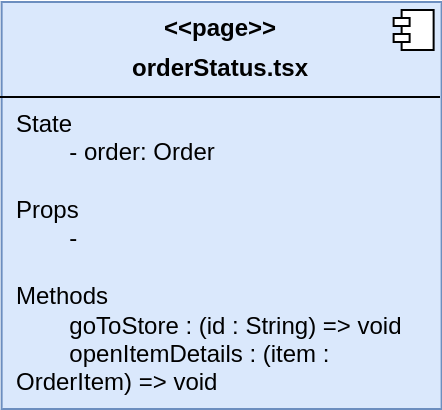
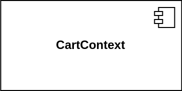

# Diagrama de Componentes (Arquitetura Front-end)

## Introdução

Este documento apresenta o diagrama de componentes desenvolvido para a aplicação HungryHub, mapeando a arquitetura front-end do sistema. O diagrama foi elaborado seguindo práticas estabelecidas de design de componentes para aplicações React conforme Munro [1], visando facilitar o entendimento das relações entre diferentes partes da interface, desde a navegação principal até componentes reutilizáveis. Esta visualização arquitetural serve como referência e apoio para a equipe desenvolver o projeto.

## Metodologia

A construção do diagrama de componentes seguiu uma abordagem estratégica e fundamentada na análise do contexto das tecnologias envolvidas no projeto HungryHub. Considerando que a aplicação foi construída utilizando o framework React, optamos por mapear a arquitetura front-end por meio de um diagrama de componentes. Essa escolha se baseia na natureza modular e reutilizável do React, que facilita a composição de interfaces complexas por meio de pequenos blocos funcionais chamados componentes.

### Objetivos

O diagrama foi desenvolvido com o objetivo de proporcionar uma visão clara das interações entre as diversas partes da interface, desde a navegação principal até componentes reutilizáveis. Ao optar por essa abordagem, buscamos não apenas representar a arquitetura de maneira estruturada, mas também garantir que a equipe tenha um entendimento aprofundado da separação de responsabilidades, da reutilização de código e das dependências entre os diferentes elementos da interface.

Adicionalmente, ao mapear a arquitetura dessa forma, conseguimos destacar potenciais áreas de refatoração, identificar dependências críticas e analisar o impacto de mudanças na aplicação, o que ajuda a garantir que o sistema permaneça escalável, de fácil manutenção e eficiente ao longo do desenvolvimento.

### Abordagem

Para garantir uma representação clara e coerente, adotamos uma nomenclatura padronizada, dividindo as entidades da arquitetura em cinco tipos principais: **Páginas**, **Componentes**, **Modais**, **Contextos** e **Dependências**. Cada categoria foi cuidadosamente escolhida com base nas melhores práticas do desenvolvimento em React, onde a modularização e a separação de preocupações são princípios chave. A representação visual de cada tipo de entidade segue padrões que ajudam a ilustrar suas funções e suas interações com outros elementos, o que facilita a compreensão das relações dinâmicas entre os diferentes componentes.

| Tipo de Entidade | Descrição                                                                                                                                                        | Exemplo                                                |
|------------------|------------------------------------------------------------------------------------------------------------------------------------------------------------------|--------------------------------------------------------|
| **Página**       | Representa uma rota individual da interface, que pode agregar outros componentes e modais                                                                        |            |
| **Componente**   | Bloco reutilizável de interface, responsável por renderizar partes específicas da aplicação. Pode ser funcional ou de classe, e encapsula lógica e apresentação. |              |
| **Modal**        | Janela sobreposta à interface principal usada para exibir informações ou interações temporárias sem navegar para outra página                                    |    |
| **Contexto**     | Ferramenta para gerenciar estado global ou compartilhado entre vários componentes, permitindo comunicação eficiente sem passar props manualmente                 |        |
| **Dependência**  | Representa uma relação de dependência entre duas entidades indicada pela direção da seta, ou seja, uma entidade depende ou importa uma outra entidade            |  |

### Rastreabilidade

Além disso, este documento apresenta rastreabilidade com a [baseline](/Modelagem/Extra/Baseline) desenvolvida para o projeto, garantindo que as decisões de arquitetura estejam alinhadas com os requisitos e as metas estabelecidas no início do desenvolvimento. Também é importante destacar que o diagrama de componentes está integrado com o [protótipo desenvolvido](https://unbarqdsw2024-2.github.io/2024.2_G7_Entrega_Entrega_01/#/Base/DesignSprint/Prototipo), proporcionando uma correspondência direta entre a arquitetura proposta e a interface visual do sistema

## Diagramas

Para melhor visualização, o diagrama foi divido em seções que individualizam partes da interface que estão mais relacionadas ou próximas entre si. Cada uma dessas sessões e seus autores podem ser encontradas a seguir:

### 1. Seção Login-Home-Notificações

**Autores**: [Felipe Amorim de Araújo](https://github.com/lipeaaraujo), [Leonardo Sobrinho de Aguiar](https://github.com/Leonardo0o0), [Guilherme Westphall de Queiroz](https://github.com/west7)

### 2. Seção Pesquisa-Detalhes

**Autores**: [Felipe Amorim de Araújo](https://github.com/lipeaaraujo), [Leonardo Sobrinho de Aguiar](https://github.com/Leonardo0o0), [Guilherme Westphall de Queiroz](https://github.com/west7)

### 3. Seção Pedidos

**Autores**: [Felipe Amorim de Araújo](https://github.com/lipeaaraujo), [Guilherme Silva Dutra](https://github.com/GuiDutra21)

### 4. Seção Favoritos

**Autores**: [Felipe Amorim de Araújo](https://github.com/lipeaaraujo), [Guilherme Silva Dutra](https://github.com/GuiDutra21)

### 5. Seção Carrinho-Pagamento

**Autores**: [Felipe Amorim de Araújo](https://github.com/lipeaaraujo), [Kallyne Macedo Passos](https://github.com/kalipassos), [Guilherme Silva Dutra](https://github.com/GuiDutra21)

### 5. Seção Perfil

**Autores**: [Felipe Amorim de Araújo](https://github.com/lipeaaraujo), [Kauan de Torres Eiras](https://github.com/kauaneiras)

## Referências

1. MUNRO, Michael. Front-end component design principles. Engineering at CarsGuide, 7 dez. 2016. Disponível em: https://engineering.carsguide.com.au/front-end-component-design-principles-55c5963998c9. Acesso em: 16 nov. 2024.

## Histórico de Versão

| Versão | Data da alteração | Comentário                                                                             | Autor(es)                                                 | Revisor(es)                                            | Data de revisão |
|--------|-------------------|----------------------------------------------------------------------------------------|-----------------------------------------------------------|--------------------------------------------------------|-----------------|
| 1.0    | 24/11/2024        | Criação do documento e adição da tabela de metodologia, imagens do diagrama e autorias | [Felipe Amorim de Araújo](https://github.com/lipeaaraujo) | [Kallyne Macedo Passos](https://github.com/kalipassos), [Júlio Roberto da Silva Neto](https://github.com/JulioR2022) | 27/11/2024      |
| 1.1    | 27/11/2024        | Detalhamento da introdução e da metodologia                                            | [Kallyne Macedo Passos](https://github.com/kalipassos)    |       [Júlio Roberto da Silva Neto](https://github.com/JulioR2022)                                                 |        28/11/2024         |