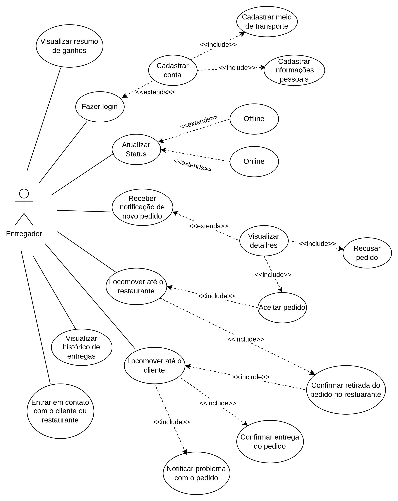

# Diagrama de Casos de Uso - Entregador

## Introdução

Este documento apresenta os casos de uso do sistema de entregas, detalhando as interações realizadas pelos entregadores no aplicativo. Cada caso de uso descreve o objetivo da funcionalidade, os passos necessários para sua execução, fluxos alternativos e exceções, além das condições prévias e posteriores ao seu uso. O objetivo é fornecer uma visão clara e estruturada sobre como as funcionalidades atendem aos requisitos do sistema, garantindo que o entregador tenha suporte adequado para executar suas tarefas diárias de forma eficiente e prática.

Os casos de uso foram elaborados de maneira concisa, seguindo um padrão que facilita a compreensão e a validação por todos os envolvidos no desenvolvimento e operação do sistema.

## Metodologia

A elaboração dos casos de uso seguiu as seguintes etapas:
    
- Identificação dos Requisitos: Os requisitos funcionais foram analisados para compreender as funcionalidades principais que o sistema deve oferecer. 
Cada requisito foi associado a um ou mais casos de uso.

- Definição do Escopo: Foi determinado o escopo de cada caso de uso, delimitando os atores envolvidos, as ações realizadas e os resultados esperados.

- Estruturação Padrão: Os casos de uso foram documentados seguindo um modelo padronizado, que inclui elementos como descrição, requisitos, atores, frequências de uso, fluxos principais, alternativos e de exceção, além de condições prévias e posteriores.

- Validação e Revisão: Cada caso de uso foi revisado para assegurar que cobre todas as possibilidades previstas e atende aos requisitos de maneira completa e clara.

- Documentação e Organização: Os casos de uso foram organizados de maneira sequencial e categorizados por funcionalidade para facilitar a navegação e a consulta.

**Tabela 1**: Integrantes

| Matrícula | Nome                |
| --------- | ------------------- |
| 211061805 | Guilherme Westphall |
| 231032121 | Wolfgang Friedrich  |
| 221034973 | Bruno Vasconcelos   |

**Autor**: [Guilherme Westphall](https://github.com/west7)

**Tabela 2**: Especificação de Caso de Uso

| ID    | Caso de Uso                                          |
| ----- | ---------------------------------------------------- |
| UCE01 | Fazer Login                                          |
| UCE02 | Cadastrar Conta                                      |
| UCE03 | Atualizar Status de Disponibilidade (Online/Offline) |
| UCE04 | Receber Notificação de Novo Pedido                   |
| UCE05 | Visualizar Detalhes do Pedido                        |
| UCE06 | Aceitar ou Recusar Pedido                            |
| UCE07 | Navegar até o Restaurante                            |
| UCE08 | Confirmar Retirada do Pedido no Restaurante          |
| UCE09 | Navegar até o Cliente                                |
| UCE10 | Confirmar Entrega do Pedido                          |
| UCE11 | Visualizar Histórico de Entregas                     |
| UCE12 | Visualizar Resumo de Ganhos                          |
| UCE13 | Entrar em Contato com o Cliente ou Restaurante       |
| UCE14 | Reportar Problema com o Pedido                       |
| UCE15 | Cadastrar Forma de transporte                        |

**Autor**: [Guilherme Westphall](https://github.com/west7), [Bruno Araújo](https://github.com/brunocva)

## Diagrama

**Figura 1**: Diagrama de casos de uso do Entregador

**Autor(es)**:  [Guilherme Westphall](https://github.com/west7), [Bruno Cunha Vasconcelos de Araújo](https://github.com/brunocva), [Wolfgang Friedrich Stein](https://github.com/Wolffstein)

## Especificações

<!-- TODO -->

### UCE01 - Fazer Login

| Elemento              | Descrição                                                                                                                                                                                                                                                                                                                                                                                                                                                                                             |
| --------------------- | ----------------------------------------------------------------------------------------------------------------------------------------------------------------------------------------------------------------------------------------------------------------------------------------------------------------------------------------------------------------------------------------------------------------------------------------------------------------------------------------------------- |
| **Caso de Uso**       | UCE01 - Fazer Login                                                                                                                                                                                                                                                                                                                                                                                                                                                                                   |
| **Descrição**         | O entregador acessa o aplicativo por meio da ação de login                                                                                                                                                                                                                                                                                                                                                                                                                                            |
| **Requisitos**        | R04                                                                                                                                                                                                                                                                                                                                                                                                                                                                                                   |
| **Atores**            | Entregador                                                                                                                                                                                                                                                                                                                                                                                                                                                                                            |
| **Frequência de Uso** | Alta                                                                                                                                                                                                                                                                                                                                                                                                                                                                                                  |
| **Pré-condições**     | - Um telefone celular com conexão com a internet.  - O aplicativo HungryHub baixado no telefone celular.                                                                                                                                                                                                                                                                                                                                                                                           |
| **Fluxo Principal**   | - O entregador liga o telefone ligado a internet.   - O entregador abre o aplicativo HungryHub.   - O usuaŕio insere as informações de email cadastrado e senha associada ao email cadastrado.  - O entregador clica no botão de "Entrar".                                                                                                                                                                                                                                                   |
| **Fluxo Alternativo** | - O entregador liga o telefone conectado a internet.   - O entregador abre o aplicativo HungryHub.   - O entregador clica no botão "Cadastrar-se".   - O entregador insere as informações requeridas pelo aplicativo.   - O entregador valida o email.   - O entregador volta para a tela de Login.  - O usuaŕio insere as informações de email cadastrado e senha associada ao email cadastrado.  - O entregador clica no botão de "Entrar"                                     |
| **Fluxo de Exceção**  | - O entregador erra sua senha.   - O entregador recebe um erro em veremelho de "Senha incorreta".  - O entregador clica em "Esqueci minha senha".   - O entregador pede um email para redefinir a senha.  - O entregador redefine sua senha no email enviado pelo HungryHub.   - O entregador retorna para a tela de Login.   - O entregador insere as informaçoes de email cadastrado e a nova senha associada ao email cadastrado.  - O entregador clica no botão de "Entrar". |
| **Pós-condições**     | O entregador consegue acessar o aplicativo pelo seu perfil.                                                                                                                                                                                                                                                                                                                                                                                                                                           |
| **Data da Criação**   | 28/11/2024                                                                                                                                                                                                                                                                                                                                                                                                                                                                                            |

**Autor**: [Guilherme Westphall](https://github.com/west7)

### UCE02 - Cadastrar Conta

| **Elemento**          | **Descrição**                                                                                                                                                                                                                                                                                                                                                                                                                                                                                          |
| --------------------- | ------------------------------------------------------------------------------------------------------------------------------------------------------------------------------------------------------------------------------------------------------------------------------------------------------------------------------------------------------------------------------------------------------------------------------------------------------------------------------------------------------ |
| **Caso de Uso**       | UCE02 - Cadastrar Conta                                                                                                                                                                                                                                                                                                                                                                                                                                                                                |
| **Descrição**         | O entregador realiza o cadastro no aplicativo HungryHub para criar uma conta.                                                                                                                                                                                                                                                                                                                                                                                                                          |
| **Requisitos**        | R02                                                                                                                                                                                                                                                                                                                                                                                                                                                                                                    |
| **Atores**            | Entregador                                                                                                                                                                                                                                                                                                                                                                                                                                                                                             |
| **Frequência de Uso** | Média                                                                                                                                                                                                                                                                                                                                                                                                                                                                                                  |
| **Pré-condições**     | - Um telefone celular com conexão à internet.  - O aplicativo HungryHub baixado no telefone celular.                                                                                                                                                                                                                                                                                                                                                                                                |
| **Fluxo Principal**   | - O entregador liga o telefone conectado à internet.  - O entregador abre o aplicativo HungryHub.  - O entregador clica no botão "Cadastrar-se".  - O entregador insere as informações obrigatórias (nome, email, senha, número de telefone).  - O entregador clica em "Finalizar Cadastro".  - O sistema envia um email de validação ao endereço informado.  - O entregador valida o email clicando no link enviado.  - O sistema confirma o cadastro e retorna à tela de login. |
| **Fluxo Alternativo** | - O entregador clica em "Cadastrar-se".  - O entregador insere apenas algumas informações obrigatórias.  - O sistema apresenta uma mensagem de erro informando os campos obrigatórios que faltam ser preenchidos.  - O entregador corrige os campos e clica em "Finalizar Cadastro".  - O fluxo principal é retomado.                                                                                                                                                                      |
| **Fluxo de Exceção**  | - O entregador insere um email já cadastrado.  - O sistema apresenta uma mensagem de erro informando que o email já está em uso.  - O entregador utiliza outro email e clica em "Finalizar Cadastro".  - O sistema detecta problemas na validação do email enviado (ex.: link expirado).  - O sistema permite que o entregador solicite o reenvio do email de validação.                                                                                                                   |
| **Pós-condições**     | O entregador tem uma conta cadastrada no aplicativo HungryHub e pode utilizá-la para fazer login.                                                                                                                                                                                                                                                                                                                                                                                                      |
| **Data da Criação**   | 28/11/2024                                                                                                                                                                                                                                                                                                                                                                                                                                                                                             |

**Autor**: [Guilherme Westphall](https://github.com/west7)

### UCE03 - Atualizar Status de Disponibilidade Online/Offline

| **Elemento**          | **Descrição**                                                                                                                                                                                                                                                                                                                                                                  |
| --------------------- | ------------------------------------------------------------------------------------------------------------------------------------------------------------------------------------------------------------------------------------------------------------------------------------------------------------------------------------------------------------------------------ |
| **Caso de Uso**       | UCE03 - Atualizar Status de Disponibilidade Online/Offline                                                                                                                                                                                                                                                                                                                     |
| **Descrição**         | O entregador atualiza seu status de disponibilidade para indicar se está pronto para receber pedidos.                                                                                                                                                                                                                                                                          |
| **Requisitos**        | R31                                                                                                                                                                                                                                                                                                                                                                            |
| **Atores**            | Entregador                                                                                                                                                                                                                                                                                                                                                                     |
| **Frequência de Uso** | Alta                                                                                                                                                                                                                                                                                                                                                                           |
| **Pré-condições**     | - Um telefone celular com conexão à internet.  - O entregador deve estar logado no aplicativo HungryHub.                                                                                                                                                                                                                                                                    |
| **Fluxo Principal**   | - O entregador acessa o aplicativo HungryHub após fazer login.  - O entregador acessa o painel de controle principal.  - O entregador clica no botão de alternância de disponibilidade.  - O sistema atualiza o status para "Online" (se o entregador estava Offline) ou "Offline" (se o entregador estava Online).  - O sistema confirma a atualização do status. |
| **Fluxo Alternativo** | - O entregador tenta mudar o status, mas a conexão com a internet é interrompida.  - O sistema exibe uma mensagem de erro informando que não foi possível atualizar o status devido à falta de conexão.  - O entregador restaura a conexão e tenta novamente, retomando o fluxo principal.                                                                               |
| **Fluxo de Exceção**  | - O entregador tenta mudar o status, mas ocorre um erro interno no servidor.  - O sistema exibe uma mensagem de erro e não atualiza o status.  - O entregador pode tentar novamente mais tarde ou entrar em contato com o suporte.                                                                                                                                       |
| **Pós-condições**     | O status de disponibilidade do entregador é atualizado corretamente no sistema, refletindo sua prontidão para aceitar pedidos.                                                                                                                                                                                                                                                 |
| **Data da Criação**   | 28/11/2024                                                                                                                                                                                                                                                                                                                                                                     |

**Autor**: [Guilherme Westphall](https://github.com/west7)

### UCE04 - Receber Notificação de Novo Pedido

| **Elemento**          | **Descrição**                                                                                                                                                                                                                                                                                                   |
| --------------------- | --------------------------------------------------------------------------------------------------------------------------------------------------------------------------------------------------------------------------------------------------------------------------------------------------------------- |
| **Caso de Uso**       | UCE04 - Receber Notificação de Novo Pedido                                                                                                                                                                                                                                                                      |
| **Descrição**         | O entregador recebe uma notificação no aplicativo informando sobre um novo pedido disponível para entrega.                                                                                                                                                                                                      |
| **Requisitos**        | R28, R31                                                                                                                                                                                                                                                                                                        |
| **Atores**            | Entregador                                                                                                                                                                                                                                                                                                      |
| **Frequência de Uso** | Alta                                                                                                                                                                                                                                                                                                            |
| **Pré-condições**     | - Um telefone celular com conexão à internet.  - O entregador deve estar logado no aplicativo HungryHub.  - O status de disponibilidade do entregador deve estar como "Online".                                                                                                                           |
| **Fluxo Principal**   | - O sistema identifica um pedido disponível próximo à localização do entregador.  - O sistema envia uma notificação push ao telefone do entregador.  - O entregador clica na notificação.                                                                                                                 |
| **Fluxo Alternativo** | O entregador está usando o aplicativo quando o sistema identifica um novo pedido.  - O sistema exibe diretamente uma mensagem na interface principal do aplicativo informando sobre o novo pedido.  - O entregador visualiza a notificação do pedido sem precisar clicar em uma notificação externa.   |
| **Fluxo de Exceção**  | - O entregador não recebe a notificação devido a problemas de conexão com a internet.  - O entregador restaura a conexão com a internet.  - O fluxo principal é retomado.                                                                                                                                 |
| **Pós-condições**     | O entregador visualiza a oportunidade de um novo pedido e pode aceitar ou recusar a entrega.                                                                                                                                                                                                                    |
| **Data da Criação**   | 28/11/2024                                                                                                                                                                                                                                                                                                      |

**Autor**: [Guilherme Westphall](https://github.com/west7)

### UCE05 - Visualizar Detalhes do Pedido

| **Elemento**          | **Descrição**                                                                                                                                                                                                                                                                                                                                                                                                                |
| --------------------- | ---------------------------------------------------------------------------------------------------------------------------------------------------------------------------------------------------------------------------------------------------------------------------------------------------------------------------------------------------------------------------------------------------------------------------- |
| **Caso de Uso**       | UCE05 - Visualizar Detalhes do Pedido                                                                                                                                                                                                                                                                                                                                                                                        |
| **Descrição**         | O entregador acessa os detalhes de um pedido recebido para entender as informações necessárias para a entrega.                                                                                                                                                                                                                                                                                                               |
| **Requisitos**        | -                                                                                                                                                                                                                                                                                                                                                                                                                            |
| **Atores**            | Entregador                                                                                                                                                                                                                                                                                                                                                                                                                   |
| **Frequência de Uso** | Alta                                                                                                                                                                                                                                                                                                                                                                                                                         |
| **Pré-condições**     | - O entregador deve estar logado no aplicativo HungryHub.  - O entregador deve ter recebido a notificação de um pedido.                                                                                                                                                                                                                                                                                                        |
| **Fluxo Principal**   | - O entregador abre o aplicativo HungryHub após ter recebido uma notificação.  - O entregador acessa a seção de "Pedidos Recebidos".  - O entregador seleciona um pedido na lista de pedidos.  - O sistema exibe os detalhes do pedido, incluindo: nome e endereço do restaurante, nome e endereço do cliente, lista de itens do pedido,   valor total do pedido, tempo estimado para entrega e o valor da entrega. |
| **Fluxo Alternativo** | - O entregador clica na notificação de um novo pedido diretamente.  - O sistema abre os detalhes do pedido na tela principal do aplicativo.  - O entregador visualiza as informações sem acessar a lista de "Pedidos Recebidos".                                                                                                                                                                                       |
| **Fluxo de Exceção**  | - O entregador tenta acessar os detalhes do pedido, mas ocorre um erro de comunicação com o servidor.  - O sistema exibe uma mensagem de erro e recomenda tentar novamente mais tarde.  - O entregador pode verificar a conexão e retomar o fluxo principal.                                                                                                                                                           |
| **Pós-condições**     | O entregador obtém todas as informações necessárias para iniciar a entrega do pedido.                                                                                                                                                                                                                                                                                                                                        |
| **Data da Criação**   | 28/11/2024                                                                                                                                                                                                                                                                                                                                                                                                                   |

**Autor**: [Guilherme Westphall](https://github.com/west7)

### UCE06 - Aceitar ou Recusar Pedido

| **Elemento**          | **Descrição**                                                                                                                                                  |
| --------------------- | ------------------------------------------------------------------------------------------------------------------------ |
| **Caso de Uso**       | UCE06 - Aceitar ou Recusar Pedido                                                                                       |
| **Descrição**         | O entregador pode aceitar ou recusar um pedido recebido pelo aplicativo.                                                |
| **Requisitos**        | R06                                                                                                                     |
| **Atores**            | Entregador                                                                                                              |
| **Frequência de Uso** | Alta                                                                                                                    |
| **Pré-condições**     | - O entregador deve estar logado no aplicativo.   - O entregador deve ter acesso à internet.                         |
| **Fluxo Principal**   | - O sistema notifica o entregador sobre um novo pedido.   - O entregador visualiza os detalhes do pedido.            |
| **Fluxo Alternativo** | - O entregador recusa o pedido clicando em "Recusar".   - O sistema registra a recusa e busca outro entregador.      |
| **Fluxo de Exceção**  | - O pedido expira se o entregador não interagir dentro de um tempo limite.                                              |
| **Pós-condições**     | O pedido é aceito ou recusado pelo entregador.                                                                          |
| **Data da Criação**   | 28/11/2024                                                                                                              |

**Autor**: [Bruno Araújo](https://github.com/brunocva)

---

### UCE07 - Navegar até o Restaurante

| **Elemento**          | **Descrição**                                                                                                      |
| --------------------- | ------------------------------------------------------------------------------------------------------------------ |
| **Caso de Uso**       | UCE07 - Navegar até o Restaurante                                                                                 |
| **Descrição**         | O entregador pode acessar a rota para o restaurante através do aplicativo.                                       |
| **Requisitos**        | R07                                                                                                               |
| **Atores**            | Entregador                                                                                                        |
| **Frequência de Uso** | Alta                                                                                                              |
| **Pré-condições**     | - O entregador deve estar logado no aplicativo.  - O entregador deve ter aceitado o pedido.  - Internet ativa. |
| **Fluxo Principal**   | - O entregador clica no botão "Navegar até o Restaurante".   - O aplicativo abre o mapa com a rota traçada.    |
| **Fluxo Alternativo** | - O entregador opta por usar outro aplicativo de navegação e o sistema redireciona para o app externo escolhido. |
| **Fluxo de Exceção**  | - O GPS está inativo ou falha.   - O sistema exibe uma mensagem de erro e orienta o entregador a ativar o GPS. |
| **Pós-condições**     | O entregador chega ao restaurante seguindo a rota exibida pelo aplicativo.                                       |
| **Data da Criação**   | 28/11/2024                                                                                                       |

**Autor**: [Bruno Araújo](https://github.com/brunocva)

---

### UCE08 - Confirmar Retirada do Pedido no Restaurante

| **Elemento**          | **Descrição**                                                                                  |
| --------------------- | ---------------------------------------------------------------------------------------------- |
| **Caso de Uso**       | UCE08 - Confirmar Retirada do Pedido no Restaurante                                           |
| **Descrição**         | O entregador confirma que retirou o pedido no restaurante antes de iniciar a entrega.         |
| **Requisitos**        | R08                                                                                           |
| **Atores**            | Entregador                                                                                    |
| **Frequência de Uso** | Alta                                                                                          |
| **Pré-condições**     | - O entregador deve estar logado no aplicativo.   - O entregador deve estar no restaurante. |
| **Fluxo Principal**   | - O entregador clica no botão "Confirmar Retirada".   - O sistema registra a retirada.     |
| **Fluxo Alternativo** | - O sistema detecta inconsistências (ex.: localização distante do restaurante) e alerta o entregador. |
| **Fluxo de Exceção**  | - O entregador enfrenta problemas no restaurante e não consegue retirar o pedido.             |
| **Pós-condições**     | O status do pedido é atualizado para "Em entrega".                                           |
| **Data da Criação**   | 28/11/2024                                                                                   |

### UCE09 - Navegar até o cliente

| **Elemento**          | **Descrição**                                                                                  |
| --------------------- | ---------------------------------------------------------------------------------------------- |
| **Caso de Uso**       | UCE09 - Locomover até o cliente                                          |
| **Descrição**         | O entregador vai até o endereço físico do cliente.         |
| **Requisitos**        | R33                                                                                           |
| **Atores**            | Entregador                                                                                    |
| **Frequência de Uso** | Alta                                                                                          |
| **Pré-condições**     | - O entregador deve estar logado no aplicativo.   - O entregador deve ter recebido o pedido  |
| **Fluxo Principal**   | - O Entregador abre o aplicativo.   - Pelo recurso da gelocalização o entregador localiza o cliente.  - O entregador se locomove até o cliente .  |
| **Fluxo Alternativo** | |
| **Fluxo de Exceção**  | - O entregador enfrenta problemas com o acesso do aplicativo e não encontra o endereço do cliente  |
| **Pós-condições**     | O entregador chega até o cliente para fazer a entrega do pedido       |
| **Data da Criação**   | 28/11/2024                                                                                   |

**Autor**: [Guilherme Silva Dutra](https://github.com/GuiDutra21)

### UCE10 - Confirmar entrega do pedido

| **Elemento**          | **Descrição**                                                                                  |
| --------------------- | ---------------------------------------------------------------------------------------------- |
| **Caso de Uso**       | UCE10 - Confirmar entrega do pedido                                         |
| **Descrição**         | O entregador confirma a entrega do pedido         |
| **Requisitos**        | pendente                                                                                           |
| **Atores**            | Entregador                                                                                    |
| **Frequência de Uso** | Alta                                                                                          |
| **Pré-condições**     | - O entregador deve estar logado no aplicativo.   - O entregador deve ter recebido o pedido  - O entregador deve ter entregado o pedidio |
| **Fluxo Principal**   | - O Entregador entrega o pedido.    - O Entregador abre o aplicativo.   - O entregador confirma que entregou o pedido |
| **Fluxo Alternativo** | |
| **Fluxo de Exceção**  | - O entregador enfrenta problemas com o acesso do aplicativo e não copnsegue confirmar a entregado do pedido  |
| **Pós-condições**     | O entregador confirmar a entrega do pedido e o Cliente recebe o seu pedido    |
| **Data da Criação**   | 28/11/2024                                                                                   |

**Autor**: [Guilherme Silva Dutra](https://github.com/GuiDutra21)

### UCE11 - Visualizar Histórico de Entregas

| **Elemento**          | **Descrição**                                                                                         |
| --------------------- | ----------------------------------------------------------------------------------------------------- |
| **Caso de Uso**       | UCE11 - Visualizar Histórico de Entregas                                                             |
| **Descrição**         | O entregador pode acessar um histórico com detalhes de todas as entregas realizadas.                 |
| **Requisitos**        | R11                                                                                                  |
| **Atores**            | Entregador                                                                                           |
| **Frequência de Uso** | Média                                                                                                |
| **Pré-condições**     | - O entregador deve estar logado no aplicativo.                                                      |
| **Fluxo Principal**   | - O entregador acessa a seção "Histórico de Entregas".   - O sistema exibe uma lista com as entregas realizadas. |
| **Fluxo Alternativo** | - O entregador aplica filtros (ex.: data ou status) para encontrar entregas específicas.              |
| **Fluxo de Exceção**  | - O sistema enfrenta problemas de conexão e não consegue carregar o histórico.                       |
| **Pós-condições**     | O entregador visualiza as informações detalhadas do histórico de entregas.                           |
| **Data da Criação**   | 28/11/2024                                                                                          |

**Autor**: [Wolfgang Friedrich](https://github.com/WolffStein)

---

### UCE12 - Visualizar Resumo de Ganhos

| **Elemento**          | **Descrição**                                                                                             |
| --------------------- | --------------------------------------------------------------------------------------------------------- |
| **Caso de Uso**       | UCE12 - Visualizar Resumo de Ganhos                                                                      |
| **Descrição**         | O entregador pode acessar um resumo detalhado dos seus ganhos acumulados no aplicativo.                  |
| **Requisitos**        | R12                                                                                                      |
| **Atores**            | Entregador                                                                                               |
| **Frequência de Uso** | Alta                                                                                                     |
| **Pré-condições**     | - O entregador deve estar logado no aplicativo.                                                          |
| **Fluxo Principal**   | - O entregador acessa a seção "Resumo de Ganhos".   - O sistema exibe os ganhos acumulados por período. |
| **Fluxo Alternativo** | - O entregador aplica filtros para visualizar ganhos específicos (ex.: semanais ou mensais).             |
| **Fluxo de Exceção**  | - O sistema encontra problemas de sincronização com os dados de pagamentos.                              |
| **Pós-condições**     | O entregador visualiza os ganhos acumulados e pode planejar seus rendimentos futuros.                    |
| **Data da Criação**   | 28/11/2024                                                                                              |

**Autor**: [Wolfgang Friedrich](https://github.com/WolffStein)

---

### UCE13 - Entrar em Contato com o Cliente ou Restaurante

| **Elemento**          | **Descrição**                                                                                                    |
| --------------------- | ---------------------------------------------------------------------------------------------------------------- |
| **Caso de Uso**       | UCE13 - Entrar em Contato com o Cliente ou Restaurante                                                         |
| **Descrição**         | O entregador pode entrar em contato com o cliente ou restaurante através de opções fornecidas pelo aplicativo. |
| **Requisitos**        | R13                                                                                                            |
| **Atores**            | Entregador                                                                                                     |
| **Frequência de Uso** | Alta                                                                                                           |
| **Pré-condições**     | - O entregador deve estar logado no aplicativo.                                                                |
| **Fluxo Principal**   | - O entregador seleciona a opção de contato com o cliente ou restaurante.   - O sistema exibe as opções disponíveis (telefone, chat, etc.). |
| **Fluxo Alternativo** | - O entregador não consegue contato via telefone e utiliza o chat no aplicativo.                               |
| **Fluxo de Exceção**  | - Os dados de contato do cliente ou restaurante estão indisponíveis.                                           |
| **Pós-condições**     | O entregador resolve pendências diretamente com o cliente ou restaurante.                                      |
| **Data da Criação**   | 28/11/2024                                                                                                    |

**Autor**: [Wolfgang Friedrich](https://github.com/WolffStein)

---

### UCE14 - Reportar Problema com o Pedido

| **Elemento**          | **Descrição**                                                                                  |
| --------------------- | ---------------------------------------------------------------------------------------------- |
| **Caso de Uso**       | UCE14 - Reportar Problema com o Pedido                                                        |
| **Descrição**         | O entregador pode reportar problemas relacionados ao pedido, como itens incorretos ou atraso. |
| **Requisitos**        | R14                                                                                           |
| **Atores**            | Entregador                                                                                    |
| **Frequência de Uso** | Média                                                                                         |
| **Pré-condições**     | - O entregador deve estar logado no aplicativo.                                               |
| **Fluxo Principal**   | - O entregador acessa a seção "Reportar Problema".   - O entregador seleciona o tipo de problema e fornece detalhes. |
| **Fluxo Alternativo** | - O entregador anexa fotos ou evidências do problema reportado.                               |
| **Fluxo de Exceção**  | - O sistema enfrenta falhas ao registrar o problema.                                          |
| **Pós-condições**     | O problema é registrado no sistema e enviado para análise pela equipe responsável.            |
| **Data da Criação**   | 28/11/2024                                                                                   |

**Autor**: [Wolfgang Friedrich](https://github.com/WolffStein)

---

### UCE15 - Cadastrar Forma de Transporte

| **Elemento**          | **Descrição**                                                                                 |
| --------------------- | --------------------------------------------------------------------------------------------- |
| **Caso de Uso**       | UCE15 - Cadastrar Forma de Transporte                                                        |
| **Descrição**         | O entregador pode cadastrar ou atualizar sua forma de transporte (ex.: moto, bicicleta, carro). |
| **Requisitos**        | R15                                                                                          |
| **Atores**            | Entregador                                                                                   |
| **Frequência de Uso** | Baixa                                                                                       |
| **Pré-condições**     | - O entregador deve estar logado no aplicativo.                                              |
| **Fluxo Principal**   | - O entregador acessa a seção "Forma de Transporte".   - O entregador seleciona ou insere os detalhes do transporte. |
| **Fluxo Alternativo** | - O entregador edita informações previamente cadastradas sobre o transporte.                 |
| **Fluxo de Exceção**  | - O sistema encontra falhas ao salvar ou atualizar as informações.                           |
| **Pós-condições**     | A forma de transporte do entregador é atualizada no sistema.                                |
| **Data da Criação**   | 28/11/2024                                                                                  |

**Autor**: [Wolfgang Friedrich](https://github.com/WolffStein)

## Referências

1. Caso de Uso – Include, Extend e Generalização, ATÉ O MOMENTO. Disponível em: https://www.ateomomento.com.br/caso-de-uso-include-extend-e-generalizacao/. Acessado em 27 de novembro de 2024.

## Histórico de versões

| Versão | Data da alteração | Comentário                                       | Autor(es)                                       | Revisor(es) | Data de revisão |
| ------ | ----------------- | ------------------------------------------------ | ----------------------------------------------- | ----------- | --------------- |
| 1.0    | 28/11/2024        | Criação do documento                             | [Guilherme Westphall](https://github.com/west7) |      [Júlio Roberto da Silva Neto](https://github.com/JulioR2022)       |          29/11/2024       |
| 1.1    | 28/11/2024        | Adiciona o diagrama                              | [Guilherme Westphall](https://github.com/west7) |       [Júlio Roberto da Silva Neto](https://github.com/JulioR2022)      |         29/11/2024         |
| 1.2    | 28/11/2024        | Adiciona especificações dos casos UCE01 ao UCE05 | [Guilherme Westphall](https://github.com/west7) |        [Júlio Roberto da Silva Neto](https://github.com/JulioR2022)     |        29/11/2024          |
| 1.3    | 28/11/2024        | Adiciona UCE15 na tabela 02 | [Bruno Araújo](https://github.com/brunocva) |     [Júlio Roberto da Silva Neto](https://github.com/JulioR2022)        |          29/11/2024        |
| 1.4    | 28/11/2024        | Adiciona introdução, metodologia, especificações dos casos UCE06 ao UCE10 | [Bruno Araújo](https://github.com/brunocva) | [Júlio Roberto da Silva Neto](https://github.com/JulioR2022) | 29/11/2024  |         
| 1.5    | 28/11/2024        | Adiciona especificações dos casos UCE11 ao UCE15 | [Wolfgang Friedrich](https://github.com/WolffStein) |    [Júlio Roberto da Silva Neto](https://github.com/JulioR2022) e [Guilherme Silva Dutra](https://github.com/GuiDutra21)    |      29/11/2024            |