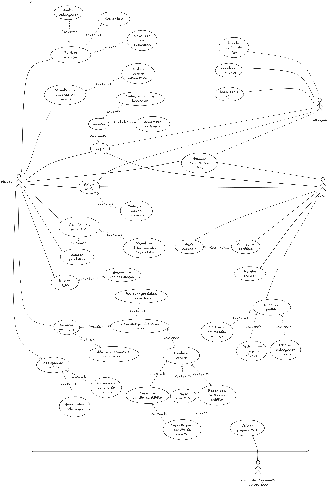

# Diagrama de Casos de Uso - Geral

## Introdução

Este documento apresenta o diagrama de casos de uso geral do sistema do HungryHub, representando todas as funcionalidades que dizem respeito aos três atores principais do sistema (Cliente, Loja e Entregador).

## Metodologia

O diagrama foi desenvolvido de forma a identificar todos os atores e denifir os casos de uso que indicam o fluxo de ações gerais no sistema, ou seja que dizem respeito aos três atores que utilizariam o sistema do HungryHub.

Foi utilizada a ferramenta Excalidraw para a criação do diagrama.

### Tabela 1 - Casos de Uso

| Código | Caso de Uso                     | Resonsável                      |
| ------ | ------------------------------- | ------------------------------- |
| [UC01](#especificação-uc01-login)   | Login                           | [Davi Gonçalves Akegawa Pierre](https://github.com/DaviPierre) |
| [UC02](#especificação-uc02-editar-perfil)   | Editar perfil                   | [Davi Gonçalves Akegawa Pierre](https://github.com/DaviPierre) |
| [UC03](#especificação-uc03-buscar-produtos)   | Buscar produtos                 | [Davi Gonçalves Akegawa Pierre](https://github.com/DaviPierre) |
| [UC04](#especificação-uc04-buscar-lojas)   | Buscar lojas                    | [Davi Gonçalves Akegawa Pierre](https://github.com/DaviPierre) |
| [UC05](#especificação-uc05-comprar-produtos)   | Comprar produtos                | [Davi Gonçalves Akegawa Pierre](https://github.com/DaviPierre) |
| [UC06](#especificação-uc06-acompanhar-pedido)   | Acompanhar pedido               | [Felipe Amorim de Araújo](https://github.com/lipeaaraujo) | 
| [UC07](#especificação-uc07-visualizar-histórico-de-pedidos)   | Visualizar histórico de pedidos | [Felipe Amorim de Araújo](https://github.com/lipeaaraujo) |
| [UC08](#especificação-uc08-acessar-suporte-via-chat)   | Acessar suporte via chat     | [Felipe Amorim de Araújo](https://github.com/lipeaaraujo) |
| [UC09](#especificação-uc09-realizar-avaliação)   | Realizar avaliação              | [Lucas Martins Gabriel](https://github.com/martinsglucas) |
| [UC10](#especificação-uc10-cadastrar-cardápio)  | Cadastrar cardápio              | [Lucas Martins Gabriel](https://github.com/martinsglucas) |
| [UC11](#especificação-uc11-recebe-pedidos)  | Recebe pedidos                  | [Lucas Martins Gabriel](https://github.com/martinsglucas) |
| [UC12](#especificação-uc12-entregar-pedidos)  | Entregar pedido                 | [Guilherme Silva Dutra](https://github.com/GuiDutra21) |
| [UC13](#especificação-uc13-recebe-pedido-da-loja)  | Recebe pedido da loja           | [Guilherme Silva Dutra](https://github.com/GuiDutra21) |
| [UC14](#especificação-uc14-localizar-o-cliente)  | Localizar o cliente             | [Guilherme Silva Dutra](https://github.com/GuiDutra21) |
| [UC15](#especificação-uc15-localizar-a-loja)  | Localizar a loja                | [Guilherme Silva Dutra](https://github.com/GuiDutra21) |

Posteriormente, todos os casos de uso representados no diagrama foram especificados utilizando a [tabela modelo](Modelagem/ModelagemOrganizacional/2.3.ModelagemOrganizacionalCasosDeUso.md#tabela-2-modelo-de-especificação-dos-casos-de-uso) como base.

## Diagrama

**Autores**: [Felipe Amorim de Araújo](https://github.com/lipeaaraujo), [Guilherme Silva Dutra](https://github.com/GuiDutra21), [Lucas Martins Gabriel](https://github.com/martinsglucas), [Davi Gonçalves Akegawa Pierre](https://github.com/DaviPierre)

## Especificações

| Elemento          | Descrição                                                                     |
| ----------------- | ----------------------------------------------------------------------------- |
| Caso de Uso       | Nome do Caso de Uso                                                           |
| Descrição         | Descrição do objetivo do caso de uso                                          |
| Requisitos        | Lista de requisitos que o caso de uso atende                                  |
| Atores            | Lista dos atores que interagem com o caso de uso                              |
| Frequência de Uso | Frequência com que o caso de uso será executado                               |
| Pré-condições     | Condições que devem ser verdadeiras antes do início do caso de uso            |
| Fluxo Principal   | Passos do Fluxo Principal                                                     |
| Fluxo Alternativo | Passos do Fluxo Alternativo                                                   |
| Fluxo de Exceção  | Passos do fluxo de exceção, descrevendo possíveis erros ou condições atípicas |
| Pós-condições     | Condições que devem ser verdadeiras após a execução do caso de uso            |
| Data da Criação   | Data em que o caso de uso foi criado                                          |

### Especificação UC01 Login

| Elemento          | Descrição                                                                                                                                                                                                                                                                                                                                                                                                                                                                     |
| ----------------- | ----------------------------------------------------------------------------------------------------------------------------------------------------------------------------------------------------------------------------------------------------------------------------------------------------------------------------------------------------------------------------------------------------------------------------------------------------------------------------- |
| Caso de Uso       | Login                                                                                                                                                                                                                                                                                                                                                                                                                                                                         |
| Descrição         | O usuário acessa o aplicativo e realiza a ação de login para ter acesso ao seu perfil                                                                                                                                                                                                                                                                                                                                                                                         |
| Requisitos        | R01, R02,R03,R04                                                                                                                                                                                                                                                                                                                                                                                                                                                              |
| Atores            | Cliente, Loja ou Entregador                                                                                                                                                                                                                                                                                                                                                                                                                                                   |
| Frequência de Uso | Alta                                                                                                                                                                                                                                                                                                                                                                                                                                                                          |
| Pré-condições     | - Um telefone celular com conexão com a internet.  - O aplicativo HungryHub baixado no telefone celular.                                                                                                                                                                                                                                                                                                                                                                   |
| Fluxo Principal   | - O usuário liga o telefone ligado a internet.   - O usuário abre o aplicativo HungryHub.   - O usuaŕio insere as informações de email cadastrado e senha associada ao email cadastrado.  - O usuário clica no botão de "Entrar".                                                                                                                                                                                                                                    |
| Fluxo Alternativo | - O usuário liga o telefone conectado a internet.   - O usuário abre o aplicativo HungryHub.   - O usuário clica no botão "Cadastrar-se".   - O usuário insere as informações requeridas pelo aplicativo.   - O usuário valida o email.   - O usuário volta para a tela de Login.  - O usuaŕio insere as informações de email cadastrado e senha associada ao email cadastrado.  - O usuário clica no botão de "Entrar"                                 |
| Fluxo de Exceção  | - O usuário erra sua senha.   - O usuário recebe um erro em veremelho de "Senha incorreta".  - O usuário clica em "Esqueci minha senha".   - O usuário pede um email para redefinir a senha.  - O usuário redefine sua senha no email enviado pelo HungryHub.   - O usuário retorna para a tela de Login.   - O usuário insere as informaçoes de email cadastrado e a nova senha associada ao email cadastrado.  - O usuário clica no botão de "Entrar". |
| Pós-condições     | O usuário consegue acessar o aplicativo pelo seu perfil.                                                                                                                                                                                                                                                                                                                                                                                                                      |
| Data da Criação   | 27/11/2024                                                                                                                                                                                                                                                                                                                                                                                                                                                                    |

**Autores**: [Davi Gonçalves Akegawa Pierre](https://github.com/DaviPierre)

### Especificação UC02 Editar perfil

| Elemento          | Descrição                                                                                                                                                                                                                                                                                                                       |
| ----------------- | ------------------------------------------------------------------------------------------------------------------------------------------------------------------------------------------------------------------------------------------------------------------------------------------------------------------------------- |
| Caso de Uso       | Editar perfil                                                                                                                                                                                                                                                                                                                   |
| Descrição         | O usuário deve ser capaz de editar informações públicas e privadas do seu perfil                                                                                                                                                                                                                                                |
| Requisitos        | R05, R06                                                                                                                                                                                                                                                                                                                        |
| Atores            | Usuário                                                                                                                                                                                                                                                                                                                         |
| Frequência de Uso | Média                                                                                                                                                                                                                                                                                                                           |
| Pré-condições     | - Um telefone celular com conexão com a internet.  - O aplicativo HungryHub baixado no telefone celular.  - Uma conta logada no aplicativo HungryHub                                                                                                                                                                      |
| Fluxo Principal   | - O usuário acessa o aplicativo e navega até o seu pefrfil.  - O usuário navega até a informação que deseja editar na página de perfil.  - O usuário altera os dados desejados.   - O usuário salva os dados editados.                                                                                                 |
| Fluxo Alternativo | - O usuário acessa o aplicativo e navega até o seu perfil.  - O usuário navega até seus dados bancários.   - O usuário cadastra seus dados bancários no sistema.  - O usuário salva os dados bancários cadastrados.                                                                                                    |
| Fluxo de Exceção  | - O usuário acessa o aplicativo e navega até o seu pefrfil.  - O usuário navega até a informação que deseja editar na página de perfil.  - O usuário altera os dados desejados.   - O usuário sai do aplicativo antes de salvar as alterações feitas.   - Os dados são revertidos para os originais antes da troca. |
| Pós-condições     | Os dados do perfil do usuário foram editados com sucesso.                                                                                                                                                                                                                                                                       |
| Data da Criação   | 27/11/2024                                                                                                                                                                                                                                                                                                                      |

**Autores**: [Davi Gonçalves Akegawa Pierre](https://github.com/DaviPierre)

### Especificação UC03 Buscar produtos

| Elemento          | Descrição                                                                                                                                                                                                                                                                                                                                                                                                                                            |
| ----------------- | ---------------------------------------------------------------------------------------------------------------------------------------------------------------------------------------------------------------------------------------------------------------------------------------------------------------------------------------------------------------------------------------------------------------------------------------------------- |
| Caso de Uso       | Buscar produtos                                                                                                                                                                                                                                                                                                                                                                                                                                      |
| Descrição         | O usuário deseja encontrar um produto específico para comer                                                                                                                                                                                                                                                                                                                                                                                          |
| Requisitos        | R07, R08, R09                                                                                                                                                                                                                                                                                                                                                                                                                                        |
| Atores            | Cliente                                                                                                                                                                                                                                                                                                                                                                                                                                              |
| Frequência de Uso | Alta                                                                                                                                                                                                                                                                                                                                                                                                                                                 |
| Pré-condições     | - Um telefone celular com conexão com a internet.  - O aplicativo HungryHub baixado no telefone celular.  - Uma conta logada no aplicativo HungryHub                                                                                                                                                                                                                                                                                           |
| Fluxo Principal   | - O usuário acessa o aplicativo pelo telefone celular.   - O usuário realiza o login no aplicativo.  - O usuário clica na ferramenta de busca do aplicativo.  - O usuário digita o nome do produto a ser pesquisado.  - O usuário encontra o produto desejado e pede o mesmo.                                                                                                                                                            |
| Fluxo Alternativo | - O usuário acessa o aplicativo pelo telefone celular.   - O usuário realiza o login no aplicativo.  - O usuário clica na ferramenta de busca do aplicativo.  - O usuário digita o nome do produto a ser pesquisado.  - O usuário encontra o produto.   - O usuário clica no produto encontrado para ver os detalhes do produto.  - O usuário decide se pede o produto ou não.                                                     |
| Fluxo de Exceção  | - O usuário acessa o aplicativo pelo telefone celular.   - O usuário realiza o login no aplicativo.  - O usuário clica na ferramenta de busca do aplicativo.  - O usuário digita o nome do produto a ser pesquisado.  - O aplicativo imprime uma mensagem de erro de "Produto não encontrado".  - O usuário percebe um erro ortográfico.   - O usuário corrige o erro.  - O usuário encontra o produto desejado e pede o mesmo. |
| Pós-condições     | O cliente encontra o produto procurado                                                                                                                                                                                                                                                                                                                                                                                                               |
| Data da Criação   | 28/11/2024                                                                                                                                                                                                                                                                                                                                                                                                                                           |

**Autores**: [Davi Gonçalves Akegawa Pierre](https://github.com/DaviPierre)

### Especificação UC04 Buscar lojas

| Elemento          | Descrição                                                                                                                                                                                                                                                                                                                                                                                                                                          |
| ----------------- | -------------------------------------------------------------------------------------------------------------------------------------------------------------------------------------------------------------------------------------------------------------------------------------------------------------------------------------------------------------------------------------------------------------------------------------------------- |
| Caso de Uso       | Buscar lojas                                                                                                                                                                                                                                                                                                                                                                                                                                       |
| Descrição         | O usuário deseja encontrar uma loja para pedir seu lanche, almoço ou jantar                                                                                                                                                                                                                                                                                                                                                                        |
| Requisitos        | R10                                                                                                                                                                                                                                                                                                                                                                                                                                                |
| Atores            | Cliente                                                                                                                                                                                                                                                                                                                                                                                                                                            |
| Frequência de Uso | Alto                                                                                                                                                                                                                                                                                                                                                                                                                                               |
| Pré-condições     | - Um telefone celular com conexão com a internet.  - O aplicativo HungryHub baixado no telefone celular.  - Uma conta logada no aplicativo HungryHub                                                                                                                                                                                                                                                                                         |
| Fluxo Principal   | - O usuário acessa o aplicativo pelo telefone celular.   - O usuário realiza o login no aplicativo.  - O usuário clica na ferramenta de busca do aplicativo.  - O usuário digita o nome da loja a ser pesquisado.  - O usuário encontra a loja que está sendo pesquisada.  - O usuário realiza seu pedido.                                                                                                                          |
| Fluxo Alternativo | - O usuário acessa o aplicativo pelo telefone celular.   - O usuário realiza o login no aplicativo.  - O usuário clica na ferramenta de busca por geolocalizaçao.  - O usuário procura entre as lojas próximas dele qual ele quer pedir.  - O usuário clica no ícone de uma loja.  - O usuário continua seu pedido.                                                                                                                 |
| Fluxo de Exceção  | - O usuário acessa o aplicativo pelo telefone celular.   - O usuário realiza o login no aplicativo.  - O usuário clica na ferramenta de busca do aplicativo.  - O usuário digita o nome dda loja a ser pesquisada.  - O aplicativo imprime uma mensagem de erro de "Loja não encontrada".  - O usuário percebe um erro ortográfico.   - O usuário corrige o erro.  - O usuário encontra a loja desejada e realiza seu pedido. |
| Pós-condições     | O usuário encontra a loja que estava procurando                                                                                                                                                                                                                                                                                                                                                                                                    |
| Data da Criação   | 28/11/2024                                                                                                                                                                                                                                                                                                                                                                                                                                         |

**Autores**: [Davi Gonçalves Akegawa Pierre](https://github.com/DaviPierre)

### Especificação UC05 Comprar produtos

| Elemento            | Descrição                                                                                                                                                                                                                                                                                                                                                                                                                                                                                                                                                                                                                                                                                                                                                                                                                                 |
| ------------------- | ----------------------------------------------------------------------------------------------------------------------------------------------------------------------------------------------------------------------------------------------------------------------------------------------------------------------------------------------------------------------------------------------------------------------------------------------------------------------------------------------------------------------------------------------------------------------------------------------------------------------------------------------------------------------------------------------------------------------------------------------------------------------------------------------------------------------------------------- |
| Caso de Uso         | Comprar produtos                                                                                                                                                                                                                                                                                                                                                                                                                                                                                                                                                                                                                                                                                                                                                                                                                          |
| Descrição           | O usuário deseja trocar dinheiro por produtos de uma loja.                                                                                                                                                                                                                                                                                                                                                                                                                                                                                                                                                                                                                                                                                                                                                                                |
| Requisitos          | R11, R12, R13, R14                                                                                                                                                                                                                                                                                                                                                                                                                                                                                                                                                                                                                                                                                                                                                                                                                        |
| Atores              | Cliente                                                                                                                                                                                                                                                                                                                                                                                                                                                                                                                                                                                                                                                                                                                                                                                                                                   |
| Frequência de Uso   | Alta                                                                                                                                                                                                                                                                                                                                                                                                                                                                                                                                                                                                                                                                                                                                                                                                                                      |
| Pré-condições       | - Um telefone celular com conexão com a internet.  - O aplicativo HungryHub baixado no telefone celular.  - Uma conta logada no aplicativo HungryHub.                                                                                                                                                                                                                                                                                                                                                                                                                                                                                                                                                                                                                                                                               |
| Fluxo Principal     | - O usuário acessa o aplicativo pelo telefone celular.   - O usuário realiza o login no aplicativo.  - O usuário clica na ferramenta de busca do aplicativo.  - O usuário digita o nome da loja a ser pesquisado.  - O usuário encontra a loja que está sendo pesquisada.  - O usuário escolhe entre as opções o produto que mais lhe agrada.  - O usuário adiciona os produtos no carrinho.  - O usuário aperta no ícone do carrinho no aplicativo.  - O usuário visualiza os produtos no carrinho.                                                                                                                                                                                                                                                                                                               |
| Fluxo Alternativo 1 | - O usuário acessa o aplicativo pelo telefone celular.   - O usuário realiza o login no aplicativo.  - O usuário clica na ferramenta de busca do aplicativo.  - O usuário digita o nome da loja a ser pesquisado.  - O usuário encontra a loja que está sendo pesquisada.  - O usuário escolhe entre as opções o produto que mais lhe agrada.  - O usuário adiciona os produtos no carrinho.  - O usuário aperta no ícone do carrinho no aplicativo.  - O usuário visualiza os produtos no carrinho.  - O usuário muda de ideia sobre um produto.  - O usuário remove esse ítem do seu carrinho.                                                                                                                                                                                                             |
| Fluxo Alternativo 2 | - O usuário acessa o aplicativo pelo telefone celular.   - O usuário realiza o login no aplicativo.  - O usuário clica na ferramenta de busca do aplicativo.  - O usuário digita o nome da loja a ser pesquisado.  - O usuário encontra a loja que está sendo pesquisada.  - O usuário escolhe entre as opções o produto que mais lhe agrada.  - O usuário adiciona os produtos no carrinho.  - O usuário aperta no ícone do carrinho no aplicativo.  - O usuário visualiza os produtos no carrinho.  - O usuário finaliza sua compra.                                                                                                                                                                                                                                                                          |
| Fluxo Alternativo 3 | - O usuário acessa o aplicativo pelo telefone celular.   - O usuário realiza o login no aplicativo.  - O usuário clica na ferramenta de busca do aplicativo.  - O usuário digita o nome da loja a ser pesquisado.  - O usuário encontra a loja que está sendo pesquisada.  - O usuário escolhe entre as opções o produto que mais lhe agrada.  - O usuário adiciona os produtos no carrinho.  - O usuário aperta no ícone do carrinho no aplicativo.  - O usuário visualiza os produtos no carrinho.  - O usuário finaliza sua compra.  - O usuário decide pagar com o cartão de débito.                                                                                                                                                                                                                     |
| Fluxo Alternativo 4 | - O usuário acessa o aplicativo pelo telefone celular.   - O usuário realiza o login no aplicativo.  - O usuário clica na ferramenta de busca do aplicativo.  - O usuário digita o nome da loja a ser pesquisado.  - O usuário encontra a loja que está sendo pesquisada.  - O usuário escolhe entre as opções o produto que mais lhe agrada.  - O usuário adiciona os produtos no carrinho.  - O usuário aperta no ícone do carrinho no aplicativo.  - O usuário visualiza os produtos no carrinho.  - O usuário finaliza sua compra.  - O usuário decide pagar com o cartão de crédito.                                                                                                                                                                                                                    |
| Fluxo Alternativo 5 | - O usuário acessa o aplicativo pelo telefone celular.   - O usuário realiza o login no aplicativo.  - O usuário clica na ferramenta de busca do aplicativo.  - O usuário digita o nome da loja a ser pesquisado.  - O usuário encontra a loja que está sendo pesquisada.  - O usuário escolhe entre as opções o produto que mais lhe agrada.  - O usuário adiciona os produtos no carrinho.  - O usuário aperta no ícone do carrinho no aplicativo.  - O usuário visualiza os produtos no carrinho.  - O usuário finaliza sua compra.  - O usuário decide pagar com o PIX.                                                                                                                                                                                                                                  |
| Fluxo de Exceção 1  | - O usuário acessa o aplicativo pelo telefone celular.   - O usuário realiza o login no aplicativo.  - O usuário clica na ferramenta de busca do aplicativo.  - O usuário digita o nome da loja a ser pesquisado.  - O usuário encontra a loja que está sendo pesquisada.  - O usuário escolhe entre as opções o produto que mais lhe agrada.  - O usuário adiciona os produtos no carrinho.  - O usuário aperta no ícone do carrinho no aplicativo.  - O usuário visualiza os produtos no carrinho.  - O usuário finaliza sua compra.  - O usuário decide pagar com o cartão de débito.  - O aplicativo não reconhece o cartão.  - O usuário precisa ligar para o suporte de cartão de débito.  - O problema do usuário é resolvido pela equipe de suporte.  - O usuário completa sua compra.   |
| Fluxo de Exceção 2  | - O usuário acessa o aplicativo pelo telefone celular.   - O usuário realiza o login no aplicativo.  - O usuário clica na ferramenta de busca do aplicativo.  - O usuário digita o nome da loja a ser pesquisado.  - O usuário encontra a loja que está sendo pesquisada.  - O usuário escolhe entre as opções o produto que mais lhe agrada.  - O usuário adiciona os produtos no carrinho.  - O usuário aperta no ícone do carrinho no aplicativo.  - O usuário visualiza os produtos no carrinho.  - O usuário finaliza sua compra.  - O usuário decide pagar com o cartão de crédito.  - O aplicativo não reconhece o cartão.  - O usuário precisa ligar para o suporte de cartão de crédito.  - O problema do usuário é resolvido pela equipe de suporte.  - O usuário completa sua compra. |
| Pós-condições     | O cliente é capaz de confirmar a compra de seu produto desejado          |
| Data da Criação     | 28/11/2024                                                                                                                                                                                                                                                                                                                                                                                                                                                                                                                                                                                                                                                                                                                                                                                                                                |

**Autores**: [Davi Gonçalves Akegawa Pierre](https://github.com/DaviPierre)

## Especificação UC06 Acompanhar pedido

| Elemento          | Descrição                                                                     |
| ----------------- | ----------------------------------------------------------------------------- |
| Caso de Uso       | Acompanhar pedido                                                           |
| Descrição         | O usuário acompanha os status ou a localizaçao do seu pedido realizado                                          |
| Requisitos        | R15                                  |
| Atores            | Cliente                              |
| Frequência de Uso | Alta                               |
| Pré-condições     | - Um telefone celular com conexão com a internet.  - O aplicativo HungryHub baixado no telefone celular.  - Uma conta logada no aplicativo HungryHub.            |
| Fluxo Principal   | - O usuário acessa o aplicativo pelo telefone celular.   - O usuário realiza o login no aplicativo.   - O usuário acessa a aba de "Meus Pedidos".   - O usuário seleciona o pedido que realizou.   - O usuário acompanha o pedido                                                    |
| Fluxo Alternativo 1 | - O usuário acessa o aplicativo pelo telefone celular.   - O usuário realiza o login no aplicativo.   - O usuário acessa a aba de "Meus Pedidos".   - O usuário seleciona o pedido que realizou.   - O usuário observa os status atual atualizado do pedido                                                   |
| Fluxo Alternativo 2 | - O usuário acessa o aplicativo pelo telefone celular.   - O usuário realiza o login no aplicativo.   - O usuário acessa a aba de "Meus Pedidos".   - O usuário seleciona o pedido que realizou.   - O usuário acessa o mapa  - O usuário observa a localização atual do pedido no restaurante ou com o entregador                                                   |
| Fluxo de Exceção 1  | - O usuário acessa o aplicativo pelo telefone celular.   - O usuário realiza o login no aplicativo.   - O usuário acessa a aba de "Meus Pedidos".   - O usuário seleciona o pedido que realizou.   - Os status do pedido não está sendo atualizado   - O usuário não é capaz de acompanhar em tempo real o status do pedido |
| Fluxo de Exceção 2 | - O usuário acessa o aplicativo pelo telefone celular.   - O usuário realiza o login no aplicativo.   - O usuário acessa a aba de "Meus Pedidos".   - O usuário seleciona o pedido que realizou.   - O usuário acessa o mapa  - O mapa não está atualizado com a localização atual   - O usuário não é capaz de acompanhar a localização atualizada do pedido |
| Pós-condições     | O cliente consegue se informar do status atual do seu pedido           |
| Data da Criação   | 28/11/2024                                          |

**Autores**: [Felipe Amorim de Araújo](https://github.com/lipeaaraujo)

## Especificação UC07 Visualizar histórico de pedidos

| Elemento          | Descrição                                                                     |
| ----------------- | ----------------------------------------------------------------------------- |
| Caso de Uso       | Visualizar histórico de pedidos                                                           |
| Descrição         | O usuário visualiza informações do seu histórico de pedidos que já foram ou não entregues e pode realizar uma compra automática                                          |
| Requisitos        | R20, R21                                  |
| Atores            | Cliente                              |
| Frequência de Uso | Média                               |
| Pré-condições     | - Um telefone celular com conexão com a internet.  - O aplicativo HungryHub baixado no telefone celular.  - Uma conta logada no aplicativo HungryHub.            |
| Fluxo Principal   | - O usuário acessa o aplicativo pelo telefone celular.   - O usuário realiza o login no aplicativo.   - O usuário acessa a aba de "Meus Pedidos".   - O usuário visualiza as informações dos pedidos que já realizou como preço, itens, data e horário de pedido e entrega                                                    |
| Fluxo Alternativo  | - O usuário acessa o aplicativo pelo telefone celular.   - O usuário realiza o login no aplicativo.   - O usuário acessa a aba de "Meus Pedidos".   - O usuário seleciona um pedido que realizou.   - O usuário seleciona um item que deseja comprar   - O usuário acessa a tela de informações do item do pedido e aperta o botão de visualizar produto na loja   - O usuário realiza a compra do produto                                                   |
| Fluxo de Exceção  | - O usuário acessa o aplicativo pelo telefone celular.   - O usuário realiza o login no aplicativo.   - O usuário acessa a aba de "Meus Pedidos".   - O usuário seleciona um pedido que realizou.   - O usuário seleciona um item que deseja comprar   - O usuário acessa a tela de informações do item do pedido e aperta o botão de visualizar produto na loja   O item não está mais disponível para entrega   O usuário não é capaz de realizar a compra do pedido |
| Pós-condições     | O cliente consegue visualizar informações úteis dos pedidos que já realizou           |
| Data da Criação   | 28/11/2024                                          |

**Autores**: [Felipe Amorim de Araújo](https://github.com/lipeaaraujo)

## Especificação UC08 Acessar suporte via chat

| Elemento          | Descrição                                                                     |
| ----------------- | ----------------------------------------------------------------------------- |
| Caso de Uso       | Acessar suporte via chat                                                           |
| Descrição         | O usuário acessa uma interface de suporte via chat para comunicação com loja, entregador ou cliente                                         |
| Requisitos        | R36                                  |
| Atores            | Cliente, Loja, Entregador                             |
| Frequência de Uso | Alta                               |
| Pré-condições     | - Um telefone celular com conexão com a internet.  - O aplicativo HungryHub baixado no telefone celular.  - Uma conta logada no aplicativo HungryHub.            |
| Fluxo Principal   | - O usuário acessa o aplicativo pelo telefone celular.   - O usuário realiza o login no aplicativo.   - O usuário acessa a interface de pedidos.   - O usuário seleciona um pedido específico em andamento.   - O usuário abre a interface de suporte via chat.   - O usuário seleciona falar com o cliente, a loja ou o entregador.   - O usuário consegue realizar a comunicação                                                    |
| Fluxo de Exceção  | - O usuário acessa o aplicativo pelo telefone celular.   - O usuário realiza o login no aplicativo.   - O usuário acessa a interface de pedidos.   - O usuário seleciona um pedido específico em andamento.   - O usuário abre a interface de suporte via chat.   - O serviço de chat está fora do ar   - O usuário reporta o problema |
| Data da Criação   | 28/11/2024                                          |

**Autores**: [Felipe Amorim de Araújo](https://github.com/lipeaaraujo)

## Especificação UC09 Realizar avaliação

| Elemento          | Descrição                                                                     |
| ----------------- | ----------------------------------------------------------------------------- |
| Caso de Uso       | Realizar avaliação                                                           |
| Descrição         | O usuário avalia a loja ou o entregador após a entrega do pedido                                          |
| Requisitos        | R22, R23, R24                                  |
| Atores            | Cliente                              |
| Frequência de Uso | Alta                               |
| Pré-condições     | - Um telefone celular com conexão com a internet.  - O aplicativo HungryHub baixado no telefone celular.  - Uma conta logada no aplicativo HungryHub.            |
| Fluxo Principal   | - O usuário acessa o aplicativo pelo telefone celular.   - O usuário realiza o login no aplicativo.   - O usuário acessa a aba de "Meus Pedidos".   - O usuário seleciona um pedido que realizou.   - O usuário realiza avaliação                                                    
| Fluxo Alternativo  1 | - O usuário acessa o aplicativo pelo telefone celular.   - O usuário realiza o login no aplicativo.   - O usuário acessa a aba de "Meus Pedidos".   - O usuário seleciona um pedido que realizou.   - O usuário avalia o entregador que fez a entrega do seu pedido com estrelas e um comentário                                                   |
| Fluxo Alternativo 2 | - O usuário acessa o aplicativo pelo telefone celular.   - O usuário realiza o login no aplicativo.   - O usuário acessa a aba de "Meus Pedidos".   - O usuário seleciona um pedido que realizou.   - O usuário avalia a loja que preparou seu pedido com estrelas e um comentário                                                  |
| Fluxo Alternativo 3 | - O usuário acessa o aplicativo pelo telefone celular.   - O usuário realiza o login no aplicativo.   - O usuário acessa a aba de "Meus Pedidos".   - O usuário seleciona um pedido que realizou.   - O usuário comenta em outras avaliações de entregadores ou lojas                                                  |
| Fluxo de Exceção  | - O usuário acessa o aplicativo pelo telefone celular.   - O usuário realiza o login no aplicativo.   - O usuário acessa a aba de "Meus Pedidos".   - O usuário seleciona um pedido que realizou.   - O usuário tenta avaliar um pedido que não foi entregue   - O usuário não é capaz de avaliar um pedido que não foi entregue |
| Pós-condições     | O cliente consegue avaliar a loja ou o entregador que realizou a entrega do pedido           |
| Data da Criação   | 28/11/2024                                          |

**Autores**: [Lucas Martins Gabriel](https://github.com/martinsglucas)

## Especificação UC10 Cadastrar cardápio

| Elemento          | Descrição                                                                     |
| ----------------- | ----------------------------------------------------------------------------- |
| Caso de Uso       | Cadastrar cardápio                                                           |
| Descrição         | A loja cadastra o cardápio de produtos que ela oferece                                          |
| Requisitos        | R25, R26                                  |
| Atores            | Loja                              |
| Frequência de Uso | Alta                               |
| Pré-condições     | - Um telefone celular com conexão com a internet.  - O aplicativo HungryHub baixado no telefone celular.  - Uma conta logada no aplicativo HungryHub.            |
| Fluxo Principal   | - A loja acessa o aplicativo pelo telefone celular.   - A loja realiza o login no aplicativo.   - A loja acessa a aba de "Meus Produtos".   - A loja seleciona a opção de "Cadastrar Produto".   - A loja preenche as informações do produto.   - A loja salva o produto |
| Fluxo Alternativo  |   |
| Fluxo de Exceção  | - A loja acessa o aplicativo pelo telefone celular.   - A loja realiza o login no aplicativo.   - A loja acessa a aba de "Meus Produtos".   - A loja seleciona a opção de "Cadastrar Produto".   - A loja preenche as informações do produto.   - A loja não salva o produto   - O produto não é cadastrado |
| Pós-condições     | A loja consegue cadastrar um produto no cardápio           |
| Data da Criação   | 28/11/2024                                          |

**Autores**: [Lucas Martins Gabriel](https://github.com/martinsglucas)

## Especificação UC11 Recebe pedidos

| Elemento          | Descrição                                                                     |
| ----------------- | ----------------------------------------------------------------------------- |
| Caso de Uso       | Recebe pedidos                                                           |
| Descrição         | A loja recebe os pedidos realizados pelos clientes                                          |
| Requisitos        | R27                                  |
| Atores            | Loja                              |
| Frequência de Uso | Alta                               |
| Pré-condições     | - Um telefone celular com conexão com a internet.  - O aplicativo HungryHub baixado no telefone celular.  - Uma conta logada no aplicativo HungryHub.            |
| Fluxo Principal   | - A loja acessa o aplicativo pelo telefone celular.   - A loja realiza o login no aplicativo.   - A loja acessa a aba de "Pedidos".   - A loja seleciona o pedido que foi realizado.   - A loja confirma o pedido.   - A loja prepara o pedido.   - A loja entrega o pedido |
| Fluxo Alternativo  |   |
| Fluxo de Exceção  | - A loja acessa o aplicativo pelo telefone celular.   - A loja realiza o login no aplicativo.   - A loja acessa a aba de "Pedidos".   - A loja não encontrou o pedido que foi realizado.   - A loja não confirma o pedido   - O pedido não é preparado   - O pedido não é entregue |
| Pós-condições     | A loja consegue receber, preparar e entregar o pedido           |
| Data da Criação   | 28/11/2024                                          |

**Autores**: [Lucas Martins Gabriel](https://github.com/martinsglucas)

## Especificação UC12 Entregar pedidos

| Elemento          | Descrição                                                                     |
| ----------------- | ----------------------------------------------------------------------------- |
| Caso de Uso       | Entregar pedidos                                                           |
| Descrição         | A loja realiza a entrega do pedido                                         |
| Requisitos        | R28 e R30                                   |
| Atores            | Loja                              |
| Frequência de Uso | Alta                               |
| Pré-condições     | - Um telefone celular com conexão com a internet.  - O aplicativo HungryHub baixado no telefone celular.  - Uma conta logada no aplicativo HungryHub.  - Pedido pronto para entrega           |
| Fluxo Principal   | - A loja termina um pedido   - A loja acessa o aplicativo pelo telefone celular.   - A loja realiza o login no aplicativo.  - A loja atualiza o status do pedido para pronto para entrega.  - A loja confirma ao aplicativo que precisa de um entregador do HungryHub para fazer a entrega do pedido.  - A loja entrega o pedido ao entregador |
| Fluxo Alternativo 1 | - A loja termina um pedido   - A loja acessa o aplicativo pelo telefone celular.   - A loja realiza o login no aplicativo.  - A loja atualiza o status do pedido para pronto para entrega.  - A loja diz ao aplicativo que não vai precisar de um motorista do HungryHub para realizar a entrega.  - A loja entrega o pedido a um motorista parceiro. |
| Fluxo Alternativo 2 |- A loja termina um pedido   - A loja acessa o aplicativo pelo telefone celular.   - A loja realiza o login no aplicativo.  - A loja atualiza o status do pedido para pronto para entrega.  - O aplicativo informa que o pedido será retirado fisicamente pelo cliente.  - A loja entrega o pedido ao cliente. |
| Fluxo de Exceção  | - A loja acessa o aplicativo pelo telefone celular.   - A loja realiza o login no aplicativo.   - A loja acessa a aba de "Pedidos".   - A loja recebe um pedido.   - A loja prepera um pedido   - O entregador não aparece para buscar o pedido e nem o cliente retira o pedido fisicamente na loka   - O pedido não é entregue |
| Pós-condições     | - O pedido é entregue ao cliente  |
| Data da Criação   | 28/11/2024 |

**Autores**: [Guilherme Silva Dutra](https://github.com/GuiDutra21)

## Especificação UC13 Recebe pedido da loja

| Elemento          | Descrição                                                                     |
| ----------------- | ----------------------------------------------------------------------------- |
| Caso de Uso       | Recebe pedido da loja                                                           |
| Descrição         | O entregador faz a retirada do pedido para realizar a sua entrega               |
| Requisitos        | R31 |
| Atores            | Entregador                         |
| Frequência de Uso | Alta                               |
| Pré-condições     | - Um telefone celular com conexão com a internet.  - O aplicativo HungryHub baixado no telefone celular.  - Uma conta logada no aplicativo HungryHub.  - Ser um entregador da loja ou do aplicativo     |
| Fluxo Principal   | - O entregador acessa o celular.  - O entregador faz login  - O entregador recebe uma notificação de uma solicitação de entrega.  - O entregador aceita a solicitação e se direciona até a loja.  - O entregador recebe o pedido da loja. |
| Fluxo Alternativo |  |
| Fluxo de Exceção  | - O entregador recebe uma notificação no celular de uma solicitação de entrega.  - O entregador aceita a solicitação e se direciona até a loja.  - O entr   egador demora muito a chegar na loja e o aplicatio designa outro entregador para aquele pedido.   - O entregador não recebe o pedido. |
| Pós-condições     | - O entregador recebe o pedido para fazer a entrega |
| Data da Criação   | 28/11/2024 |

**Autores**: [Guilherme Silva Dutra](https://github.com/GuiDutra21)

## Especificação UC14 Localizar o cliente

| Elemento          | Descrição                                                                     |
| ----------------- | ----------------------------------------------------------------------------- |
| Caso de Uso       | Localizar o cliente                                                           |
| Descrição         | O entregador atráves do aplicativo localiza o endereço físico do cliente                         |
| Requisitos        | R33 |
| Atores            | Entregador                            |
| Frequência de Uso | Alta                               |
| Pré-condições     | - Um telefone celular com conexão com a internet.  - O aplicativo HungryHub baixado no telefone celular.  - Uma conta logada no aplicativo HungryHub.  - O entregador recebeu um pedido e está para entrega-lo|
| Fluxo Principal   | - O entregador recebe um pedido da loja.  - O entregador acessa o aplicativo pelo celular.  - O entregador faz login.  - O entregador busca o endereço do cliente pela geolocalização do aplicativo. |
| Fluxo Alternativo |  |
| Fluxo de Exceção  | - O entregador recebe um pedido da loja.  - O entregador acessa o aplicativo pelo celular.  - O entregador faz login.  - O entregador tenta buscar o endereço do cliente pela geolocalização do aplicativo, mas o serviço está fora do ar.  - O entregador não consegue locaizar o cliente |
| Pós-condições     | - O entregador localiza o endereço físico do cliente para fazer a entrega |
| Data da Criação   | 28/11/2024 |

**Autores**: [Guilherme Silva Dutra](https://github.com/GuiDutra21)

## Especificação UC15 Localizar a loja

| Elemento          | Descrição                                                                     |
| ----------------- | ----------------------------------------------------------------------------- |
| Caso de Uso       | Localizar a loja                                                           |
| Descrição         | O entregador atráves do aplicativo localiza o endereçço físico da loja                         |
| Requisitos        | R32 |
| Atores            | Entregador                            |
| Frequência de Uso | Alta                               |
| Pré-condições     | - Um telefone celular com conexão com a internet.  - O aplicativo HungryHub baixado no telefone celular.  - Uma conta logada no aplicativo HungryHub.  - O entregador deve ter aceitado uma solicitação de entrega |
| Fluxo Principal   |  - O entregador acessa o celular.  - O entregador faz login  - O entregador recebe uma notificação de uma solicitação de entrega.  - O entregador aceita a solicitação.  - O entregador pelo serviço de geolocalização do aplicativo localiza o endereço físico da loja. |
| Fluxo Alternativo |  |
| Fluxo de Exceção  | - O entregador acessa o celular.  - O entregador faz login  - O entregador recebe uma notificação de uma solicitação de entrega.  - O entregador aceita a solicitação.  - O entregador pelo serviço de geolocalização do aplicativo tenta localiza o endereço físico da loja, mas o serviço não está disponível.  - O entregador não consegue localizar a loja.|
| Pós-condições     | - O entregador localiza o endereço físisco da loja para realizar a entrega |
| Data da Criação   | 28/11/2024 |

**Autores**: [Guilherme Silva Dutra](https://github.com/GuiDutra21)

## Histórico de Versão

| Versão | Data da alteração | Comentário                                                                                        | Autor(es)                                                      | Revisor(es) | Data de revisão |
| ------ | ----------------- | ------------------------------------------------------------------------------------------------- | -------------------------------------------------------------- | ----------- | --------------- |
| 1.0    | 26/11/2024        | Criação do documento, adicionando introdução, metodologia e diagrama                              | [Felipe Amorim de Araújo](https://github.com/lipeaaraujo)      | [Gabryel Nicolas S de Sousa](https://github.com/gabryelns)            | 29/11/2024                |
| 1.1    | 28/11/2028        | Criação da especialização dos casos de uso UC01, UC02, UC03, UC04, UC05 e atualização da tabela 1 | [Davi Gonçalves Akegawa Pierre](https://github.com/DaviPierre) | [Gabryel Nicolas S de Sousa](https://github.com/gabryelns)            |    29/11/2024             |
| 1.2    | 28/11/2028        | Criação da especialização dos casos de uso UC06 e UC07 | [Felipe Amorim de Araújo](https://github.com/lipeaaraujo) | [Gabryel Nicolas S de Sousa](https://github.com/gabryelns)            |           29/11/2024     |
| 1.3    | 28/11/2028        | Criação da especialização do caso de uso UG08 | [Felipe Amorim de Araújo](https://github.com/lipeaaraujo) |  [Gabryel Nicolas S de Sousa](https://github.com/gabryelns)           |        29/11/2024         |
| 1.4    | 28/11/2028        | Adicionando especificação dos casos de uso UC09, UC10 e UC11 | [Lucas Martins Gabriel](https://github.com/martinsglucas) | [Gabryel Nicolas S de Sousa](https://github.com/gabryelns)            |      29/11/2024           |  
| 1.5    | 28/11/2028        | Adicionando especificação dos casos de uso UC12, UC13, UC14 e UC15 | [Guilherme Silva Dutra](https://github.com/GuiDutra21) | [Gabryel Nicolas S de Sousa](https://github.com/gabryelns)            |    29/11/2024             |  

