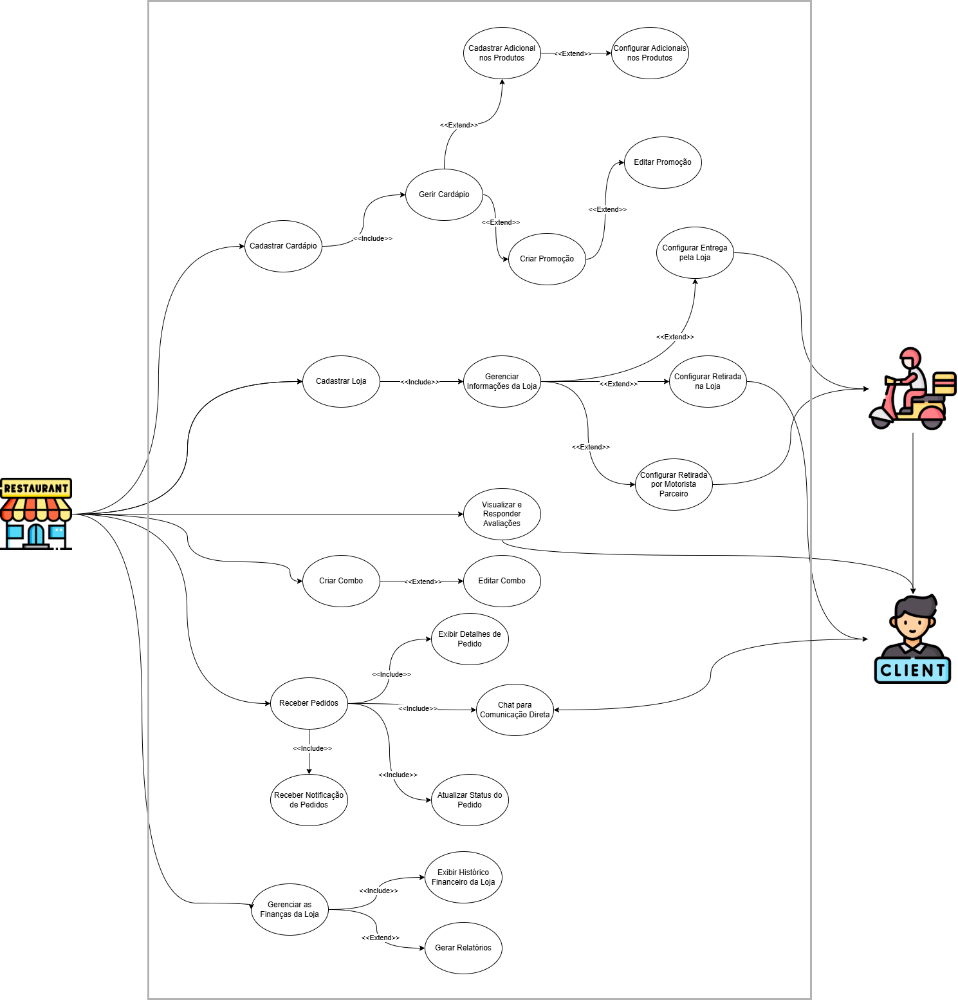

# Diagrama de Casos de Uso - Loja

## Introdução

Este documento apresenta o diagrama de casos de uso da loja do HungryHub, representando todas as funcionalidades que dizem respeito à Loja.

## Metodologia

O diagrama foi desenvolvido de forma a identificar todos os atores e denifir os casos de uso que indicam o fluxo de ações da loja no sistema

Foi utilizada a ferramenta Draw.io para a criação do diagrama.

**Tabela 1**: Integrantes

| Matrícula | Nome                |
| --------- | ------------------- |
| 202046229 | Kallyne Passos      |
| 200022199 | Leonardo Aguiar     |
| 232014727 | Kauan Eiras         |

**Autores**: [Kallyne Macedo](https://github.com/kalipassos), [Kauan T. Eiras](https://github.com/kauaneiras) e [Leonardo Aguiar](https://github.com/Leonardo0o0).

**Tabela 2**: Especificação de Caso de Uso

| Código | Caso de Uso | Responsável |
|--------|-------------|-------------|
| [UCL01](#tabela-3-caso-de-uso-ucl01-cadastrar-loja-no-aplicativo) | Cadastrar Loja no Aplicativo | [Kallyne Macedo](https://github.com/kalipassos), [Kauan T. Eiras](https://github.com/kauaneiras), [Leonardo Aguiar](https://github.com/Leonardo0o0) |
| [UCL02](#tabela-4-caso-de-uso-ucl02-gerenciar-informações-da-loja) | Gerenciar Informações da Loja | [Kallyne Macedo](https://github.com/kalipassos), [Kauan T. Eiras](https://github.com/kauaneiras), [Leonardo Aguiar](https://github.com/Leonardo0o0) |
| [UCL03](#tabela-5-caso-de-uso-ucl03-cadastrar-cardápio) | Cadastrar Cardápio | [Kallyne Macedo](https://github.com/kalipassos), [Kauan T. Eiras](https://github.com/kauaneiras), [Leonardo Aguiar](https://github.com/Leonardo0o0) |
| [UCL04](#tabela-6-caso-de-uso-ucl04-gerir-cardápio) | Gerir Cardápio | [Kallyne Macedo](https://github.com/kalipassos), [Kauan T. Eiras](https://github.com/kauaneiras), [Leonardo Aguiar](https://github.com/Leonardo0o0) |
| [UCL05](#tabela-7-caso-de-uso-ucl05-cadastrar-adicional-nos-produtos) | Cadastrar Adicional nos Produtos | [Kallyne Macedo](https://github.com/kalipassos), [Kauan T. Eiras](https://github.com/kauaneiras), [Leonardo Aguiar](https://github.com/Leonardo0o0) |
| [UCL06](#tabela-8-caso-de-uso-ucl06-configurar-adicionais-nos-produtos) | Configurar Adicionais nos Produtos | [Kallyne Macedo](https://github.com/kalipassos), [Kauan T. Eiras](https://github.com/kauaneiras), [Leonardo Aguiar](https://github.com/Leonardo0o0) |
| [UCL07](#tabela-9-caso-de-uso-ucl07-receber-pedidos) | Receber Pedidos | [Kallyne Macedo](https://github.com/kalipassos) |
| [UCL08](#tabela-10-caso-de-uso-ucl08-exibir-detalhes-de-pedido) | Exibir Detalhes de Pedido | [Kallyne Macedo](https://github.com/kalipassos) |
| [UCL09](#tabela-11-caso-de-uso-ucl09-atualizar-status-do-pedido) | Atualizar Status do Pedido | [Kallyne Macedo](https://github.com/kalipassos) |
| [UCL10](#tabela-12-caso-de-uso-ucl10-receber-notificações-de-pedidos) | Receber Notificações de Pedidos | [Kallyne Macedo](https://github.com/kalipassos) |
| [UCL11](#tabela-13-caso-de-uso-ucl11-configurar-entrega-pela-própria-loja) | Configurar Entrega pela Própria Loja | [Kallyne Macedo](https://github.com/kalipassos) |
| [UCL12](#tabela-14-caso-de-uso-ucl12-configurar-retirada-na-loja) | Configurar Retirada na Loja | [Leonardo Aguiar](https://github.com/Leonardo0o0) |
| [UCL13](#tabela-15-caso-de-uso-ucl13-configurar-retirada-por-motorista-parceiro) | Configurar Retirada por Motorista Parceiro | [Leonardo Aguiar](https://github.com/Leonardo0o0) |
| [UCL14](#tabela-16-caso-de-uso-ucl14-criar-promoção) | Criar Promoção | [Leonardo Aguiar](https://github.com/Leonardo0o0) |
| [UCL15](#tabela-17-caso-de-uso-ucl15-editar-promoção) | Editar Promoção | [Leonardo Aguiar](https://github.com/Leonardo0o0) |
| [UCL16](#tabela-18-caso-de-uso-ucl16-criar-combo) | Criar Combo | [Leonardo Aguiar](https://github.com/Leonardo0o0) |
| [UCL17](#tabela-19-caso-de-uso-ucl17-editar-combo) | Editar Combo | [Kauan T. Eiras](https://github.com/kauaneiras) |
| [UCL18](#tabela-20-caso-de-uso-ucl18-visualizar-e-responder-avaliações) | Visualizar e Responder Avaliações | [Kauan T. Eiras](https://github.com/kauaneiras) |
| [UCL19](#tabela-21-caso-de-uso-ucl19-chat-para-comunicação-direta) | Chat para Comunicação Direta | [Kauan T. Eiras](https://github.com/kauaneiras) |
| [UCL20](#tabela-22-caso-de-uso-ucl20-gerar-relatórios) | Gerar Relatórios | [Kauan T. Eiras](https://github.com/kauaneiras) |
| [UCL21](#tabela-23-caso-de-uso-ucl21-exibir-histórico-financeiro-da-loja) | Exibir Histórico Financeiro da Loja | [Kauan T. Eiras](https://github.com/kauaneiras) |
| [UCL22](#tabela-24-caso-de-uso-ucl22-gerenciar-as-finanças-da-loja) | Gerenciar as Finanças da Loja | [Kauan T. Eiras](https://github.com/kauaneiras) |

**Autores**: [Kallyne Macedo](https://github.com/kalipassos), [Kauan T. Eiras](https://github.com/kauaneiras) e [Leonardo Aguiar](https://github.com/Leonardo0o0).

## Diagrama dos Casos de Uso

**Autores**: [Kallyne Macedo](https://github.com/kalipassos), [Kauan T. Eiras](https://github.com/kauaneiras) e [Leonardo Aguiar](https://github.com/Leonardo0o0).

## Especificações dos Casos de Uso

### Tabela 3: Caso de Uso - UCL01 Cadastrar Loja no Aplicativo
| Campo | Descrição |
|--------------------|-------------------------------------------------------------------------------------------|
| Caso de Uso | Cadastrar Loja no Aplicativo |
| Descrição | Permite à loja se cadastrar no aplicativo, criando um perfil com informações necessárias para operar no sistema |
| Requisitos | R25 |
| Atores | Representante da Loja |
| Frequência de uso | Média |
| Pré-condições | O aplicativo deve estar disponível para cadastro e a loja deve ter acesso à internet |
| Fluxo Principal | 1. Acessar a seção de cadastro de lojas 2. Inserir dados cadastrais, como nome da loja, endereço, telefone e documentos 3. Submeter o cadastro para análise 4. Receber confirmação de cadastro realizado com sucesso |
| Fluxos de Exceção | 1. Dados obrigatórios não preenchidos 2. Falha na conexão durante o processo de cadastro 3. Dados inválidos ou formatos incorretos |
| Pós-condições | A loja é cadastrada e pode acessar as funcionalidades do sistema após aprovação |
| Data Criação | 28/11/2024 |

**Autores**: [Kallyne Macedo](https://github.com/kalipassos), [Kauan T. Eiras](https://github.com/kauaneiras) e [Leonardo Aguiar](https://github.com/Leonardo0o0).

### Tabela 4: Caso de Uso - UCL02 Gerenciar Informações da Loja
| Campo | Descrição |
|--------------------|-------------------------------------------------------------------------------------------|
| Caso de Uso | Gerenciar Informações da Loja |
| Descrição | Permite à loja editar informações cadastrais como endereço e horário de funcionamento |
| Requisitos | Pendente |
| Atores | Representante da Loja |
| Frequência de uso | Alta |
| Pré-condições | A loja deve estar cadastrada e autenticada no sistema |
| Fluxo Principal | 1. Acessar a seção de informações da loja 2. Editar dados 3. Salvar as alterações |
| Fluxos de Exceção | 1. Dados obrigatórios não preenchidos 2. Falha na atualização dos dados |
| Pós-condições | As informações da loja são atualizadas no sistema |
| Data Criação | 28/11/2024 |

**Autores**: [Kallyne Macedo](https://github.com/kalipassos), [Kauan T. Eiras](https://github.com/kauaneiras) e [Leonardo Aguiar](https://github.com/Leonardo0o0).

### Tabela 5: Caso de Uso - UCL03 Cadastrar Cardápio
| Campo | Descrição |
|--------------------|-------------------------------------------------------------------------------------------|
| Caso de Uso | Cadastrar Cardápio |
| Descrição | Permite à loja cadastrar produtos no cardápio do aplicativo |
| Requisitos | R25 |
| Atores | Representante da Loja |
| Frequência de uso | Média |
| Pré-condições | A loja deve estar cadastrada e autenticada no sistema |
| Fluxo Principal | 1. Acessar a seção de gerenciamento do cardápio 2. Adicionar produtos com nome, descrição, preço e imagens 3. Salvar as informações |
| Fluxos de Exceção | 1. Dados obrigatórios não preenchidos 2. Erro na conexão ao salvar o cardápio |
| Pós-condições | O cardápio é cadastrado com os novos produtos |
| Data Criação | 28/11/2024 |

**Autores**: [Kallyne Macedo](https://github.com/kalipassos), [Kauan T. Eiras](https://github.com/kauaneiras) e [Leonardo Aguiar](https://github.com/Leonardo0o0).

### Tabela 6: Caso de Uso - UCL04 Gerir Cardápio
| Campo | Descrição |
|--------------------|-------------------------------------------------------------------------------------------|
| Caso de Uso | Gerir Cardápio |
| Descrição | Permite à loja editar ou remover produtos do cardápio |
| Requisitos | R26 |
| Atores | Representante da Loja |
| Frequência de uso | Alta |
| Pré-condições | A loja deve estar cadastrada e autenticada no sistema A loja deve ter produtos já cadastrados |
| Fluxo Principal | 1. Acessar a lista de produtos cadastrados 2. Selecionar um produto para editar ou remover 3. Atualizar informações ou confirmar remoção |
| Fluxos de Exceção | 1. Produto não encontrado 2. Falha na atualização dos dados |
| Pós-condições | O cardápio é atualizado conforme as alterações realizadas |
| Data Criação | 28/11/2024 |

**Autores**: [Kallyne Macedo](https://github.com/kalipassos), [Kauan T. Eiras](https://github.com/kauaneiras) e [Leonardo Aguiar](https://github.com/Leonardo0o0).

### Tabela 7: Caso de Uso - UCL05 Cadastrar Adicional nos Produtos
| Campo | Descrição |
|--------------------|-------------------------------------------------------------------------------------------|
| Caso de Uso | Cadastrar Adicional nos Produtos |
| Descrição | Permite à loja cadastrar opções adicionais para os produtos como acompanhamentos e extras |
| Requisitos | Pendente |
| Atores | Representante da Loja |
| Frequência de uso | Média |
| Pré-condições | A loja deve estar cadastrada e autenticada no sistema A loja deve ter produtos já cadastrados |
| Fluxo Principal | 1. Acessar o produto na seção de gerenciamento do cardápio 2. Selecionar a opção para adicionar adicionais 3. Inserir nome, descrição, valores e configurações dos adicionais 4. Salvar as alterações |
| Fluxos de Exceção | 1. Dados obrigatórios não preenchidos 2. Produto não encontrado 3. Erro ao salvar os adicionais |
| Pós-condições | O produto é atualizado com os adicionais cadastrados e está disponível para os clientes |
| Data Criação | 28/11/2024 |

**Autores**: [Kallyne Macedo](https://github.com/kalipassos), [Kauan T. Eiras](https://github.com/kauaneiras) e [Leonardo Aguiar](https://github.com/Leonardo0o0).

### Tabela 8: Caso de Uso - UCL06 Configurar Adicionais nos Produtos
| Campo | Descrição |
|--------------------|-------------------------------------------------------------------------------------------|
| Caso de Uso | Configurar Adicionais nos Produtos |
| Descrição | Permite à loja adicionar opções como acompanhamentos e outros adicionais aos produtos |
| Requisitos | Pendente |
| Atores | Representante da Loja |
| Frequência de uso | Média |
| Pré-condições | A loja deve estar cadastrada e autenticada no sistema A loja deve ter produtos já cadastrados O produto já deve ter um adicional cadastrado |
| Fluxo Principal | 1. Acessar a lista de produtos cadastrados 2. Selecionar um produto 3. Configurar adicionais e preços 4. Salvar as alterações |
| Fluxos de Exceção | 1. Produto não encontrado 2. Dados obrigatórios não preenchidos 3. Erro ao salvar as alterações |
| Pós-condições | O produto é atualizado com os adicionais configurados |
| Data Criação | 28/11/2024 |

**Autores**: [Kallyne Macedo](https://github.com/kalipassos), [Kauan T. Eiras](https://github.com/kauaneiras) e [Leonardo Aguiar](https://github.com/Leonardo0o0).

### Tabela 9: Caso de Uso - UCL07 Receber Pedidos
| Campo | Descrição |
|--------------------|-------------------------------------------------------------------------------------------|
| Caso de Uso | Receber Pedidos |
| Descrição | Permite à loja visualizar e gerenciar pedidos realizados pelos clientes |
| Requisitos | R27 |
| Atores | Representante da Loja |
| Frequência de uso | Alta |
| Pré-condições | A loja deve estar cadastrada e autenticada no sistema A loja deve ter produtos já cadastrados |
| Fluxo Principal | 1. Acessar a seção de pedidos 2. Visualizar pedidos recebidos 3. Aceitar ou recusar pedidos |
| Fluxos de Exceção | 1. Pedido cancelado antes da confirmação 2. Falha na conexão ao atualizar status do pedido |
| Pós-condições | O pedido é processado pela loja para entrega ou retirada |
| Data Criação | 28/11/2024 |

**Autor**: [Kallyne Macedo](https://github.com/kalipassos).

### Tabela 10: Caso de Uso - UCL08 Exibir Detalhes de Pedido
| Campo | Descrição |
|--------------------|-------------------------------------------------------------------------------------------|
| Caso de Uso | Exibir Detalhes de Pedido |
| Descrição | Permite à loja visualizar todos os detalhes de um pedido, incluindo produtos, preços e endereço de entrega |
| Requisitos | Pendente |
| Atores | Representante da Loja |
| Frequência de uso | Alta |
| Pré-condições | A loja deve estar autenticada no sistema   A loja deve ter pedidos recebidos |
| Fluxo Principal | 1. Acessar a seção de pedidos recebidos 2. Selecionar um pedido específico 3. Visualizar os detalhes do pedido |
| Fluxos de Exceção | 1. Pedido não encontrado 2. Erro na exibição dos detalhes devido a falha na conexão |
| Pós-condições | A loja visualiza todos os detalhes do pedido e pode tomar as ações necessárias |
| Data Criação | 28/11/2024 |

**Autor**: [Kallyne Macedo](https://github.com/kalipassos).

### Tabela 11: Caso de Uso - UCL09 Atualizar Status do Pedido
| Campo | Descrição |
|--------------------|-------------------------------------------------------------------------------------------|
| Caso de Uso | Atualizar Status do Pedido |
| Descrição | Permite à loja atualizar o status dos pedidos em tempo real |
| Requisitos | Pendente |
| Atores | Representante da Loja |
| Frequência de uso | Alta |
| Pré-condições | A loja deve estar autenticada no sistema   A loja deve ter pedidos recebidos |
| Fluxo Principal | 1. Acessar a seção de pedidos em andamento 2. Selecionar o pedido a ser atualizado 3. Alterar o status do pedido 4. Confirmar a atualização |
| Fluxos de Exceção | 1. Pedido não encontrado 2. Falha na conexão ao atualizar o status |
| Pós-condições | O status do pedido é atualizado e o cliente é notificado sobre a mudança |
| Data Criação | 28/11/2024 |

**Autor**: [Kallyne Macedo](https://github.com/kalipassos).

### Tabela 12: Caso de Uso - UCL10 Receber Notificações de Pedidos
| Campo | Descrição |
|--------------------|-------------------------------------------------------------------------------------------|
| Caso de Uso | Receber Notificações de Pedidos |
| Descrição | Permite à loja receber notificações em tempo real sobre novos pedidos |
| Requisitos | Pendente |
| Atores | Representante da Loja |
| Frequência de uso | Alta |
| Pré-condições | A loja deve estar cadastrada, autenticada   A loja deve estar com o aplicativo configurado para notificações |
| Fluxo Principal | 1. O cliente realiza um pedido no aplicativo 2. O sistema envia uma notificação para a loja 3. A loja visualiza o pedido recebido |
| Fluxos de Exceção | 1. Notificação não recebida devido a falha de conexão 2. Erro no sistema ao enviar a notificação |
| Pós-condições | A loja é informada sobre novos pedidos e pode iniciar o processamento |
| Data Criação | 28/11/2024 |

**Autor**: [Kallyne Macedo](https://github.com/kalipassos).

### Tabela 13: Caso de Uso - UCL11 Configurar Entrega pela Própria Loja
| Campo | Descrição |
|--------------------|-------------------------------------------------------------------------------------------|
| Caso de Uso | Configurar Entrega pela Própria Loja |
| Descrição | Permite à loja configurar a opção de realizar entregas por conta própria |
| Requisitos | R30 |
| Atores | Representante da Loja |
| Frequência de uso | Média |
| Pré-condições | A loja deve estar cadastrada e autenticada no sistema |
| Fluxo Principal | 1. Acessar as configurações de entrega 2. Ativar a opção de entrega própria 3. Definir taxas de entrega ou área de cobertura |
| Fluxos de Exceção | 1. Dados obrigatórios não preenchidos 2. Erro ao salvar as configurações |
| Pós-condições | A loja está habilitada para realizar entregas por conta própria |
| Data Criação | 28/11/2024 |

**Autor**: [Kallyne Macedo](https://github.com/kalipassos).

### Tabela 14: Caso de Uso - UCL12 Configurar Retirada na Loja
| Campo | Descrição |
|--------------------|-------------------------------------------------------------------------------------------|
| Caso de Uso | Configurar Retirada na Loja |
| Descrição | Permite à loja configurar a opção de retirada de pedidos no estabelecimento |
| Requisitos | R29 |
| Atores | Representante da Loja |
| Frequência de uso | Média |
| Pré-condições | A loja deve estar cadastrada e autenticada no sistema |
| Fluxo Principal | 1. Acessar as configurações de entrega 2. Ativar a opção de retirada na loja 3. Salvar as configurações |
| Fluxos de Exceção | 1. Dados obrigatórios não preenchidos 2. Erro ao salvar as configurações |
| Pós-condições | A loja está habilitada para aceitar pedidos com retirada no local |
| Data Criação | 28/11/2024 |

**Autor**:  [Leonardo Aguiar](https://github.com/Leonardo0o0).

### Tabela 15: Caso de Uso - UCL13 Configurar Retirada por Motorista Parceiro
| Campo | Descrição |
|--------------------|-------------------------------------------------------------------------------------------|
| Caso de Uso | Configurar Retirada por Motorista Parceiro |
| Descrição | Permite à loja configurar a opção de retirada e entrega por motoristas parceiros |
| Requisitos | Pendente |
| Atores | Representante da Loja |
| Frequência de uso | Média |
| Pré-condições | A loja deve estar cadastrada e autenticada no sistema O sistema deve ter motoristas parceiros cadastrados |
| Fluxo Principal | 1. Acessar as configurações de entrega 2. Ativar a opção de retirada por motorista parceiro 3. Definir regras de uso e salvar as configurações |
| Fluxos de Exceção | 1. Dados obrigatórios não preenchidos 2. Erro ao salvar as configurações 3. Motorista parceiro indisponível |
| Pós-condições | A loja está habilitada para utilizar motoristas parceiros na entrega |
| Data Criação | 28/11/2024 |

**Autor**:  [Leonardo Aguiar](https://github.com/Leonardo0o0).
### Tabela 16: Caso de Uso - UCL14 Criar Promoção
| Campo | Descrição |
|--------------------|-------------------------------------------------------------------------------------------|
| Caso de Uso | Criar Promoção |
| Descrição | Permite à loja criar promoções para atrair mais clientes. |
| Requisitos | Pendente |
| Atores | Representante da Loja |
| Frequência de uso | Alta |
| Pré-condições | A loja deve estar cadastrada e autenticada no sistema.   A loja deve ter produtos já cadastrados. |
| Fluxo Principal | 1. Acessar a seção de promoções. 2. Inserir informações da promoção, como descrição, descontos e validade. 3. Salvar a promoção. |
| Fluxos de Exceção | 1. Dados obrigatórios não preenchidos. 2. Erro ao salvar a promoção. |
| Pós-condições | A promoção é criada e está disponível para os clientes. |
| Data Criação | 28/11/2024 |

**Autor**:  [Leonardo Aguiar](https://github.com/Leonardo0o0).

### Tabela 17: Caso de Uso - UCL15 Editar Promoção
| Campo | Descrição |
|--------------------|-------------------------------------------------------------------------------------------|
| Caso de Uso | Editar Promoção |
| Descrição | Permite à loja editar promoções já cadastradas no sistema. |
| Requisitos | Pendente |
| Atores | Representante da Loja |
| Frequência de uso | Média |
| Pré-condições | A loja deve estar cadastrada e autenticada no sistema.   A loja deve ter produtos já cadastrados.   A loja deve ter promoções criadas. |
| Fluxo Principal | 1. Acessar a seção de promoções. 2. Selecionar a promoção desejada. 3. Atualizar os dados, como valores ou validade. 4. Salvar as alterações. |
| Fluxos de Exceção | 1. Promoção não encontrada. 2. Dados obrigatórios não preenchidos. 3. Erro ao salvar as alterações. |
| Pós-condições | A promoção é atualizada e as alterações são refletidas no sistema. |
| Data Criação | 28/11/2024 |

**Autor**:  [Leonardo Aguiar](https://github.com/Leonardo0o0).

### Tabela 18: Caso de Uso - UCL16 Criar Combo
| Campo | Descrição |
|--------------------|-------------------------------------------------------------------------------------------|
| Caso de Uso | Criar Combo |
| Descrição | Permite à loja criar combos com ofertas especiais combinando produtos. |
| Requisitos | Pendente |
| Atores | Representante da Loja |
| Frequência de uso | Média |
| Pré-condições | A loja deve estar cadastrada e autenticada no sistema.   A loja deve ter no minimo dois produtos já cadastrados. |
| Fluxo Principal | 1. Acessar a seção de combos. 2. Selecionar produtos para compor o combo. 3. Configurar o valor especial e validade. 4. Salvar o combo. |
| Fluxos de Exceção | 1. Dados obrigatórios não preenchidos. 2. Erro ao salvar o combo. |
| Pós-condições | O combo criado está disponível para os clientes. |
| Data Criação | 28/11/2024 |

**Autor**:  [Leonardo Aguiar](https://github.com/Leonardo0o0).

### Tabela 19: Caso de Uso - UCL17 Editar Combo
| Campo | Descrição |
|--------------------|-------------------------------------------------------------------------------------------|
| Caso de Uso | Editar Combo |
| Descrição | Permite à loja editar combos já cadastrados no sistema. |
| Requisitos | Pendente |
| Atores | Representante da Loja |
| Frequência de uso | Alta |
| Pré-condições | A loja deve estar cadastrada e autenticada no sistema.   A loja deve ter no minimo dois produtos já cadastrados.   A loja deve ter combos criados. |
| Fluxo Principal | 1. Acessar a seção de combos. 2. Selecionar o combo desejado. 3. Atualizar informações, como produtos ou valores. 4. Salvar as alterações. |
| Fluxos de Exceção | 1. Combo não encontrado. 2. Dados obrigatórios não preenchidos. 3. Erro ao salvar as alterações. |
| Pós-condições | O combo é atualizado e as alterações são refletidas no sistema. |
| Data Criação | 28/11/2024 |

**Autor:** [Kauan T. Eiras](https://github.com/kauaneiras).

### Tabela 20: Caso de Uso - UCL18 Visualizar e Responder Avaliações
| Campo | Descrição |
|--------------------|-------------------------------------------------------------------------------------------|
| Caso de Uso | Visualizar e Responder Avaliações |
| Descrição | Permite à loja visualizar as avaliações feitas pelos clientes e responder a feedbacks para melhorar a interação e satisfação. |
| Requisitos | R23 |
| Atores | Representante da Loja |
| Frequência de uso | Média |
| Pré-condições | A loja deve estar autenticada   A loja deve ter avaliações registradas no sistema. |
| Fluxo Principal | 1. Acessar a seção de avaliações. 2. Visualizar avaliações e notas recebidas. 3. Selecionar uma avaliação para responder. 4. Escrever e enviar a resposta. |
| Fluxos de Exceção | 1. Falha na conexão ao acessar as avaliações. 2. Erro ao tentar enviar a resposta. |
| Pós-condições | A loja visualiza as avaliações e responde de forma a interagir com os clientes e melhorar a experiência de serviço. |
| Data Criação | 28/11/2024 |

**Autor:** [Kauan T. Eiras](https://github.com/kauaneiras).

### Tabela 21: Caso de Uso - UCL19 Chat para Comunicação Direta
| Campo | Descrição |
|--------------------|-------------------------------------------------------------------------------------------|
| Caso de Uso | Chat para Comunicação Direta |
| Descrição | Permite à loja e ao cliente se comunicarem diretamente por meio de um aplicativo externo. |
| Requisitos | Pendente |
| Atores | Representante da Loja, Cliente |
| Frequência de uso | Alta |
| Pré-condições | A loja deve estar autenticada   A loja deve ter um pedido em andamento com o cliente |
| Fluxo Principal | 1. Acessar a seção de chat na interface do pedido. 2. Enviar e receber mensagens em tempo real. 3. Visualizar histórico de mensagens. |
| Fluxos de Exceção | 1. Falha na conexão à internet. 2. Problemas técnicos que impedem o envio de mensagens. |
| Pós-condições | A loja e o cliente podem se comunicar para esclarecer dúvidas, informar sobre o pedido e resolver questões relacionadas. |
| Data Criação | 28/11/2024 |

**Autor:** [Kauan T. Eiras](https://github.com/kauaneiras).

### Tabela 22: Caso de Uso - UCL20 Gerar Relatórios
| Campo | Descrição |
|--------------------|---------------------------------------------------------------------------|
| Caso de Uso | Gerar Relatórios |
| Descrição | Permite à loja visualizar relatórios de vendas e produtos mais vendidos. |
| Requisitos | Pendente |
| Atores | Representante da Loja |
| Frequência de uso | Média |
| Pré-condições | A loja deve ter um histórico de vendas no sistema |
| Fluxo Principal | 1. Acessar a seção de relatórios. 2. Selecionar o período desejado. 3. Visualizar os relatórios gerados. |
| Fluxos de Exceção | 1. Falha na geração do relatório. 2. Falta de dados suficientes para gerar o relatório. |
| Pós-condições | A loja obtém informações detalhadas sobre suas vendas e desempenho. |
| Data Criação | 28/11/2024 |

**Autor:** [Kauan T. Eiras](https://github.com/kauaneiras).

### Tabela 23: Caso de Uso - UCL21 Exibir Histórico Financeiro da Loja
| Campo | Descrição |
|--------------------|-------------------------------------------------------------------------------------------|
| Caso de Uso | Exibir Histórico Financeiro da Loja |
| Descrição | Permite à loja visualizar seu histórico financeiro, incluindo saldo a receber e pagamentos realizados. |
| Requisitos | Pendente |
| Atores | Representante da Loja |
| Frequência de uso | Alta |
| Pré-condições | A loja deve estar autenticada no sistema  A loja deve ter usado o aplicativo por no minimo uma semana |
| Fluxo Principal | 1. Acessar a seção de histórico financeiro. 2. Visualizar saldo a receber e pagamentos realizados. 3. Consultar detalhes de transações específicas. |
| Fluxos de Exceção | 1. Falha na conexão ao exibir os dados. 2. Dados financeiros ausentes ou incompletos. |
| Pós-condições | A loja tem acesso às informações financeiras detalhadas para controle e planejamento. |
| Data Criação | 28/11/2024 |

**Autor:** [Kauan T. Eiras](https://github.com/kauaneiras).

### Tabela 24: Caso de Uso - UCL22 Gerenciar as finanças da Loja
| Campo | Descrição |
|--------------------|-------------------------------------------------------------------------------------------|
| Caso de Uso | Gerenciar as financas da Loja |
| Descrição | Permite à loja consultar valores recebidos, taxas cobradas pelo aplicativo e gerenciar o saldo financeiro. |
| Requisitos | Pendente |
| Atores | Representante da Loja |
| Frequência de uso | Alta |
| Pré-condições | A loja deve estar autenticada no sistema   A loja deve ter transações financeiras registradas. |
| Fluxo Principal | 1. Acessar a seção de finanças. 2. Visualizar valores recebidos e taxas cobradas. 3. Consultar detalhadamente cada transação. |
| Fluxos de Exceção | 1. Falha na conexão ao acessar os dados financeiros. 2. Dados financeiros incompletos ou corrompidos. |
| Pós-condições | A loja tem acesso detalhado às informações financeiras para controle e tomada de decisões. |
| Data Criação | 28/11/2024 |

**Autor:** [Kauan T. Eiras](https://github.com/kauaneiras).

## Referências

1. Caso de Uso – Include, Extend e Generalização, ATÉ O MOMENTO. Disponível em: https://www.ateomomento.com.br/caso-de-uso-include-extend-e-generalizacao/. Acessado em 27 de novembro de 2024.

## Histórico de Versão

| Versão | Data da alteração | Comentário | Autor(es) | Revisor(es) | Data de revisão |
| -- | -- | -- | -- | -- | -- |
| 1.0 | 28/11/2024 | Criacao dos documentos, adição das tabelas de casos de uso e adição do diagrama | [Kallyne Macedo](https://github.com/kalipassos), [Kauan T. Eiras](https://github.com/kauaneiras) e [Leonardo Aguiar](https://github.com/Leonardo0o0). |[Guilherme Silva Dutra](https://github.com/GuiDutra21) | 28/11/24 |