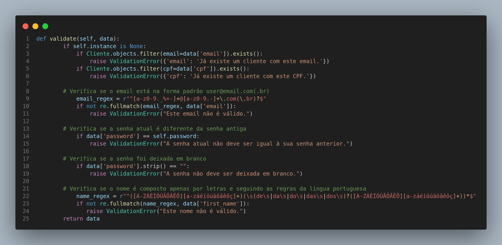

# Command

## Introdução

O padrão comportamental **Command** encapsula uma solicitação como um objeto, permitindo que ações sejam parametrizadas e tornando possível armazená-las, desfazê-las ou executá-las em diferentes contextos. Ele é amplamente utilizado para desacoplar remetentes de solicitantes e fornecer flexibilidade na execução de comandos. No projeto, o padrão Command está representado pela função `handleNavigation`, que encapsula a lógica de navegação e permite que a ação seja parametrizada com a rota desejada.

## Metodologia

- **Processo de Trabalho**: A equipe seguiu uma abordagem modular, encapsulando a lógica de navegação em comandos reutilizáveis, promovendo a clareza e a organização no código.
- **Ferramentas Utilizadas**: O desenvolvimento foi realizado com `React Native` e a biblioteca `expo-router` para gerenciamento de rotas.
- **Justificativa**: O padrão Command foi empregado para encapsular a lógica de navegação, permitindo sua reutilização em diferentes partes do aplicativo e simplificando futuras modificações.

## Exemplo de Implementação no Projeto

A função `handleNavigation` no arquivo `Profile.tsx` é um exemplo do padrão Command, encapsulando a lógica de navegação em um comando que pode ser reutilizado e parametrizado com diferentes rotas.

## Implementações no Código Fonte

### Função handleNavigation

**Tecnologia:** `React Native`

A função `handleNavigation` encapsula a navegação como um comando, aceitando uma rota como parâmetro e utilizando o `router.push` para executar a navegação.

<b>Implementação no Código</b>

**Autor: [Kauan Eiras](https://github.com/kauaneiras)**

### Função validate

**Tecnologia:** `Django`

A função `validate` verifica se o email, fist_name ou password estão de acordo com os padrões esperados pelo site.

<b>Implementação no Código</b>

**Autor: [Davi Pierre](https://github.com/DaviPierre)**

### Justificativa Técnica

- **Prós**:

  - **Reutilização**: A lógica de navegação pode ser reutilizada em várias partes do projeto.
  - **Modularidade**: A lógica está encapsulada, facilitando a manutenção e a extensão.
  - **Flexibilidade**: Comandos podem ser parametrizados, tornando a navegação dinâmica.

- **Contras**:
  - Introduz uma camada adicional de abstração, que pode ser desnecessária em casos simples.
  - Pode complicar a depuração se houver muitas abstrações aninhadas.

## Referências

1. Gamma, Erich, et al. _Design Patterns: Elements of Reusable Object-Oriented Software_. Addison-Wesley, 1994.
2. React Router Documentation. Navigation. Disponível em: [https://reactrouter.com/en/main/hooks/use-navigate](https://reactrouter.com/en/main/hooks/use-navigate). Acesso em: 06 jan. 2025.
3. Expo Router Documentation. Navigation API. Disponível em: [https://expo.dev/router](https://expo.dev/router). Acesso em: 06 jan. 2025.

## Histórico de Versões

| Versão | Data da alteração | Comentário                | Autor(es)                                    | Revisor(es)                            | Data de revisão |
| ------ | ----------------- | ------------------------- | -------------------------------------------- | -------------------------------------- | --------------- |
| 1.0    | 06/01/2025        | Criação do documento      | [Kauan Eiras](https://github.com/kauaneiras) | [Bruno Araújo](https://github.com/cva) | 06/01/2025      |
| 1.1    | 06/01/2025        | Adição da Função validate | [Davi Pierre](https://github.com/DaviPierre) |                                        |                 |
