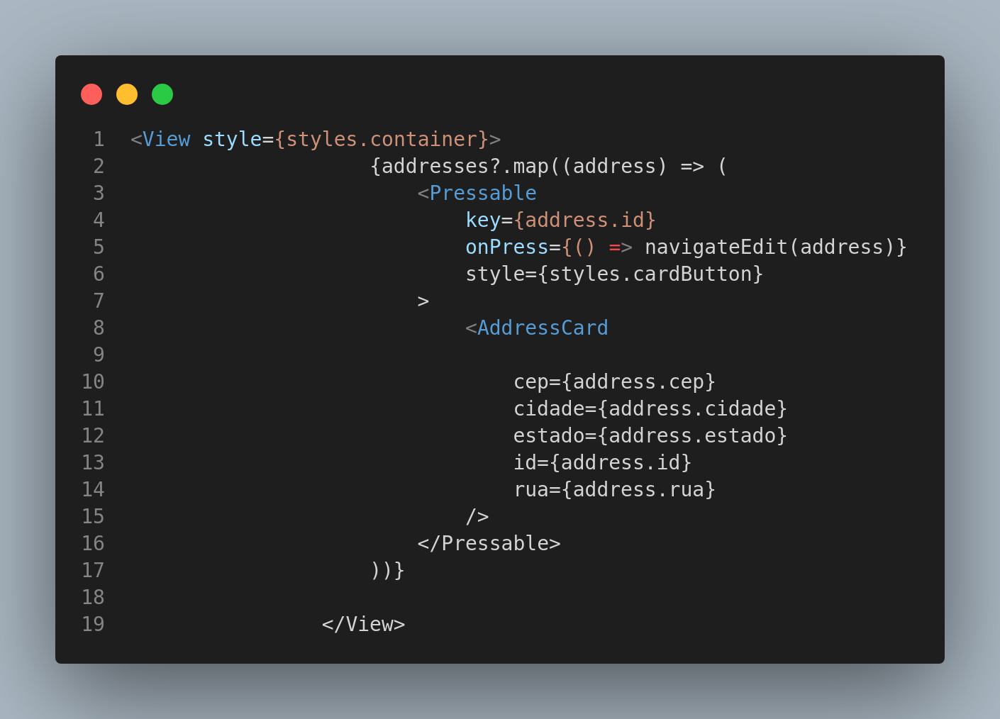

 <!-- base nos outros arquivo me gere um para o iterator -->
<!-- me ajuda ai copilot -->
# Iterator

## Introdução

Este documento registra as contribuições dos membros do projeto relacionadas à utilização do padrão de projeto Iterator. O Iterator é um padrão de projeto comportamental que permite a você percorrer os elementos de uma coleção sem expor a sua representação subjacente. Dessa forma, o Iterator permite que você acesse os elementos de uma coleção de maneira sequencial sem revelar os detalhes internos da coleção.

O padrão Iterator é utilizado quando você precisa acessar os elementos de uma coleção de maneira uniforme, sem se preocupar com a estrutura interna da coleção.

<!-- Inclua os seguintes elementos:

- **Objetivo**: Descrever o propósito deste documento.
- **Contexto**: Breve explicação sobre o projeto e sua importância.
- **Escopo**: Delimitação do conteúdo abordado neste documento. -->

## Metodologia

No contexto das nossas tecnologias, o padrão **Iterator** é implementado através de mecanismos que permitem a iteração sobre coleções de dados. No JavaScript, por exemplo, o padrão Iterator é implementado através do uso de iteradores e geradores, que permitem que você percorra os elementos de uma coleção de maneira sequencial. No Python, o padrão Iterator é implementado através de iteradores e a interface `__iter__`, que permitem a iteração sobre coleções de dados de maneira uniforme.

Para a implementação do padrão Iterator, olhamos os requisitos do projeto e identificamos situações em que a iteração sobre coleções de dados é necessária. Em seguida, utilizamos as ferramentas disponíveis em nossas tecnologias para implementar o padrão Iterator de forma eficiente e eficaz.

<!-- Explique como as decisões foram tomadas, as ferramentas utilizadas, e justifique escolhas arquiteturais.

- **Processo de Trabalho**: Descrição do método utilizado pela equipe (ex.: Scrum, Kanban).
- **Ferramentas Utilizadas**: Ferramentas empregadas na criação deste artefato (ex.: LucidChart, GitHub).
- **Justificativa**: Razões para as escolhas metodológicas e tecnológicas. -->

### Justificativa Técnica

<!-- - Justificativas das decisões tomadas, incluindo análise de prós e contras. -->

O padrão **Iterator** foi escolhido para a implementação de funcionalidades que requerem a iteração sobre coleções de dados. Ele permite que você acesse os elementos de uma coleção de maneira sequencial sem revelar os detalhes internos da coleção. Isso é útil em situações em que você precisa acessar os elementos de uma coleção de maneira uniforme, sem se preocupar com a estrutura interna da coleção.

- Prós:
  - Permite percorrer os elementos de uma coleção de maneira uniforme.
  - Oculta a representação interna da coleção.
  - Facilita a implementação de algoritmos que operam sobre coleções de dados.

- Contras:
  - Requer a implementação de mecanismos de iteração.
  - Pode introduzir sobrecarga adicional em coleções muito grandes.
  
## Implementações no Código Fonte

### Iterator na criação do AddressCard

O padrão Iterator foi utilizado na implementação da funcionalidade de listagem de endereços de um usuário, permitindo percorrer de forma ordenada e controlada a coleção de endereços armazenada. Essa abordagem facilita a exibição de cada endereço na interface, garantindo que cada item seja processado de maneira uniforme, independente da estrutura interna da coleção.

<b>Implementação no código</b>

**[index.tsx](https://github.com/UnBArqDsw2024-2/2024.2_G7_Entrega_Entrega_03/blob/17-US06/src/HungryHub.2024.2-Front/hungryhub/src/app/(auth)/(tabs)/profile/addresses/index.tsx)**

**Autores**:  [Guilherme Silva Dutra](https://github.com/GuiDutra21), [Júlio Roberto da Silva Neto](https://github.com/JulioR2022)

## Referências
https://www.tutorialspoint.com/design_pattern/iterator_pattern.htm
https://sourcemaking.com/design_patterns/iterator

## Histórico de Versões

| Versão | Data da alteração | Comentário           | Autor(es)                                       | Revisor(es) | Data de revisão |
| ------ | ----------------- | -------------------- | ----------------------------------------------- | ----------- | --------------- |
| 1.0    | 06/01/2025       | Criação do documento. Introdução, Metodologia, Justificativa Técnica |   [Guilherme Silva Dutra](https://github.com/GuiDutra21), [Júlio Roberto da Silva Neto](https://github.com/JulioR2022) |         |         |
| 1.1    | 06/01/2025       | Adiciona Implementações no Código Fonte |   [Guilherme Silva Dutra](https://github.com/GuiDutra21), [Júlio Roberto da Silva Neto](https://github.com/JulioR2022) |         |         |
