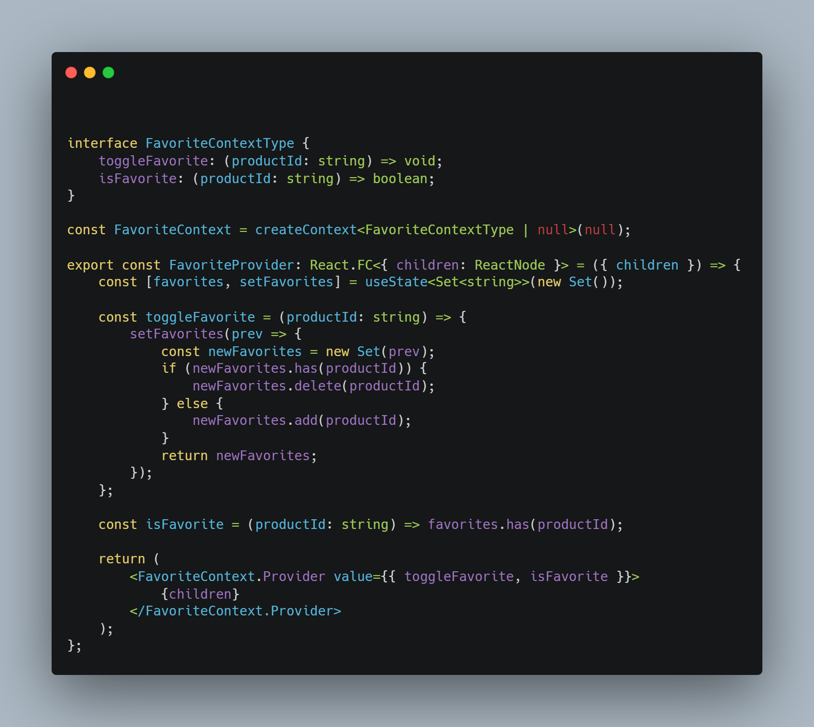
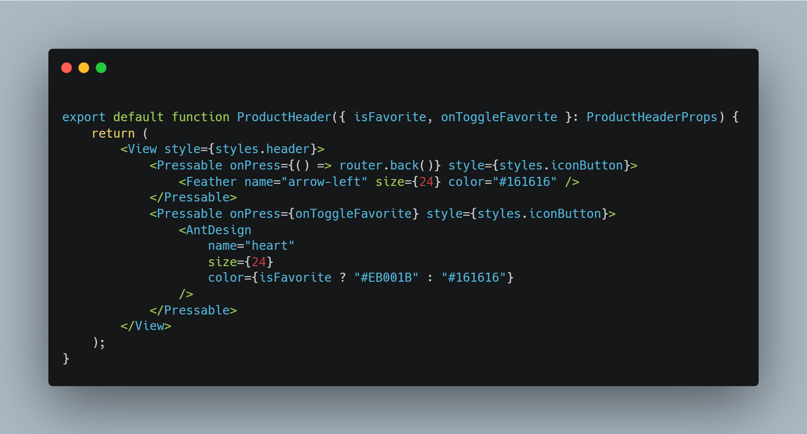
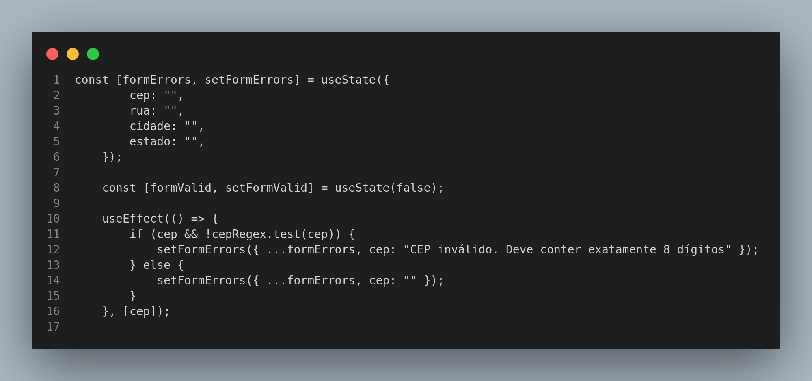

# Observer

## Introdução

Este documento registra as contribuições dos membros do projeto relacionadas à utilização do padrão de projeto Observer. O Observer é um padrão de projeto comportamental que permite que você defina um mecanismo de assinatura para notificar múltiplos objetos sobre quaisquer eventos que aconteçam com o objeto que eles estão observando (REFACTORING GURU, 2025). Dessa forma, o Observer permite que objetos observadores reajam a mudanças em um objeto observado sem acoplamento rígido entre eles.

O padrão Observer é utilizado quando mudanças no estado de um objeto podem precisar mudar outros objetos, e o atual conjunto de objetos é desconhecido de antemão ou muda dinamicamente.

<!-- Inclua os seguintes elementos:

- **Objetivo**: Descrever o propósito deste documento.
- **Contexto**: Breve explicação sobre o projeto e sua importância.
- **Escopo**: Delimitação do conteúdo abordado neste documento. -->

## Metodologia

No contexto das nossas tecnologias, o padrão **Observer** é implementado através de mecanismos de notificação de mudanças de estado. No React, por exemplo, o padrão Observer é implementado através do uso de Context API e hooks, que permitem que múltiplos componentes reajam a mudanças em um estado compartilhado. No Django, o padrão Observer é implementado através de sinais, que permitem que funções sejam executadas em resposta a eventos específicos.

Para a implementação do padrão Observer, olhamos os requisitos do projeto e identificamos situações em que mudanças em um objeto precisam ser refletidas em outros objetos. Em seguida, utilizamos as ferramentas disponíveis em nossas tecnologias para implementar o padrão Observer de forma eficiente e eficaz.

<!-- Explique como as decisões foram tomadas, as ferramentas utilizadas, e justifique escolhas arquiteturais.

- **Processo de Trabalho**: Descrição do método utilizado pela equipe (ex.: Scrum, Kanban).
- **Ferramentas Utilizadas**: Ferramentas empregadas na criação deste artefato (ex.: LucidChart, GitHub).
- **Justificativa**: Razões para as escolhas metodológicas e tecnológicas. -->

### Justificativa Técnica

<!-- - Justificativas das decisões tomadas, incluindo análise de prós e contras. -->

O padrão **Observer** foi escolhido para a implementação de funcionalidades que requerem notificação de mudanças de estado. Ele permite que objetos observadores reajam a mudanças em um objeto observado sem acoplamento rígido entre eles. Isso é útil em situações em que mudanças em um objeto precisam ser refletidas em outros objetos, mas o atual conjunto de objetos é desconhecido de antemão ou muda dinamicamente.

- Prós:
  - Permite estabelecer relações entre objetos durante a execução.
  - Reduz o acoplamento entre objetos observadores e observados.
  - Facilita a manutenção e a reutilização de código.

- Contras:
  - Requer a implementação de mecanismos de notificação de mudanças de estado.
  - Assinantes são notificados em ordem aleatória

## Implementações no Código Fonte

<!-- Descreva como o padrão foi implementado no projeto, incluindo código e diagramas. -->

### useContext do AuthProvider

O padrão **Observer** é implementado implicitamente aqui pelo uso do React Context com hooks. Através do `useContext` e `AuthContext.Provider`, quando o estado de autenticação do usuário (por exemplo, `user` ou `isLoading`) muda, qualquer componente que utilize o contexto será re-renderizado automaticamente para refletir a mudança. Esse comportamento é fundamental no padrão Observer, onde múltiplos componentes "observam" o estado e reagem a mudanças nele.

<b>Implementação no código</b>

**Contexto observa os valores do AuthContext.Provider**

<!-- TODO: Adicionar exemplos da tela de Login e Register quando integrado -->

Autores: [Guilherme Westphall](https://github.com/west7)

### Signals do Django

O padrão **Observer** é implementado implicitamente aqui através do uso de `signals` do Django. Quando um novo `Cliente` é criado, o sinal `post_save` é emitido e o método `add_user_to_group` é chamado. Esse método adiciona o novo `Cliente` ao grupo `Clientes`, garantindo que o cliente tenha as permissões corretas.

<b>Implementação no código</b>

**Implementação no [signals.py](https://github.com/UnBArqDsw2024-2/2024.2_G7_Entrega_Entrega_03/blob/main/src/HungryHub.2024.2-Back/hungryhub/signals.py)**

Autores: [Lucas Martins Gabriel](https://github.com/martinsglucas)

### Observer nos Favoritos

O padrão **Observer** é implementado na funcionalidade de favoritos através de uma estrutura que permite que múltiplos componentes da aplicação "observem" e reajam a mudanças no estado dos produtos favoritos. O `FavoriteProvider` atua como o subject (observável) principal, mantendo o estado dos favoritos e comunicando os observers (componentes que utilizam o hook useFavorites) sobre qualquer alteração.

<b>Implementação no código</b>

**[FavoriteProvider.tsx](https://github.com/UnBArqDsw2024-2/2024.2_G7_Entrega_Entrega_03/blob/2e14635d78cec6fe56c077d691d46e6996ae38e9/src/HungryHub.2024.2-Front/hungryhub/src/app/patterns/FavoriteObserver.tsx)**:

**Uso no componente [ProductHeader.tsx](https://github.com/UnBArqDsw2024-2/2024.2_G7_Entrega_Entrega_03/blob/2e14635d78cec6fe56c077d691d46e6996ae38e9/src/HungryHub.2024.2-Front/hungryhub/src/components/ProductHeader.tsx)**:

Autor: [Kallyne Macedo Passos](https://github.com/kalipassos)

### Observer no useState de erros

O padrão **Observer** é aplicado na funcionalidade de edição e criação de endereços, permitindo que os componentes acompanhem e reajam dinamicamente ao estado dos dados inseridos pelo usuário (como "válido" ou "inválido"). Essa implementação garante que alterações nos campos de entrada sejam imediatamente refletidas em validações ou atualizações visuais, promovendo uma experiência mais responsiva e consistente para o usuário

<b>Implementação no código</b>

**[createAddress](https://github.com/UnBArqDsw2024-2/2024.2_G7_Entrega_Entrega_03/blob/17-US06/src/HungryHub.2024.2-Front/hungryhub/src/app/(auth)/(tabs)/profile/addresses/createAddress.tsx)**

**Autores**:  [Guilherme Silva Dutra](https://github.com/GuiDutra21), [Júlio Roberto da Silva Neto](https://github.com/JulioR2022)

<!-- ## Rastreabilidade -->

<!-- Adicione uma seção para mapear decisões a requisitos ou justificativas técnicas.

| Decisão Relacionada               | Justificativa                                 | Elo     | Data       |
| --------------------------------- | --------------------------------------------- | ------- | ---------- |
| Escolha de arquitetura em camadas | Modularidade e separação de responsabilidades | [R01]() | 07/12/2024 | --> 

## Referências

1. HEWAWASAM, Lakindu. Using GoF design patterns with React. Blog Bits and Pieces, 4 maio 2023. Disponível em: https://blog.bitsrc.io/using-gof-design-patterns-with-react-c334f3ea3147. Acesso em: 17 dez. 2024.
2. Dev Junior Alves. Como Aplicar Design Patterns do GoF em React.js com TypeScript?!. Youtube, 19 dezembro 2024. Disponível em: https://www.youtube.com/watch?v=t9wKmfFVgJQ. Acesso em: 02 jan. 2024.
3. AWAN, Talha. GOF Design Patterns in React JS. TecHighness. 21 maio 2022. Disponível em: https://www.techighness.com/post/gof-design-patterns-react-js/. Acesso em: 02 jan. 2024.

## Histórico de Versões

| Versão | Data da alteração | Comentário           | Autor(es)                                       | Revisor(es) | Data de revisão |
| ------ | ----------------- | -------------------- | ----------------------------------------------- | ----------- | --------------- |
| 1.0    | 27/12/2024        | Criação do documento | [Guilherme Westphall](https://github.com/west7) |  [Kallyne Macedo Passos](https://github.com/kalipassos)           |    05/01/2025             |
| 1.1    | 05/01/2025        | Adição do uso nos signals | [Lucas Martins Gabriel](https://github.com/martinsglucas) |[Kallyne Macedo Passos](https://github.com/kalipassos) |     05/01/2025         |                
| 1.2    | 05/01/2025        | Adição do uso nos favoritos | [Kallyne Macedo Passos](https://github.com/kalipassos) |              |                 | 
| 1.3    | 06/01/2025        | Adição de introdução e metodologia | [Lucas Martins Gabriel](https://github.com/martinsglucas) |     [Bruno Araújo](https://github.com/cva)          |        06/01/2025         |
| 1.4    | 06/01/2025        | Adiciona Observer no useState de erros |  [Guilherme Silva Dutra](https://github.com/GuiDutra21), [Júlio Roberto da Silva Neto](https://github.com/JulioR2022)    |   |  | 