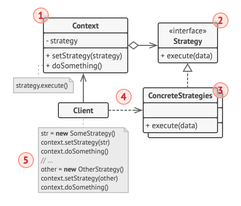
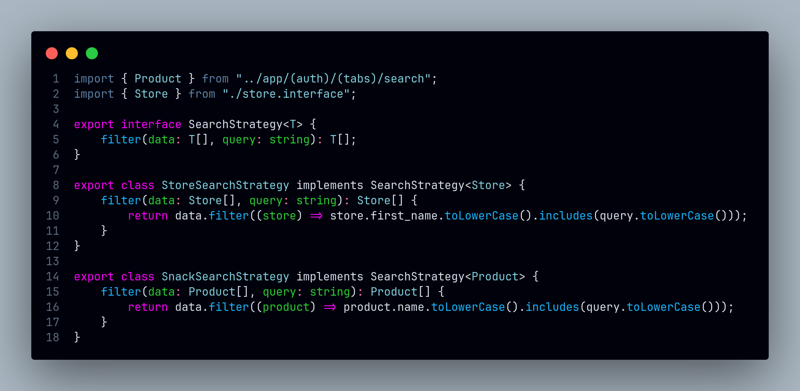

# Strategy

## Introdução

Este documento registra as contribuições dos membros do projeto relacionadas à utilização do padrão de projeto Strategy. O Strategy é um padrão de projeto comportamental que permite definir uma família de algoritmos, encapsulá-los e torná-los intercambiáveis. Dessa forma, o cliente pode escolher o algoritmo que deseja utilizar em tempo de execução, sem alterar a estrutura do código (REFACTORING GURU, 2025).

**Imagem:** Exemplo de estrutura do padrão Strategy (REFACTORING GURU, 2025).

O Strategy é útil quando se tem uma família de algoritmos que possuem comportamentos similares, mas que variam em detalhes específicos. Ele permite que esses algoritmos sejam encapsulados em classes separadas, facilitando a manutenção e a reutilização de código. Além disso, o padrão Strategy promove o princípio do aberto/fechado, pois permite adicionar novos algoritmos sem modificar o código existente. (REFACTORING GURU, 2025).

## Metodologia

No contexto das nossas tecnologias, o padrão **Strategy** é implementado através da criação de interfaces e classes que representam diferentes estratégias de um algoritmo. O React Native, por exemplo, permite a criação de componentes reutilizáveis que encapsulam diferentes comportamentos, tornando-os intercambiáveis em tempo de execução. Essa abordagem é útil para lidar com situações em que diferentes telas ou componentes precisam de comportamentos específicos, mas com uma estrutura comum.

### Justificativa Técnica

O padrão **Strategy** foi escolhido para a implementação da pesquisa entre lojas e produtos por sua capacidade de encapsular algoritmos e torná-los intercambiáveis. Isso facilita a manutenção do código, pois cada estratégia de pesquisa é implementada em uma classe separada, permitindo adicionar novas estratégias sem modificar o código existente. Além disso, o padrão Strategy promove a reutilização de código, pois as classes de estratégia podem ser compartilhadas entre diferentes componentes.

- Prós:
  - Permite a escolha de algoritmos em tempo de execução.
  - Facilita a manutenção e a reutilização de código.
  - Promove o princípio do aberto/fechado, permitindo adicionar novas estratégias sem modificar o código existente.

- Contras:
  - Pode introduzir complexidade adicional em cenários simples.
  - Requer a criação de classes adicionais para cada estratégia.

<!-- Explique como as decisões foram tomadas, as ferramentas utilizadas, e justifique escolhas arquiteturais.

- **Processo de Trabalho**: Descrição do método utilizado pela equipe (ex.: Scrum, Kanban).
- **Ferramentas Utilizadas**: Ferramentas empregadas na criação deste artefato (ex.: LucidChart, GitHub).
- **Justificativa**: Razões para as escolhas metodológicas e tecnológicas. -->

## Implementações no Código Fonte

<!-- Descreva como o padrão foi implementado no projeto, incluindo código e diagramas. -->

### Estratégia de Pesquisa entre Lojas e Produtos

**Tecnologia:** `React Native`

A tela de pesquisa do aplicativo permite que o usuário escolha entre pesquisar por lojas ou por produtos. Para isso, foi implementado o padrão **Strategy**, que permite a seleção da estratégia de pesquisa a ser utilizada. As classes `SearchByStores` e `SearchByProducts` representam as diferentes estratégias de pesquisa, encapsulando os algoritmos específicos de cada tipo de busca. Dessa forma, o usuário pode escolher entre pesquisar por lojas ou por produtos em tempo de execução.

<b>Implementação em Código</b>

**Implementação na [searchStrategies.tsx](https://github.com/UnBArqDsw2024-2/2024.2_G7_Entrega_Entrega_03/blob/19-us09/src/HungryHub.2024.2-Front/hungryhub/src/interfaces/searchStrategies.tsx)**:

**Utilização na tela de pesquisa [search.tsx](https://github.com/UnBArqDsw2024-2/2024.2_G7_Entrega_Entrega_03/blob/19-us09/src/HungryHub.2024.2-Front/hungryhub/src/app/(auth)/(tabs)/search.tsx)**:

Autores: [Felipe Amorim de Araújo](https://github.com/lipeaaraujo), [Bruno Cunha Vasconcelos de Araújo](https://github.com/brunocva), [Leonardo Sobrinho de Aguiar](https://github.com/Leonardo0o0), [Raquel Ferreira Andrade](https://github.com/raquel-andrade), [Wolfgang Friedrich Stein](https://github.com/Wolffstein)

## Referências

1. HEWAWASAM, Lakindu. Using GoF design patterns with React. Blog Bits and Pieces, 05 jan. 2024. Disponível em: https://blog.bitsrc.io/using-gof-design-patterns-with-react-c334f3ea3147. Acesso em: 05 jan. 2024.
2. Dev Junior Alves. Como Aplicar Design Patterns do GoF em React.js com TypeScript?!. Youtube, 19 dezembro 2024. Disponível em: https://www.youtube.com/watch?v=t9wKmfFVgJQ. Acesso em: 02 jan. 2024.
3. AWAN, Talha. GOF Design Patterns in React JS. TecHighness. 21 maio 2022. Disponível em: https://www.techighness.com/post/gof-design-patterns-react-js/. Acesso em: 05 jan. 2024.
4. REFATORING GURU. Strategy. Disponível em: https://refactoring.guru/design-patterns/strategy. Acesso em: 6 jan. 2025.

## Histórico de Versões

| Versão | Data da alteração | Comentário | Autor(es) | Revisor(es) | Data de revisão |
|--------|-----------|-----------|-----------|-------------|-------------|
| 1.0 | 05/01/2025 | Criação do documento e adição do exemplo da pesquisa | [Felipe Amorim de Araújo](https://github.com/lipeaaraujo), [Raquel Ferreira Andrade](https://github.com/raquel-andrade) | [Gabryel Nicolas Soares de Sousa](https://github.com/gabryelns)  | 06/01/2025 |
| 1.1 | 06/01/2025 | Adição da introdução, metodologia e justificativa técnica | [Felipe Amorim de Araújo](https://github.com/lipeaaraujo), [Gabryel Nicolas Soares de Sousa](https://github.com/gabryelns) | [Bruno Araújo](https://github.com/brunocva) | 06/01/2025 |
