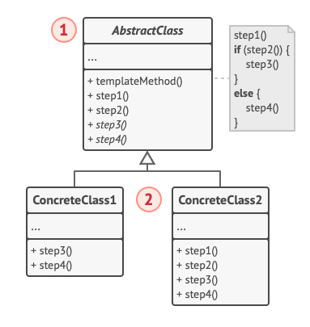
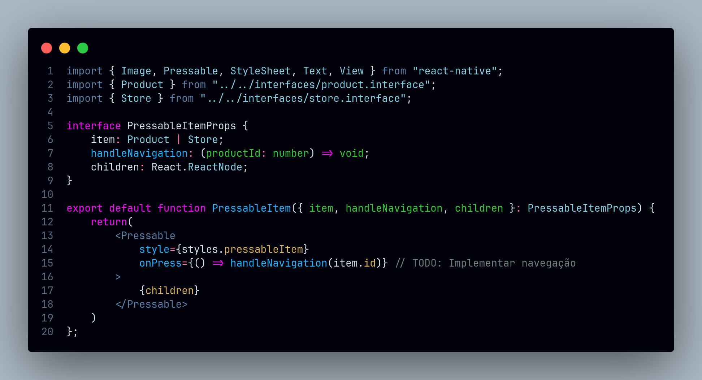
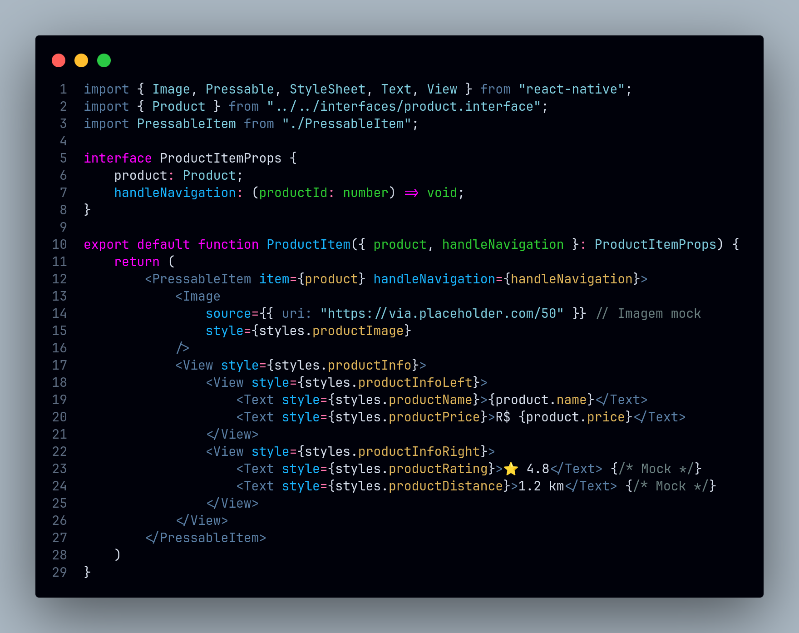
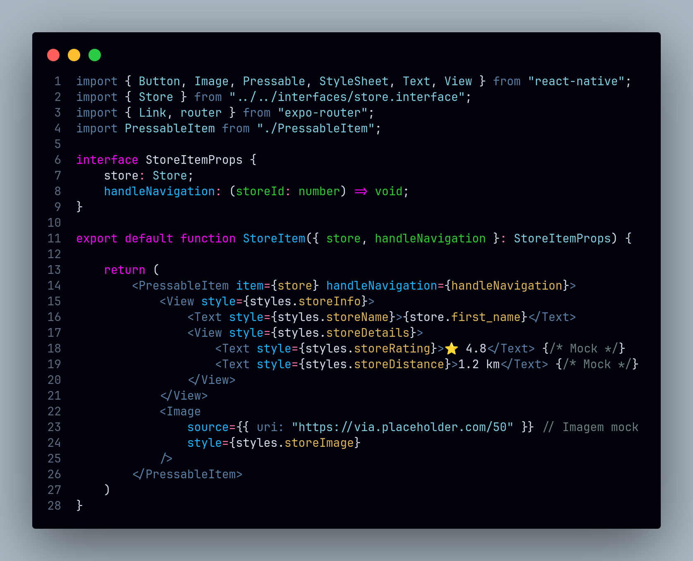

# Template Method

## Introdução

Este documento registra as contribuições dos membros do projeto relacionadas à utilização do método de padronização baseado no padrão de projeto Template Method. O Template Method é um padrão de projeto comportamental que estabelece a estrutura geral de um algoritmo em uma classe base (superclasse), permitindo que etapas específicas sejam sobrescritas em subclasses sem alterar a organização principal do processo (REFACTORING GURU, 2025).  Essa abordagem facilitou o desenvolvimento e melhorou a organização do projeto, tornando-o mais eficiente e sustentável.

**Imagem:** Exemplo de estrutura do padrão Template Method (REFATORING GURU, 2025).

No projeto, o Template Method foi utilizado para padronizar fluxos comuns, o que ajudou a reduzir a duplicação de código, centralizando a lógica compartilhada e eliminando redundâncias em diferentes partes do sistema. Também contribuiu para diminuir o tamanho do código, tornando-o mais conciso e fácil de entender. Além disso, proporcionou flexibilidade para personalizações, permitindo que as subclasses sobrescrevessem etapas específicas do fluxo e atendessem a diferentes necessidades sem comprometer a estrutura principal.
<!-- Inclua os seguintes elementos:

- **Objetivo**: Descrever o propósito deste documento.
- **Contexto**: Breve explicação sobre o projeto e sua importância.
- **Escopo**: Delimitação do conteúdo abordado neste documento. -->

## Metodologia

<!-- Explique como as decisões foram tomadas, as ferramentas utilizadas, e justifique escolhas arquiteturais.

- **Processo de Trabalho**: Descrição do método utilizado pela equipe (ex.: Scrum, Kanban).
- **Ferramentas Utilizadas**: Ferramentas empregadas na criação deste artefato (ex.: LucidChart, GitHub).
- **Justificativa**: Razões para as escolhas metodológicas e tecnológicas. -->

O **Template Method** se relaciona intimamente com a estrutura de componentes do React Native, no mesmo é possível criar componentes que servem como templates para a criação de outros componentes com a mesma estrutura, mas com comportamentos diferentes. Normalmente é comum em componentes de modais ou de listas, onde se cria componentes para uma estrutura padrão e outros componentes herdam essa estrutura e implementam comportamentos específicos.

### Justificativa Técnica

No nosso contexto, temos telas que implementam listas de produtos e listas de lojas, onde a estrutura é a mesma, mas o comportamento de cada item é diferente. Neste caso foi útil a utilização do padrão **Template Method** para criar um componente base que servisse de template para a criação de outros componentes.

- Prós:
  - Reduz a duplicação de código.
  - Facilita a manutenção do código.
  - Permite a definição de um esqueleto de algoritmo que pode ser customizado por subclasses.
  
- Contras:
  - Pode tornar o código mais complexo se não for bem utilizado.

## Implementações no Código Fonte

<!-- Descreva como o padrão foi implementado no projeto, incluindo código e diagramas. -->

### Template de Item de Pesquisa

**Tecnologia:** `React Native`

O componente PressebleItem é um exemplo de implementação do padrão **Template Method**. Ele é um componente que serve como um template para a criação de outros componentes. O componente possui um Pressable que envolve um conteúdo e um método onPress que precisa ser implementado por quem for utilizar o componente.

<b>Implementação em Código</b>

Implementação no **[PressableItem.tsx](https://github.com/UnBArqDsw2024-2/2024.2_G7_Entrega_Entrega_03/blob/19-us09/src/HungryHub.2024.2-Front/hungryhub/src/components/search/PressableItem.tsx)**:

Utilização para criar o **[ProductItem.tsx](https://github.com/UnBArqDsw2024-2/2024.2_G7_Entrega_Entrega_03/blob/19-us09/src/HungryHub.2024.2-Front/hungryhub/src/components/search/ProductItem.tsx)**:

Utilização para criar o **[StoreItem.tsx](https://github.com/UnBArqDsw2024-2/2024.2_G7_Entrega_Entrega_03/blob/19-us09/src/HungryHub.2024.2-Front/hungryhub/src/components/search/StoreItem.tsx)**:

Autores: [Felipe Amorim de Araújo](https://github.com/lipeaaraujo), [Leonardo Sobrinho de Aguiar](https://github.com/Leonardo0o0)

## Referências

1. HEWAWASAM, Lakindu. Using GoF design patterns with React. Blog Bits and Pieces, 4 maio 2023. Disponível em: https://blog.bitsrc.io/using-gof-design-patterns-with-react-c334f3ea3147. Acesso em: 6 jan. 2025.
2. AWAN, Talha. GOF Design Patterns in React JS. TecHighness. 21 maio 2022. Disponível em: https://www.techighness.com/post/gof-design-patterns-react-js/. Acesso em: 6 jan. 2025.
3. REFATORING GURU. Template Method. Disponível em: https://refactoring.guru/design-patterns/template-method. Acesso em: 6 jan. 2025.

## Histórico de Versões

| Versão | Data da alteração | Comentário | Autor(es) | Revisor(es) | Data de revisão |
|--------|-----------|-----------|-----------|-------------|-------------|
| 1.0 | 06/01/2025 | Criação do documento | [Felipe Amorim de Araújo](https://github.com/lipeaaraujo), [Leonardo Sobrinho de Aguiar](https://github.com/Leonardo0o0) | [Bruno Araújo](https://github.com/cva)  | 06/01/2025  |
| 1.1 | 06/01/2025 | Adição da implementação do PressableItem, introdução, metodologia e justificativas | [Felipe Amorim de Araújo](https://github.com/lipeaaraujo), [Leonardo Sobrinho de Aguiar](https://github.com/Leonardo0o0) | [Bruno Araújo](https://github.com/cva)  |  06/01/2025|