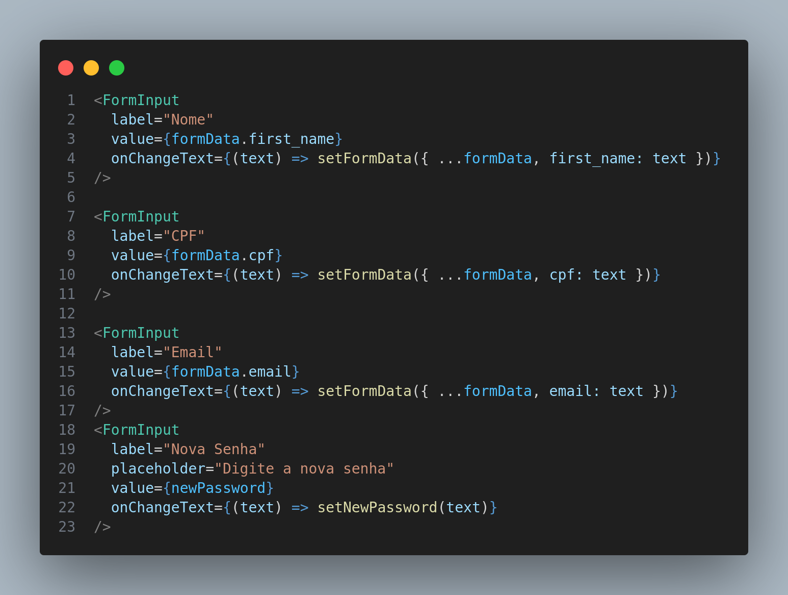

# **Abstract Factory**

## **Introdução**

O **Abstract Factory** é um padrão criacional que fornece uma interface para criar famílias de objetos relacionados ou interdependentes sem especificar suas classes concretas. Neste projeto, o padrão é utilizado para gerenciar a criação de componentes de formulário, como o `FormInput`, permitindo que o código seja reutilizável e facilmente extensível para diferentes tipos de inputs (por exemplo, texto, senha, email).

## **Metodologia**

- **Processo de Trabalho**: Seguiu-se uma abordagem baseada em modularização para separar responsabilidades, facilitando a criação e manutenção de componentes reutilizáveis.
- **Ferramentas Utilizadas**: Foi utilizado React Native para a implementação, explorando o sistema de estilos nativo e a modularização com TypeScript para definir interfaces.
- **Justificativa**: O uso do padrão **Abstract Factory** para o `FormInput` garante consistência nos formulários e permite adicionar novos tipos de inputs (como seleção de data ou opções) sem modificar o código existente.

## **Implementações no Código Fonte**

### **Fábrica para Criar Inputs de Formulário**

**Tecnologia:** `React Native`

O padrão **Abstract Factory** foi aplicado na criação do componente `FormInput`. Ele abstrai a lógica para criação de inputs, permitindo alterar o comportamento e o estilo de forma dinâmica.

<b>Implementação em Código</b>

1. FormInput 
   
**Componente [FormInput.tsx](../../../src/HungryHub.2024.2-Front/hungryhub/src/components/Profile/FormInput.tsx)**:

**Uso em [profile_data](../../../src/HungryHub.2024.2-Front/hungryhub/src/app/(auth)/(tabs)/profile/profile_data.tsx)**

Autores: [Kauan Eiras](https://github.com/kauaneiras)

### **Justificativa Técnica**

- **Prós**:
  - O componente é reutilizável, promovendo consistência nos formulários.
  - Permite fácil adição de novos tipos de inputs, como campos de data ou senha.
  - Centraliza o estilo e a lógica dos inputs, reduzindo duplicação.

- **Contras**:
  - A implementação inicial pode parecer mais complexa para pequenos projetos.
  - Cada novo tipo de input requer o ajuste da fábrica para suportá-lo.

---

## **Referências**

1. HEWAWASAM, Lakindu. Using GoF design patterns with React. Blog Bits and Pieces, 4 maio 2023. Disponível em: https://blog.bitsrc.io/using-gof-design-patterns-with-react-c334f3ea3147. Acesso em: 17 dez. 2024.

2. RESTAK. Real-World Examples Of Abstract Factory Pattern. Disponível em: https://www.restack.io/p/abstract-factory-pattern-answer-real-world-examples. Acesso em: 17 dez. 2024.

---

## **Histórico de Versões**

| Versão | Data             | Comentário           | Autor(es)                 | Revisor(es)             | Data da revisão |
|--------|------------------|----------------------|---------------------------|-------------------------|-------------|
| 1.0    | 06/01/2025       | Criação do documento | [Kauan Eiras](https://github.com/kauaneiras) | [Kallyne Passos](https://github.com/kalipassos) | 06/01/2025 |