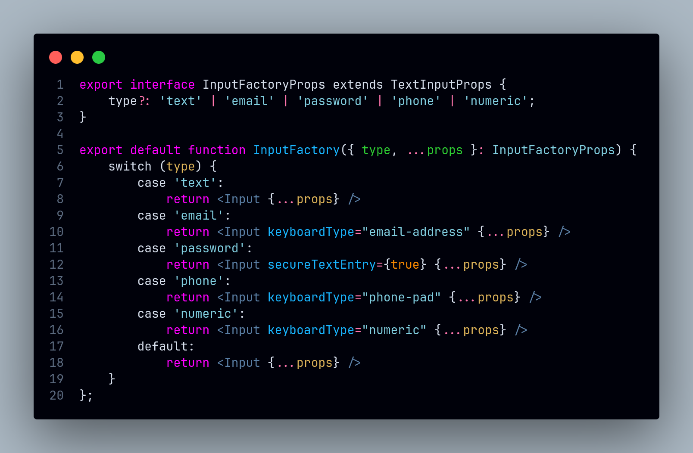

# Factory Method

## Introdução

<!-- Inclua os seguintes elementos:

- **Objetivo**: Descrever o propósito deste documento.
- **Contexto**: Breve explicação sobre o projeto e sua importância.
- **Escopo**: Delimitação do conteúdo abordado neste documento. -->

O **Factory Method** é um padrão de projeto criacional que oferece uma abordagem flexível para criação de objetos, delegando a instanciação às subclasses. No projeto, este padrão foi aplicado para gerenciar a criação de componentes de interface e entidades no backend. No React Native, foi utilizado para a criação de componentes de formulário, listas de resultados de pesquisa e seções de produto, permitindo uma manutenção simplificada do código. Já no Django, o padrão foi aplicado para gerenciar a criação de usuários e superusuários, promovendo uma separação clara de responsabilidades.

## Metodologia

<!-- Explique como as decisões foram tomadas, as ferramentas utilizadas, e justifique escolhas arquiteturais.

- **Processo de Trabalho**: Descrição do método utilizado pela equipe (ex.: Scrum, Kanban).
- **Ferramentas Utilizadas**: Ferramentas empregadas na criação deste artefato (ex.: LucidChart, GitHub).
- **Justificativa**: Razões para as escolhas metodológicas e tecnológicas. -->

- **Processo de Trabalho**: Foi utilizada uma abordagem modular, com foco na reutilização de componentes. 
- **Ferramentas Utilizadas**: Foi utilizado React Native para a implementação, explorando o sistema de estilos nativo e a modularização com TypeScript para definir interfaces.
- **Justificativa**: A escolha do Factory Method se baseia na necessidade de criar diferentes tipos de componentes (como inputs, seções e usuários) dinamicamente com a flexibilidade para adicionar novos tipos sem modificar código existente e com a centralizalização da criação destes componentes em um único lugarç

O padrão Factory Method foi implementado em quatro principais áreas do aplicativo:

- Componentes de Input: Desenvolveu-se uma fábrica de inputs que gera diferentes tipos de campos (texto, senha, email) baseados em propriedades recebidas. A factory abstrai a complexidade de criação e permite adicionar novos tipos de input sem modificar o código existente.
- Lista de Resultados de Pesquisa: Implementou-se uma adaptação do Factory Method para renderizar diferentes tipos de itens em uma FlatList (restaurantes, produtos, promoções). A fábrica determina qual componente deve ser renderizado baseado no tipo do item recebido, mantendo o código organizado e extensível.
- Seções de Produtos: Desenvolveu-se uma fábrica de seções para a criação de diferentes áreas na tela inicial do aplicativo considerando a dinamicidade do aplicativo e possibilitando a criação de seções para atender momentos determinados como feriados e datas comemorativas.
- Gerenciamento de Usuários: Foi implementada uma fábrica para a criação de diferentes tipos de usuários (usuários comuns e superusuários). A classe `UsuarioManager` centraliza a lógica de criação, permitindo uma distinção clara entre os tipos de usuários e garantindo maior flexibilidades.

## Implementações no Código Fonte

<!-- Descreva como o padrão foi implementado no projeto, incluindo código e diagramas. -->

### Componente de Input para Formulário

**Tecnologia:** `React Native`

Criação de um componente de input para formulário, que pode ser utilizado para criar inputs de diversos tipos, como text, password, email, etc. O componente é criado a partir de um factory method, que recebe um tipo de input a partir de props e retorna o componente correspondente.

<b>Implementação em Código</b>

**Componente [InputFactory.tsx](https://github.com/UnBArqDsw2024-2/2024.2_G7_Entrega_Entrega_03/blob/12-us01/src/HungryHub.2024.2-Front/hungryhub/src/components/InputFactory.tsx)**:

**Implementação do InputFactory no [FormInput.tsx](https://github.com/UnBArqDsw2024-2/2024.2_G7_Entrega_Entrega_03/blob/12-us01/src/HungryHub.2024.2-Front/hungryhub/src/components/FormInput.tsx)**:

**Utilização no [Register.tsx](https://github.com/UnBArqDsw2024-2/2024.2_G7_Entrega_Entrega_03/blob/12-us01/src/HungryHub.2024.2-Front/hungryhub/src/app/(public)/register.tsx)**:

Autores: [Felipe Amorim de Araújo](https://github.com/lipeaaraujo)

### Componentes para Lista de Pesquisa

**Tecnologia:** `React Native`

O componente de FlatList é utilizado para exibir uma lista de itens na tela de pesquisa. Para cada item da lista, é utilizado um factory method para criar o componente correspondente, de acordo com o tipo de item. O componente não simula exatamente o padrão Factory Method, mas é uma adaptação do conceito para a criação de componentes.

<b>Implementação em Código</b>

**[FlatList na Tela de Pesquisa](https://github.com/UnBArqDsw2024-2/2024.2_G7_Entrega_Entrega_03/blob/19-us09/src/HungryHub.2024.2-Front/hungryhub/src/app/(auth)/(tabs)/search.tsx)**:

Autores: [Felipe Amorim de Araújo](https://github.com/lipeaaraujo), [Bruno Cunha Vasconcelos de Araújo](https://github.com/brunocva), [Leonardo Sobrinho de Aguiar](https://github.com/Leonardo0o0), [Raquel Ferreira Andrade](https://github.com/raquel-andrade), [Wolfgang Friedrich Stein](https://github.com/Wolffstein)

### Componentes para Seções de Produtos

**Tecnologia:** `React Native`

Nesse componente, houve a implementação do padrão factory method para a criação de diferentes seções na tela inicial do aplicativo. Cada factory é responsável por criar uma seção com características únicas, podendo ser recomendações com priorização de avaliação alta, por exemplo. O uso desse padrão facilita a adição de novos tipos de seção no futuro.

<b>Implementação em Código</b>

**Componente [ProductSectionFactory.tsx](https://github.com/UnBArqDsw2024-2/2024.2_G7_Entrega_Entrega_03/blob/2e14635d78cec6fe56c077d691d46e6996ae38e9/src/HungryHub.2024.2-Front/hungryhub/src/components/ProductSectionFactory.tsx)**:

**Utilização no [index.tsx](https://github.com/UnBArqDsw2024-2/2024.2_G7_Entrega_Entrega_03/blob/2e14635d78cec6fe56c077d691d46e6996ae38e9/src/HungryHub.2024.2-Front/hungryhub/src/app/(auth)/(tabs)/index.tsx)**:

Autores: [Kallyne Macedo Passos](https://github.com/kalipassos)

### Componente para o Card do Endereço

**Tecnologia:** `React Native`

Neste componente, foi implementado uma adaptação do padrão Factory Method para a criação dinâmica de diferentes cards exibidos na tela dos endereços do usuário. Cada card é instanciado de forma independente e é responsável por representar visualmente um endereço específico do usuário, encapsulando seus dados (como rua, cidade, estado e CEP) e permitindo uma interação personalizada. Essa abordagem garante flexibilidade e reutilização, além de desacoplar a lógica de criação dos cards da lógica principal do componente.

<b>Implementação em Código</b>

**Componente [AddressCard.tsx](https://github.com/UnBArqDsw2024-2/2024.2_G7_Entrega_Entrega_03/blob/main/src/HungryHub.2024.2-Front/hungryhub/src/components/Profile/AddressCard.tsx)**

**Utilizado no [index.tsx](https://github.com/UnBArqDsw2024-2/2024.2_G7_Entrega_Entrega_03/blob/main/src/HungryHub.2024.2-Front/hungryhub/src/app/(auth)/(tabs)/profile/addresses/index.tsx)**

**Autores**: [Júlio Roberto da Silva Neto](https://github.com/JulioR2022), [Guilherme Silva Dutra](https://github.com/GuiDutra21)

### Exemplo de Factory Method no Django

**Tecnologia:** `Django`

Nesse exemplo, temos a implementação do padrão Factory Method no Django, onde o método `create_user` é responsável por criar um usuário comum e o método `create_superuser` é responsável por criar um superusuário. A fábrica `UsuarioManager` é responsável por criar os usuários de acordo com o tipo passado como parâmetro.

<b>Implementação em Código</b>

**[UsuarioManager.py](https://github.com/UnBArqDsw2024-2/2024.2_G7_Entrega_Entrega_03/blob/main/src/HungryHub.2024.2-Back/hungryhub/models.py#L6)**:

Autores: [Lucas Martins Gabriel](https://github.com/martinsglucas)

### Justificativa Técnica

- **Prós**:
    - O padrão Factory Method permite padronizar a criação de componentes complexos. Por exemplo, você pode ter uma factory para criar diferentes tipos de seções contendo tipos diferentes de produto de forma a manter a consistência e o formato independente do conteúdo.  
    - Manutenção simples, pois a lógica de criação de um componente pode ser alterada sem afetar outros pontos no código.
    - Capacidade de extensão, tornando possível adicionar uma nova classe concreta sem modificar o código existente.

- **Contras**:
    - Adiciona complexidade ao projeto e tem uma curva de aprendizado alta para desenvolvedores que não conhecem o padrão.  
    - Precisa de mais código inicial do que o comum para configurar a estrutura do padrão.
    - Pode gerar soluções mais complicadas do que o necessário, considerando que, através do React, é possível obter resultados através de props e da composição de componentes sem a necessidade de uma factory.

<!-- ## Rastreabilidade Adicione uma seção para mapear decisões a requisitos ou justificativas técnicas.

| Decisão Relacionada | Justificativa | Elo | Data |
| -- | -- | -- | -- |
| Escolha de arquitetura em camadas | Modularidade e separação de responsabilidades | [R01]() | 07/12/2024 | -->

## Referências

1. HEWAWASAM, Lakindu. Using GoF design patterns with React. Blog Bits and Pieces, 4 maio 2023. Disponível em: https://blog.bitsrc.io/using-gof-design-patterns-with-react-c334f3ea3147. Acesso em: 17 dez. 2024.
2. Dev Junior Alves. Como aplicar Design Patterns no React com hooks?!. Youtube, 23 maio 2024. Disponível em: https://www.youtube.com/watch?v=kK-4Cpt5_o4. Acesso em: 17 dez. 2024.
3. Dev Junior Alves. Como Aplicar Design Patterns do GoF em React.js com TypeScript?!. Youtube, 19 dezembro 2024. Disponível em: https://www.youtube.com/watch?v=t9wKmfFVgJQ. Acesso em: 02 jan. 2024.
4. AWAN, Talha. GOF Design Patterns in React JS. TecHighness. 21 maio 2022. Disponível em: https://www.techighness.com/post/gof-design-patterns-react-js/. Acesso em: 02 jan. 2024.

## Histórico de Versões

| Versão | Data da alteração | Comentário | Autor(es) | Revisor(es) | Data de revisão |
|--------|-----------|-----------|-----------|-------------|-------------|
| 1.0 | 17/12/2024 | Criação do documento | [Felipe Amorim de Araújo](https://github.com/lipeaaraujo) | [Kallyne Macedo Passos](https://github.com/kalipassos) | 05/01/2025 |
| 1.1 | 17/12/2024 | Adição do exemplo de InputFactory | [Felipe Amorim de Araújo](https://github.com/lipeaaraujo) | [Kallyne Macedo Passos](https://github.com/kalipassos) | 05/01/2025 |
| 1.2 | 02/01/2025 | Adicionando referências | [Felipe Amorim de Araújo](https://github.com/lipeaaraujo) | [Kallyne Macedo Passos](https://github.com/kalipassos) | 05/01/2025 |
| 1.3 | 05/01/2025 | Adição do exemplo da lista de pesquisa | [Felipe Amorim de Araújo](https://github.com/lipeaaraujo), [Raquel Ferreira Andrade](https://github.com/raquel-andrade) |[Kallyne Macedo Passos](https://github.com/kalipassos)  | 05/01/2025 |
| 1.4 | 05/01/2025 | Adição da introdução, metodologia e seção para produtos | [Kallyne Macedo Passos](https://github.com/kalipassos) | [Gabryel Nicolas S de Sousa](https://github.com/gabryelns) | 06/01/2025 |
| 1.5 | 06/01/2025 | Adição do exemplo de Factory Method no Django | [Lucas Martins Gabriel](https://github.com/martinsglucas) | [Wolfgang Friedrich Stein](https://github.com/Wolffstein)| 06/01/2025
| 1.6 | 06/01/2025 | Adiciona Componente para o Card do Endereço | [Júlio Roberto da Silva Neto](https://github.com/JulioR2022), [Guilherme Silva Dutra](https://github.com/GuiDutra21) | [Wolfgang Friedrich Stein](https://github.com/Wolffstein) | 06/01/2025 |

