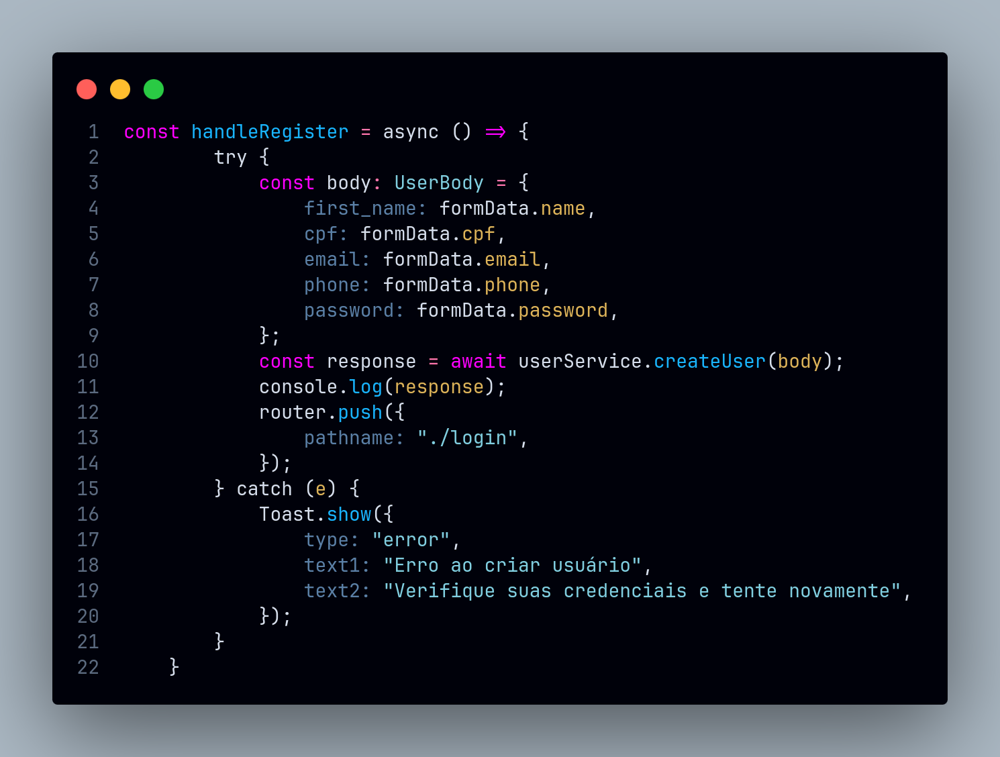

# Facade

## Introdução

O padrão **Facade** é usado para simplificar o acesso a sistemas complexos. Ele cria uma interface única e mais fácil de usar, escondendo os detalhes internos e tornando a comunicação com diferentes partes do sistema mais organizada. Esse padrão é útil para reduzir a complexidade, facilitar a manutenção e melhorar a clareza do código. (REFACTORING GURU, 2025).

**Imagem:** Exemplo de estrutura do padrão Facade (REFACTORING GURU, 2025).

No contexto das nossas tecnologias, o padrão **Facade** é implementado para fornecer uma interface simplificada que abstrai a complexidade de um conjunto de classes ou subsistemas. Em React Native, o padrão pode ser aplicado para organizar a lógica de interação com APIs, bancos de dados ou serviços externos, expondo apenas os métodos essenciais para os componentes da aplicação. Por exemplo, um módulo de gerenciamento de dados pode oferecer uma fachada que unifica operações de leitura e escrita em diferentes fontes de dados, simplificando o desenvolvimento e reduzindo o acoplamento entre os componentes e a lógica subjacente. Essa abordagem é especialmente útil para melhorar a clareza e a manutenibilidade do código em projetos complexos.

## Metodologia

A metodologia adotada priorizou a organização e eficiência, utilizando abordagens ágeis e ferramentas modernas para garantir entregas incrementais e colaborativas.

- **Abordagem Modular**: O padrão **Facade** foi aplicado para encapsular operações complexas em uma interface simplificada, garantindo uma comunicação mais clara e acessível entre os componentes do sistema.
- **Ferramentas Utilizadas**: Foram empregadas ferramentas como **React Native** e **TypeScript**, que facilitaram a criação de serviços centralizados para chamadas de API e encapsulamento de lógicas complexas. O controle de versão foi realizado com **GitHub**, promovendo rastreabilidade e organização.
- **Justificativa**: A escolha do padrão **Facade** permitiu uma melhor organização do código e a redução de complexidade nas interações entre componentes. Isso resultou em maior escalabilidade e facilidade de manutenção, aspectos fundamentais para a evolução do projeto.

No projeto, o padrão Facade foi usado principalmente para esconder as complexidades das chamadas da API do `Django REST Framework`. A fachada foi implementada em serviços que encapsulam as chamadas de API em um único arquivo, facilitando a manutenção e a reutilização do código. A fachada é responsável por fazer as chamadas de operações CRUD (Create, Read, Update, Delete) para a API, ocultando os detalhes internos e expondo apenas os métodos essenciais para os componentes da aplicação. Isso permite que os componentes se comuniquem com a API de forma mais organizada e simplificada, melhorando a clareza e a manutenibilidade do código.

## Implementações no Código Fonte

<!-- Descreva como o padrão foi implementado no projeto, incluindo código e diagramas. -->

### Função `handleLogin` na tela de Login

**Tecnologia:** `React Native`

A função `handleLogin` atua como uma fachada para o processo de login. Ela encapsula a complexidade da lógica de autenticação, incluindo a construção do objeto UserLogin, a chamada da função `loginUser`, o tratamento de erros e a navegação do usuário em uma única função. Os detalhes internos são escondidos do restante do componente.

<b>Implementação em Código</b>

**Função** [handleLogin]()

Autores: [Guilherme Westphall](https://github.com/west7)

### Encapsulamento de chamadas de API do `user.service`

**Tecnologia:** `React Native`

Encapsulamento de chamadas de API do serviço de usuário em um único arquivo, facilitando a manutenção e a reutilização do código, por meio de um arquivo de fachada (**Facade**) que contém os métodos de chamada da API. O serviço de usuário é responsável por fazer as chamadas de operações CRUD (Create, Read, Update, Delete) do usuário e autenticação para a API.

<b>Implementação em Código</b>

**Serviço [user.service.tsx](https://github.com/UnBArqDsw2024-2/2024.2_G7_Entrega_Entrega_03/blob/12-us01/src/HungryHub.2024.2-Front/hungryhub/src/api/services/user.service.tsx)**:

**Utilização na tela de registro [register.tsx](https://github.com/UnBArqDsw2024-2/2024.2_G7_Entrega_Entrega_03/blob/12-us01/src/HungryHub.2024.2-Front/hungryhub/src/app/(public)/register.tsx)**:

**Utilização na tela de login [login.tsx](https://github.com/UnBArqDsw2024-2/2024.2_G7_Entrega_Entrega_03/blob/12-us01/src/HungryHub.2024.2-Front/hungryhub/src/app/(public)/login.tsx)**:

Autores: [Felipe Amorim de Araújo](https://github.com/lipeaaraujo), [Lucas Martins Gabriel](https://github.com/martinsglucas), [Guilherme Westphall de Queiroz](https://github.com/west7)

### Encapsulamento de chamadas de API do `store.service`

**Tecnologia:** `React Native`

Encapsulamento de chamadas de API do serviço de loja em um único arquivo, facilitando a manutenção e a reutilização do código, por meio de um arquivo de fachada (**Facade**) que contém os métodos de chamada da API. O serviço de loja é responsável por fazer as chamadas de operações CRUD (Create, Read, Update, Delete) da loja para a API.

<b>Implementação em Código</b>

**Serviço [store.service.tsx]()**:

**Utilização na tela de detalhes da loja [[storeId].tsx]()**:

![[storeId].tsx](assets/servico-store-utilizacao.png)

Autores: [Bruno Cunha Vasconcelos de Araújo](https://github.com/brunocva),[Felipe Amorim de Araújo](https://github.com/lipeaaraujo), [Lucas Martins Gabriel](https://github.com/martinsglucas), [Guilherme Westphall de Queiroz](https://github.com/west7),[Wolfgang Friedrich Stein](https://github.com/Wolffstein)

### Encapsulamento de chamadas de API do `product.service`

**Tecnologia:** `React Native`

Encapsulamento de chamadas de API do serviço de produto em um único arquivo, facilitando a manutenção e a reutilização do código, por meio de um arquivo de fachada (**Facade**) que contém os métodos de chamada da API. O serviço de produto é responsável por fazer as chamadas de operações CRUD (Create, Read, Update, Delete) do produto para a API.

<b>Implementação em Código</b>

**Serviço [product.service.tsx](https://github.com/UnBArqDsw2024-2/2024.2_G7_Entrega_Entrega_03/blob/main/src/HungryHub.2024.2-Front/hungryhub/src/api/services/product.service.tsx)**:

**Utilização na tela de detalhes do produto [[productId].tsx](https://github.com/UnBArqDsw2024-2/2024.2_G7_Entrega_Entrega_03/blob/main/src/HungryHub.2024.2-Front/hungryhub/src/app/(auth)/product/%5Bid%5D.tsx)**:

![[storeId].tsx](assets/product-service-implementacao.png)

Autores: [Felipe Amorim de Araújo](https://github.com/lipeaaraujo), [Kallyne Macedo Passos](https://github.com/kalipassos) e [Raquel Ferreira Andrade](https://github.com/raquel-andrade)

### Encapsulamento de chamadas de API do `addres.service`

**Tecnologia:** `React Native`

Encapsulamento de chamadas de API do serviço de endereços em um único arquivo, facilitando a manutenção e a reutilização do código, por meio de um arquivo de fachada (**Facade**) que contém os métodos de chamada da API. O serviço de endereço é responsável por fazer as chamadas de operações CRUD (Create, Read, Update, Delete) do usuário e autenticação para a API.

<b>Implementação em Código</b>

**Serviço [AddressService](https://github.com/UnBArqDsw2024-2/2024.2_G7_Entrega_Entrega_03/blob/17-US06/src/HungryHub.2024.2-Front/hungryhub/src/api/services/address.service.tsx)**

**Utilização na tela de endereços [index.tsx](https://github.com/UnBArqDsw2024-2/2024.2_G7_Entrega_Entrega_03/blob/17-US06/src/HungryHub.2024.2-Front/hungryhub/src/app/(auth)/(tabs)/profile/addresses/index.tsx)**

**Autores**:  [Guilherme Silva Dutra](https://github.com/GuiDutra21), [Júlio Roberto da Silva Neto](https://github.com/JulioR2022)

## Justificativa Técnica

A implementação do padrão Facade, utilizando tecnologias como React Native e TypeScript, visou a simplificação das interações entre diferentes partes do sistema, permitindo maior modularidade e separação de responsabilidades. O encapsulamento das chamadas de API em serviços específicos reduziu o acoplamento e facilitou a manutenção do código, além de garantir maior organização e escalabilidade para o projeto.

## Referências

1. HEWAWASAM, Lakindu. Using GoF design patterns with React. Blog Bits and Pieces, 4 maio 2023. Disponível em: https://blog.bitsrc.io/using-gof-design-patterns-with-react-c334f3ea3147. Acesso em: 02 jan. 2025.
2. Dev Junior Alves. Como aplicar Design Patterns no React com hooks?!. Youtube, 23 maio 2024. Disponível em: https://www.youtube.com/watch?v=kK-4Cpt5_o4. Acesso em: 02 jan. 2025.
3. AWAN, Talha. GOF Design Patterns in React JS. TecHighness. 21 maio 2022. Disponível em: https://www.techighness.com/post/gof-design-patterns-react-js/. Acesso em: 02 jan. 2025.
4. REFATORING GURU. Facade. Disponível em: https://refactoring.guru/design-patterns/facade. Acesso em: 6 jan. 2025.
   
## Histórico de Versões

| Versão | Data da alteração | Comentário                   | Autor(es)                                       | Revisor(es) | Data de revisão |
| ------ | ----------------- | ---------------------------- | ----------------------------------------------- | ----------- | --------------- |
| 1.0    | 27/12/2024        | Criação do documento         | [Guilherme Westphall](https://github.com/west7) |  [Gabryel Nicolas S de Sousa](https://github.com/gabryelns) | 06/01/2025 |
| 1.1    | 27/12/2024        | Adição da função handleLogin | [Guilherme Westphall](https://github.com/west7) |     [Gabryel Nicolas S de Sousa](https://github.com/gabryelns) | 06/01/2025 |# Facade
| 1.2 | 02/01/2025 | Adição da implementação do serviço de usuário | [Felipe Amorim de Araújo](https://github.com/lipeaaraujo), [Lucas Martins Gabriel](https://github.com/martinsglucas), [Guilherme Westphall de Queiroz](https://github.com/west7) | [Gabryel Nicolas S de Sousa](https://github.com/gabryelns) | 06/01/2025 |
| 1.3 | 04/01/2025 | Adição da implementação do serviço de loja | [Felipe Amorim de Araújo](https://github.com/lipeaaraujo), [Leonardo Sobrinho de Aguiar](https://github.com/Leonardo0o0), [Raquel Ferreira Andrade](https://github.com/raquel-andrade) |  |  |
| 1.4 | 06/01/2025 | Adição da introdução | [Gabryel Nicolas S de Sousa](https://github.com/gabryelns) |  |  |
| 1.5 | 06/01/2025 | Adição da metodologia e justificativas técnicas | [Bruno Araújo](https://github.com/brunocva) |  |  |
| 1.6 | 06/01/2025 | Adição da implementação do serviço de produtos | [Felipe Amorim de Araújo](https://github.com/lipeaaraujo), [Kallyne Macedo Passos](https://github.com/kalipassos) |  |  |
| 1.7 | 06/01/2025 | Adiciona Encapsulamento de chamadas de API do `addres.service` | [Guilherme Silva Dutra](https://github.com/GuiDutra21), [Júlio Roberto da Silva Neto](https://github.com/JulioR2022) |  |  |
